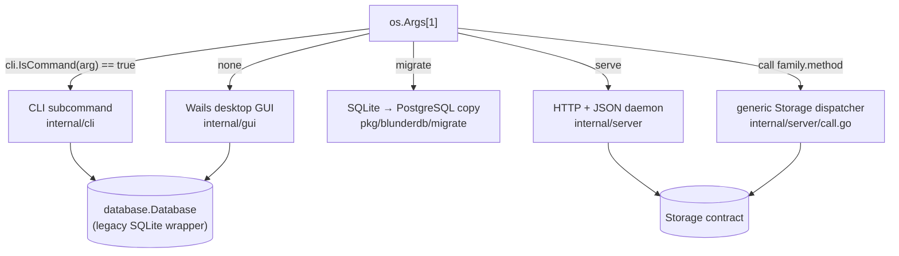
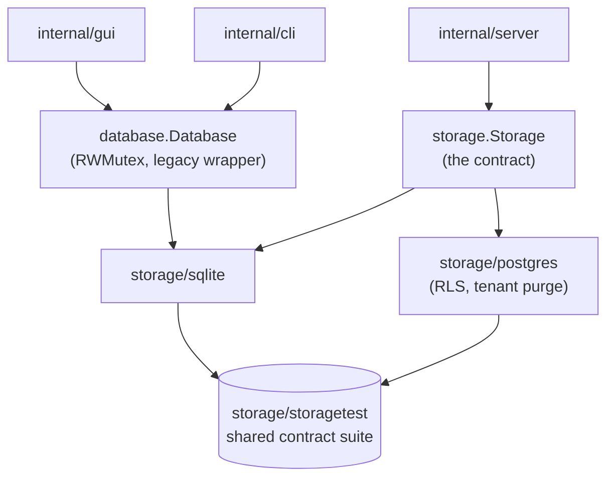
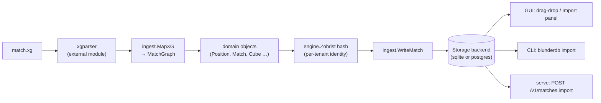

# Architecture

A tour of blunderDB for a contributor who has read `README.md` and
`CONTRIBUTING.md` and wants the shape of the system before the first change.
This file stays a diagram-first companion to `CLAUDE.md`, which holds the
working rules and invariants — read that one before changing the subsystem a
diagram below points at. `CONTEXT.md` is the domain glossary, `docs/adr/` the
decisions behind non-obvious choices, and each package's own doc comment
(`go doc ./pkg/blunderdb/...`) is the most precise description of what it
does.

## 1. One binary, five modes

`main.go` never keeps a second copy of what counts as a CLI subcommand — it
asks `cli.IsCommand`, which reads the same `handlers()` table `cli.Run`
dispatches through.

`cmd/serve` is a separate `main` package: it builds the daemon alone, no
Wails, CGO disabled, for the container image (`Dockerfile.serve`). It is
functionally identical to `blunderdb serve` from the root binary.

## 2. Two backends, one contract

`pkg/blunderdb/storage` defines the persistence contract every backend
implements; `pkg/blunderdb/database` is the older, SQLite-only wrapper the
GUI and CLI still run, and delegates to `storage/sqlite` underneath. Both
concrete backends are held to the same shared suite in
`storage/storagetest`, which is what makes them interchangeable from the
server's point of view.

Two things follow directly from this shape:

- A change to the retention predicate, or to a schema migration, is written
  once per backend (`database/db_match.go` for the wrapper,
  `storage/sqlite/matches_sqlite.go`, `storage/postgres/matches_postgres.go`)
  — three copies of the same *predicate*, not three designs.
- New Storage-level behaviour is exposed to the GUI, the CLI and the server
  from the same call, per the CLI/GUI/server parity invariant in
  `CLAUDE.md` — never forked into a mode-specific helper.

## 3. An import, end to end

Importing an `.xg` match file is the path that touches the most packages in
one request, and the one most contributors meet first (`make dev`, drag a
file onto the board). Every format (`.xg`, `.sgf`, `.mat`, `.bgf`, `.xgp`,
plain text) follows the same shape: an external parser module turns the file
into its own record types, `pkg/blunderdb/ingest` maps those into
backend-independent domain objects, and `WriteMatch` persists them through
whichever `Storage` the caller holds.

A position that hashes to one already in the tenant is deduplicated at the
`WriteMatch` step — the Zobrist hash, not the file it came from, is the
position's identity (see the hashing invariant in `CLAUDE.md` and
`docs/adr/0001-individually-imported-is-a-sticky-flag.md`). `SavePosition` is
the entry point for anything arriving as part of a match; `SaveIndividualPosition`
is the one the GUI and CLI use when a single position is brought in on its
own (a pasted XGID, an `.xgp` file) — the same dedup, with the
`individually_imported` flag set.

## Package map

Each package's `doc.go` is the first thing to read; this map only says where to look.

- `main.go` (repo root: embed patterns cannot use parent paths) — mode dispatch, Wails
  `//go:embed`; `config.go` (XDG window/last-database config), `logging.go` (slog).
- `pkg/blunderdb/domain/` — dependency-free types and constants (`Position`, `Match`, FSRS
  cards, `DatabaseVersion`).
- `pkg/blunderdb/engine/` — what is computed about a position: Zobrist hashing, bitboards, EPC,
  the match equity table (`met.go`, `GnuBGGetME`), the storage codecs. Subpackages:
  `race/` (two-sided bearoff reader, win chances, money cube verdicts), `bearoffgen/` (the
  tables, generated byte-identical to gnubg's `makebearoff`; `bearofftest/` for tests),
  `gammonnet/` (the neural evaluator, a Go port of gammonNet), `training/` (Training questions).
- `pkg/blunderdb/storage/` — the persistence contract; `sqlite/`, `postgres/` (RLS, tenant
  purge), shared SQL in `sqlshared/`, contract tests in `storagetest/`.
- `pkg/blunderdb/database/` — the legacy SQLite `Database` wrapper run by GUI and CLI: schema in
  `db_schema.go`, migrations in `db_migration.go`, one `db_*.go` per domain.
- `pkg/blunderdb/ingest/` (import/export for the daemon), `parser/` (position text),
  `migrate/` (SQLite → PostgreSQL), `server/` (`Bootstrap()` for embedding in gammonGo).
- Feature packages, pure of SQL: `searchquery/` (the search grammar, locked to the frontend
  parser by a shared corpus), `transcript/` (Transcription), `direction/` (tournament
  Direction, the only user of Nicomaque), `anki/` (FSRS), `trash/`, `watch/`, `issuance/`
  (watermark and encrypted export; its glue is `database/db_issuance.go`).
- `internal/gui/` (Wails `App`), `internal/cli/` (one `cli_<cmd>.go` per subcommand),
  `internal/server/` (HTTP daemon: `routes.go`, `handlers_*.go`, middleware, `call.go`).
- `cmd/` — `serve` plus dev-time tools, never shipped: `blunderdb-loadtest`,
  `extract_gnubg_stats`, `calibrace`, `train-analysis-dict`, `help-gen`, `cli-doc-gen`
  (rerun after changing a command's help), `openapi-gen`, `likecorpus`.
- External parsers are separate modules (`github.com/kevung/xgparser`, `gnubgparser`,
  `bgfparser`); Jellyfish `.mat` export lives here (`database/db_mat_export.go`,
  `ingest/mat_export.go`).
- Frontend: `frontend/src/App.svelte` stays thin; panels in `components/`, one store per area
  in `stores/`, the command line in `commandProcessor.js`; `Board.svelte` renders via two.js.

## Where to read next

- **Persistence contract and backends**: package doc of
  `pkg/blunderdb/storage/storage.go`.
- **Domain glossary**: `CONTEXT.md`.
- **Decisions**: `docs/adr/README.md` — one file per decision, stating the
  current state; a change rewrites the record it changes.
- **Server mode, user-facing**: `doc/source/mode_headless.rst`.
- **CLI reference**: `CLI_USAGE.md` (the flag reference section is generated
  by `cmd/cli-doc-gen`; see the file's own header).
- **Historical design notes** (do not reflect current code, but explain the
  reasoning behind a decision): `doc/archive/`.
