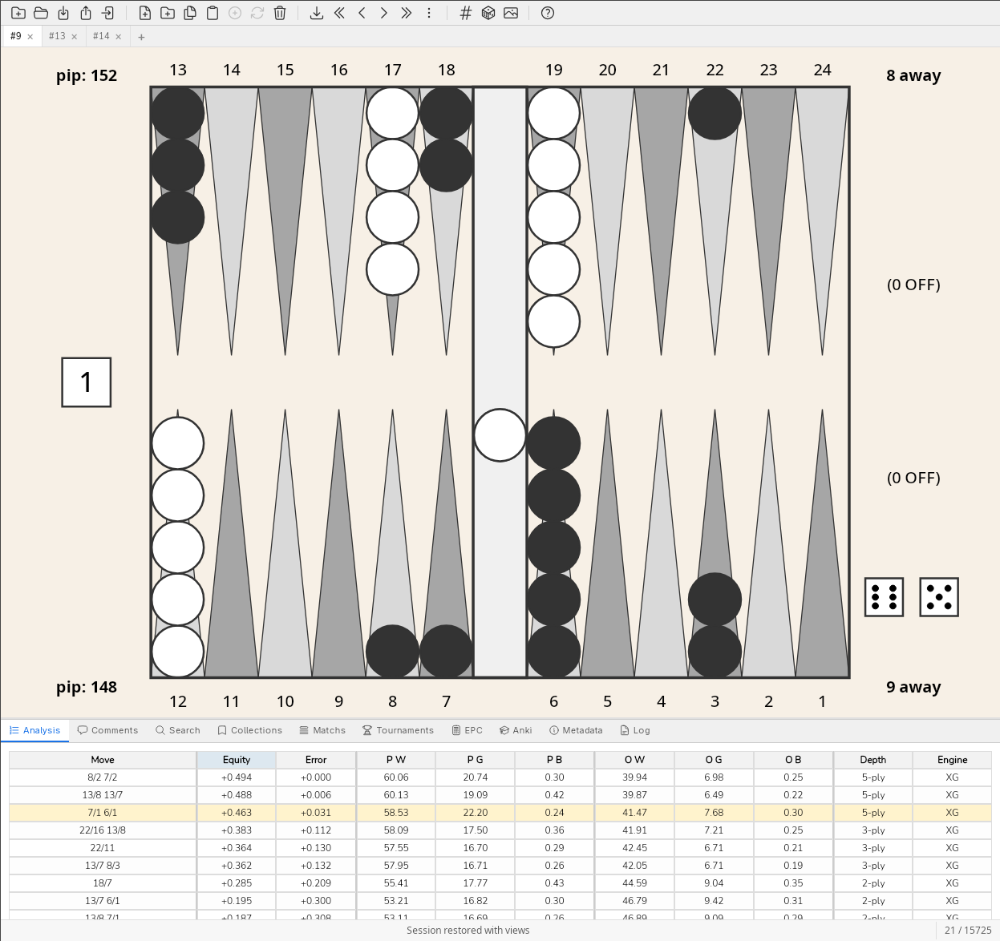

# blunderDB

A backgammon blunder analysis tool. Desktop app (GUI + CLI) for importing, storing, searching, and studying positions from eXtreme Gammon, GnuBG, and BGBlitz.

[](https://github.com/kevung/blunderDB/actions/workflows/build.yml)
[](https://kevung.github.io/blunderDB/)
[](LICENSE)



## Features

- **Import matches** from eXtreme Gammon (`.xg`/`.xgp`), GnuBG (`.sgf`), BGBlitz (`.bgf`), and Jellyfish (`.mat`)
- **Search positions** by checker structure, pip count, equity, error threshold, dice, contact/no-contact, and more
- **Spaced repetition** (FSRS/Anki-style) flash cards for position review
- **EPC calculator** with embedded GnuBG one-sided bearoff database
- **Collections and tournaments** for organising positions
- **Match Equity Tables** display (Kazaross, Rockwell, …)
- **CLI** for scripted import, export, search, and analysis workflows
- **Cross-platform:** Linux, macOS, Windows

## Installation

### Download

Grab a pre-built binary from [GitHub Releases](https://github.com/kevung/blunderDB/releases).

### Build from source

Prerequisites: Go 1.23+, Node.js 23+, [Wails v2](https://wails.io/).

```bash
go install github.com/wailsapp/wails/v2/cmd/wails@latest
git clone https://github.com/kevung/blunderDB.git
cd blunderDB
wails build            # binary at build/bin/blunderdb
```

On Linux with webkit2gtk-4.1:

```bash
wails build -tags webkit2_41
```

## Usage

### GUI

Launch the binary with no arguments to start the desktop app:

```bash
./blunderdb
```

Open or create a `.db` file, then import match files via the toolbar or drag-and-drop.

### CLI

```bash
./blunderdb import --db my.db --type match --file game.xg   # import a match
./blunderdb search --db my.db --error ">0.05"                # search by error
./blunderdb list   --db my.db --type stats                   # show statistics
./blunderdb export --db my.db --type positions --file out.txt # export positions
```

See [CLI_USAGE.md](CLI_USAGE.md) for the full command reference.

## Tech stack

| Layer | Technology |
|-------|------------|
| Backend | Go · pure-Go SQLite ([modernc.org/sqlite](https://pkg.go.dev/modernc.org/sqlite)) |
| Frontend | Svelte 5 · Vite · two.js (board rendering) |
| Framework | [Wails v2](https://wails.io/) (Go ↔ WebView bridge) |
| Docs | Sphinx (French + English) |

## Documentation

Full documentation is available at [GitHub Pages](https://kevung.github.io/blunderDB/).

## Contributing

Contributions are welcome — open an issue or submit a pull request.

Before submitting, please run:

```bash
go test ./...                          # backend tests
cd frontend && npm test && npm run lint # frontend tests + lint
```

## License

[MIT](LICENSE)
