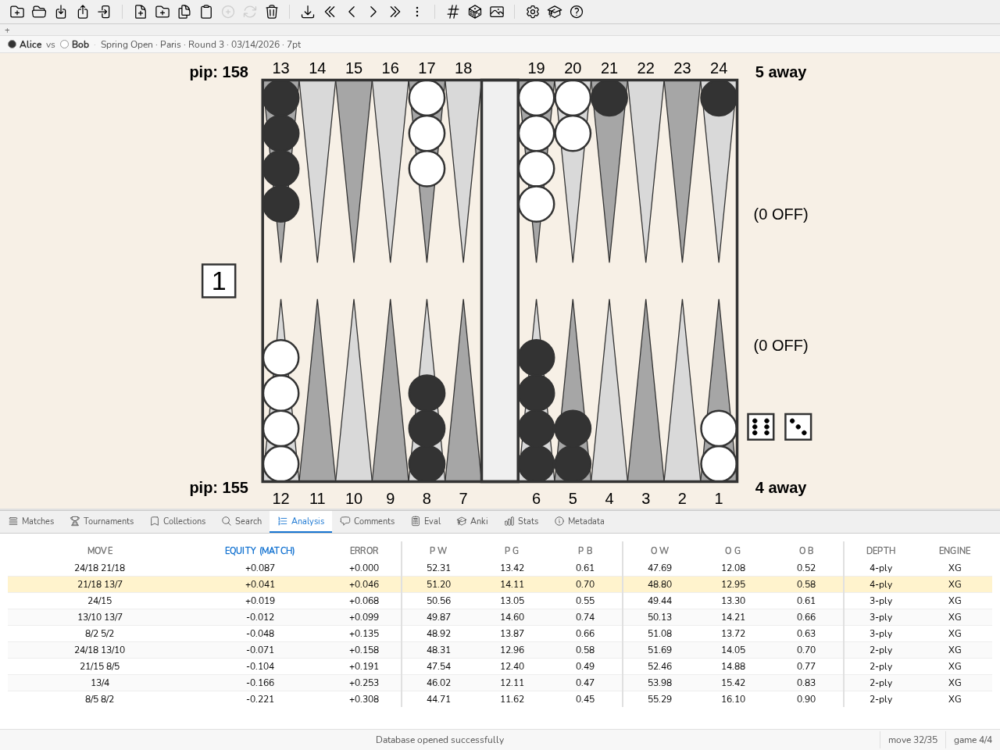

# blunderDB



A backgammon blunder analysis tool. Import your matches from eXtreme Gammon, GnuBG and BGBlitz, store every position once, search them by structure and by mistake, measure your play, and study the positions you keep getting wrong — with an evaluator built in.

[](https://github.com/kevung/blunderDB/actions/workflows/build.yml)
[](LICENSE)

Documentation, in nine languages: <https://kevung.github.io/blunderDB/>

## Features

**A library of positions**

- **Import matches** from eXtreme Gammon (`.xg`, `.xgp`), GnuBG (`.sgf`), BGBlitz (`.bgf`) and Jellyfish (`.mat`), by file, by folder or by drag-and-drop. Positions are deduplicated across imports; imported analyses, comments, luck and XG flags travel with them.
- **Search** by checker structure (including an *except* structure), pip count, score, cube, dice, equity and error thresholds, contact/no-contact, comments, flags, player, match or tournament. Every filter has a command-line token, and filter sets can be saved as a library.
- **Collections and tournaments** to organise positions and matches; match navigation with the played move highlighted.
- **Export** a match to Jellyfish/GnuBG `.mat` to replay it in another program; export positions, or selected parts of a database.

**Measuring and studying**

- **Stats panel**, four tabs: *Dashboard* (PR, Snowie error rate, MWC cost, rolling PR, top blunders), *Progression* (per tournament and per match), *Errors* (checker vs. cube, direction of cube errors, magnitude histogram) and *Players*, which compares every player in the database (record, PR, error rate, blunders, luck). Indicators are aligned on XG and GnuBG, and each one drills down to the positions behind it.
- **Spaced repetition** (Anki-style, FSRS scheduler) with study and cram modes, forecasts and parameter optimisation.
- **Eval panel** with an embedded evaluator: **gammonNet**, ported to Go and compiled into the binary, evaluates any position offline — neural network, 0- to 2-ply search, Janowski cube decisions, match-aware search. The panel shows the facts of the position (win, gammon and backgammon chances, equity) and the one decision the board asks; match equities are normalised, and "too good to double" is a verdict you actually see. Races run in three regimes: **exact** from a two-sided bearoff table (up to 6 checkers embedded, up to 11 with an optional 1.2 GB download), **evaluated** by gammonNet beyond it, and **estimated** — a win probability with an error bound, never a cube verdict. A *challenge* mode hides the numbers until you click.
- **Batch analysis** fills the positions that have no analysis, after an import or across an existing library (`blunderdb analyze`), without ever overwriting an imported analysis.

**Sharing a database**

- **Origin watermark**: a signed mark, verified on open, that says what a file is and where it came from — and records nothing on the recipient's side.
- **Password protection**: an encrypted `.dbx` container (AES-256-GCM, Argon2id) with a readable header.

**One binary, five modes**, dispatched on the first argument:

| Mode | Purpose |
|---|---|
| *(no argument)* | Desktop app (Wails: Go backend, Svelte frontend) — Linux, macOS, Windows |
| `create`, `import`, `export`, `search`, `list`, `edit`, `match`, `epc`, `analyze`, `vacuum`, `verify`, `identity`, `info`, … | Command-line interface over the same database — see [CLI_USAGE.md](CLI_USAGE.md) |
| `serve` | Headless HTTP + JSON daemon on SQLite or multi-tenant PostgreSQL, meant to run behind an authenticating reverse proxy — see [doc/source/mode_headless.rst](doc/source/mode_headless.rst) |
| `migrate` | Copy a SQLite database into PostgreSQL under a tenant |
| `call` | Generic in-process dispatcher over the daemon's handlers, for scripting and tests |

The interface is available in English, French, German, Italian, Spanish, Finnish, Japanese, Greek and Russian.

## Installation

Every asset on the [Releases page](https://github.com/kevung/blunderDB/releases) comes with a `.sha256` file; verify with `sha256sum -c`.

| Platform | How |
|---|---|
| Debian, Ubuntu, Mint | `sudo apt install ./blunderdb_x.y.z_amd64.deb` |
| Fedora, openSUSE | `sudo dnf install ./blunderdb-x.y.z.x86_64.rpm` |
| Arch Linux | `yay -S blunderdb-bin` (AUR, updated on each release) |
| Other Linux | Raw binary — `webkit2gtk-4.1` build for current distributions, `webkit2gtk-4.0` build for Ubuntu 22.04-era systems |
| macOS | Universal `.app` (unsigned — see the security appendix in the docs) |
| Windows | `.exe` (unsigned — see the security appendix in the docs) |

winget and Homebrew are not published yet: each release ships the rendered manifests (`blunderDB-winget-manifests-x.y.z.zip`, `blunderdb-x.y.z.rb`) — see `packaging/winget/` and `packaging/homebrew/` for the submission steps.

The headless daemon also builds as a container image from `Dockerfile.serve`.

### Build from source

Prerequisites: Go 1.25, Node.js 23, [Wails v2](https://wails.io/) CLI 2.10.

```bash
go install github.com/wailsapp/wails/v2/cmd/wails@v2.10.2
git clone https://github.com/kevung/blunderDB.git
cd blunderDB
make build            # wails build -tags webkit2_41 → build/bin/blunderDB
make dev              # hot-reload development build
```

`make build` targets webkit2gtk-4.1; plain `wails build` targets webkit2gtk-4.0. The daemon alone builds without Wails or CGO: `go build ./cmd/serve`.

## Usage

```bash
./blunderDB                                                    # desktop app
./blunderDB import  --db my.db --type match --file game.xg      # import a match
./blunderDB search  --db my.db --error-min 0.05                 # search by error
./blunderDB list    --db my.db --type players                   # players table
./blunderDB analyze --db my.db                                  # fill missing analyses
./blunderDB serve   --db my.db --addr 127.0.0.1:8080            # headless daemon
```

In the desktop app, open or create a `.db` file, then import match files via the toolbar or drag-and-drop. A demo database (`demo` command) and guided tours are built in.

## Tech stack

| Layer | Technology |
|---|---|
| Backend | Go · pure-Go SQLite ([modernc.org/sqlite](https://pkg.go.dev/modernc.org/sqlite)) · PostgreSQL (server mode) |
| Evaluator | gammonNet ported to Go · GnuBG bearoff tables (one-sided and two-sided) |
| Frontend | Svelte 5 · Vite · two.js (board rendering) |
| Framework | [Wails v2](https://wails.io/) (Go ↔ WebView bridge) |
| Docs | Sphinx, 9 languages (French source + 8 gettext translations) |

## Contributing

Contributions are welcome — open an issue or submit a pull request. Read [CLAUDE.md](CLAUDE.md) first: it holds the working rules and the invariants that tests do not catch, and every user-visible change ships with its French documentation in the same branch.

CI runs the following; run them before pushing anything nontrivial:

```bash
go vet ./...
go test ./...
go test -race ./...
golangci-lint run ./...          # v2, config in .golangci.yml
govulncheck ./...
cd frontend && npm run lint && npm run format:check && npm test && npm run test:e2e
```

Design decisions are recorded in [docs/adr/](docs/adr/README.md).

## License

[MIT](LICENSE)
