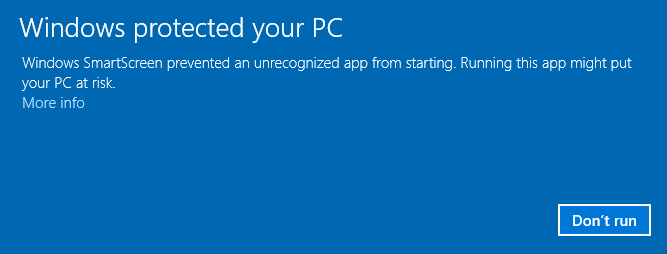
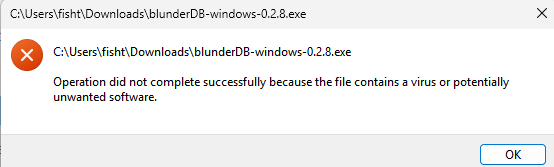
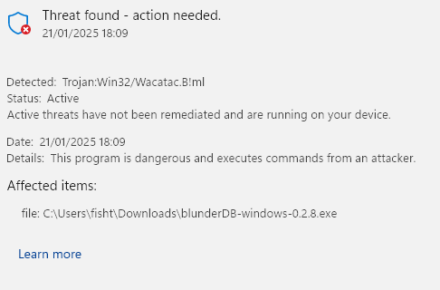
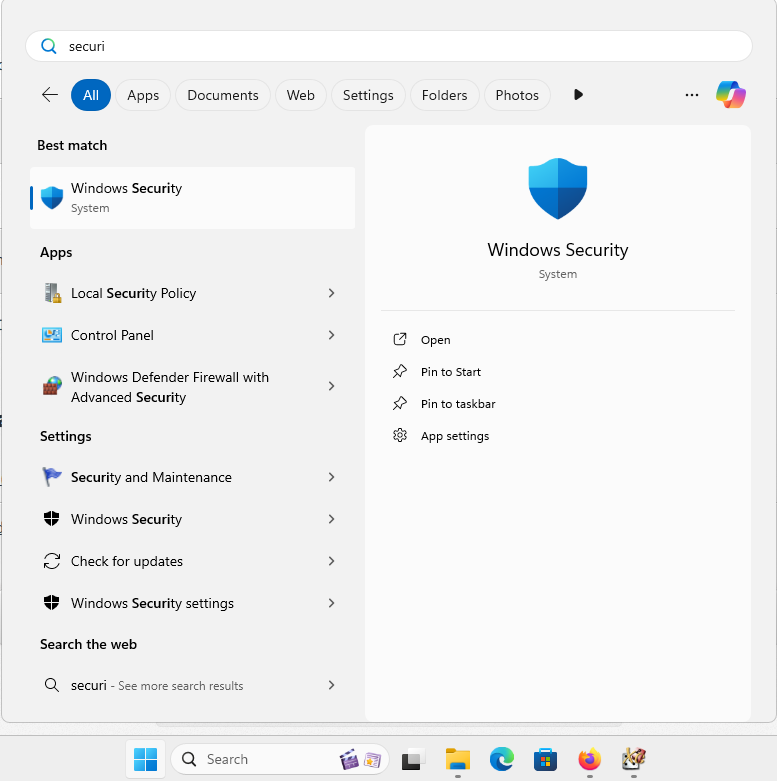
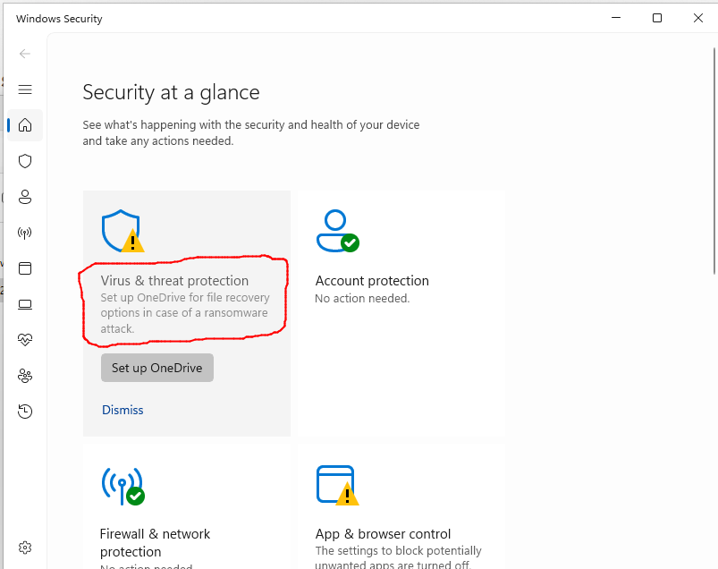
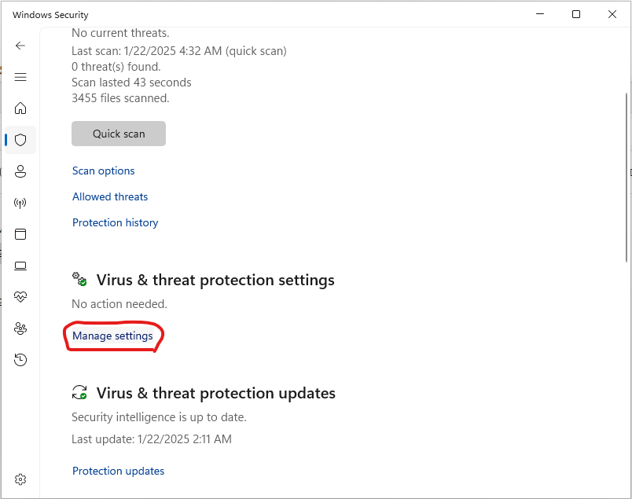
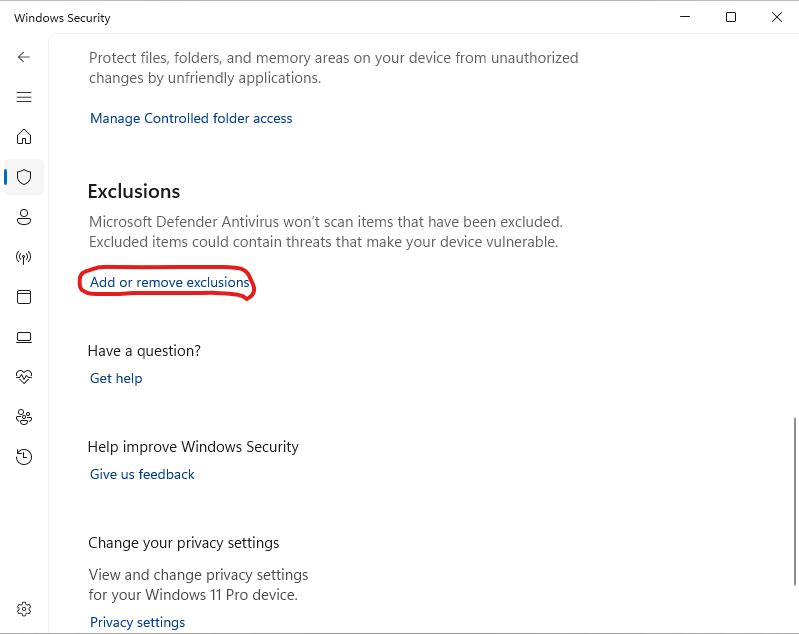
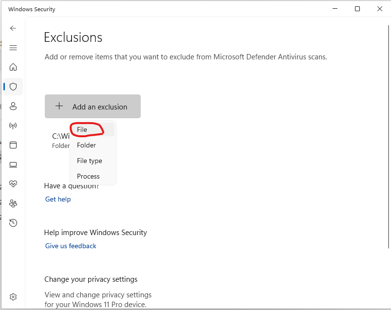
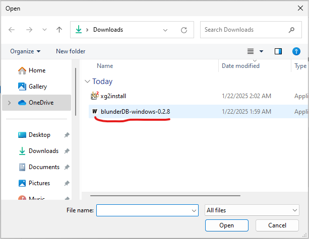
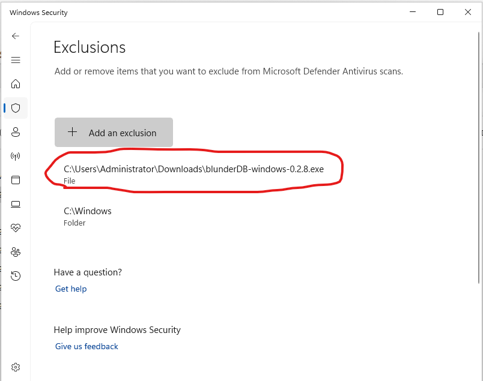

.. _annexe_windows_malware:

Annexe Windows : que faire si Windows bloque le lancement
=========================================================

.. note:: Ce qui suit concerne les systèmes d'exploitation Windows 10 et 11.

Windows requiert aujourd'hui de la part de sociétés d'édition logicielle ou
d'éditeurs logiciel indépendants de certifier numériquement leurs applications
voire de distribuer via le Windows Store. Il est alors préconisé de faire appel
à des sociétés extérieures pour obtenir un certificat numérique au prix de
plusieurs centaines d'euros (voir par exemple
https://learn.microsoft.com/en-us/archive/blogs/ie_fr/certificats-de-signature-de-code-ev-extended-validation-et-microsoft-smartscreen
).

Partageant blunderDB gratuitement, je ne souhaite pas m'orienter vers ces
possibilités onéreuses. Une piste **gratuite** réservée aux logiciels libres
(la *SignPath Foundation*, https://signpath.org/) a été explorée, mais la
candidature n'a pas abouti ; les binaires Windows ne sont donc pas signés
numériquement. Il est par conséquent fort probable que Windows vous avertisse
d'un potentiel danger, voire bloque complètement l'exécution de blunderDB. Les
sections suivantes expliquent les opérations à réaliser pour passer outre les
réticences de Windows, et comment vérifier l'intégrité du binaire téléchargé.

Avertissement Windows SmartScreen
---------------------------------

Après téléchargement de blunderDB, lors de son exécution, il est possible que
Windows affiche un avertissement du type

.. note:: Cette copie d'écran provient d'un Windows en anglais. Sur un Windows
   en français, le même écran s'intitule *Windows a protégé votre ordinateur* ;
   le lien à cliquer est *Informations supplémentaires* (*Informations
   complémentaires* selon la version de Windows), et le bouton qui apparaît
   ensuite est *Exécuter quand même*.

**Deux clics suffisent dans la quasi-totalité des cas** — *Informations
supplémentaires*, puis *Exécuter quand même* — et il n'y a rien d'autre à
faire : ni exclusion antivirus, ni réglage à modifier. La section suivante ne
concerne que les rares cas où le blocage ne venait pas de SmartScreen.

Si vous souhaitez autoriser un exécutable spécifique bloqué par SmartScreen :

1. **Essayer d’exécuter l'exécutable** :

   - Lorsque vous essayez de lancer l'exécutable, SmartScreen peut le bloquer
     et afficher un avertissement.

2. **Cliquer sur "Informations supplémentaires"** :

   - Dans la fenêtre d'avertissement de SmartScreen, cliquez sur **Informations
     supplémentaires**.

3. **Sélectionner "Exécuter quand même"** :

   - Si vous faites confiance à l'exécutable, cliquez sur **Exécuter quand
     même** pour contourner l'avertissement SmartScreen pour cette instance.

Blocage Windows Defender
------------------------

Cette section est un **dernier recours**, à ne suivre que si le blocage ne
venait pas de SmartScreen. Pour certains paramétrages de sécurité, il arrive
en effet que malgré le déblocage décrit ci-dessus, Windows Defender empêche
l'exécution de blunderDB avec des messages du type

ou encore

voire le placer en quarantaine.

Windows Defender est connu pour déclencher des faux positifs. Ce problème est
explicitement mentionné dans la FAQ du site officiel de Golang (
https://go.dev/doc/faq#virus ) ou dans des tickets Github de certains projets
programmés en Go ( https://github.com/golang/vscode-go/issues/3182 ).

.. warning:: Exclure un fichier de l'analyse antivirus n'est pas un geste
   anodin : l'exclusion porte sur un chemin, et tout fichier placé ensuite à
   cet endroit échappera lui aussi à l'analyse. Vérifiez d'abord l'empreinte
   SHA-256 du fichier téléchargé (section suivante) : c'est elle, et non
   l'exclusion, qui atteste que vous exécutez bien le binaire publié.

Si vous souhaitez malgré tout empêcher la Sécurité Windows d’analyser
blunderDB :

1. **Ouvrir la Sécurité Windows** :

   - Allez dans **Démarrer** et tapez **Sécurité Windows**.

2. **Aller à "Protection contre les virus et menaces"** :

   - Cliquez sur **Protection contre les virus et menaces**.

3. **Gérer les paramètres** :

   - Faites défiler vers le bas et cliquez sur **Gérer les paramètres** sous Paramètres de protection contre les virus et menaces.

4. **Ajouter ou supprimer des exclusions** :

   - Faites défiler jusqu’à la section **Exclusions** et cliquez sur **Ajouter ou supprimer des exclusions**.

5. **Ajouter une exclusion** :

   - Cliquez sur **Ajouter une exclusion** et sélectionnez **Fichier**. Naviguez ensuite jusqu’à
     l’exécutable que vous souhaitez exclure et sélectionnez-le.

Vérifier l'intégrité du téléchargement (SHA256)
-----------------------------------------------

Chaque binaire publié sur la page des *releases* est accompagné d'un fichier
``.sha256`` contenant son empreinte cryptographique. Vérifier cette empreinte
permet de s'assurer que le fichier téléchargé est authentique et n'a pas été
altéré, ce qui constitue une garantie utile en l'absence de signature de code.

Sous Windows (PowerShell), dans le dossier de téléchargement :

.. code-block:: powershell

   Get-FileHash .\blunderDB-windows-<version>.exe -Algorithm SHA256

Comparez la valeur affichée avec celle du fichier
``blunderDB-windows-<version>.exe.sha256``. Les deux doivent être identiques.

Sous Linux ou macOS :

.. code-block:: bash

   sha256sum -c blunderDB-linux-<version>.sha256      # Linux
   shasum -a 256 -c blunderDB-macos-<version>.zip.sha256   # macOS

