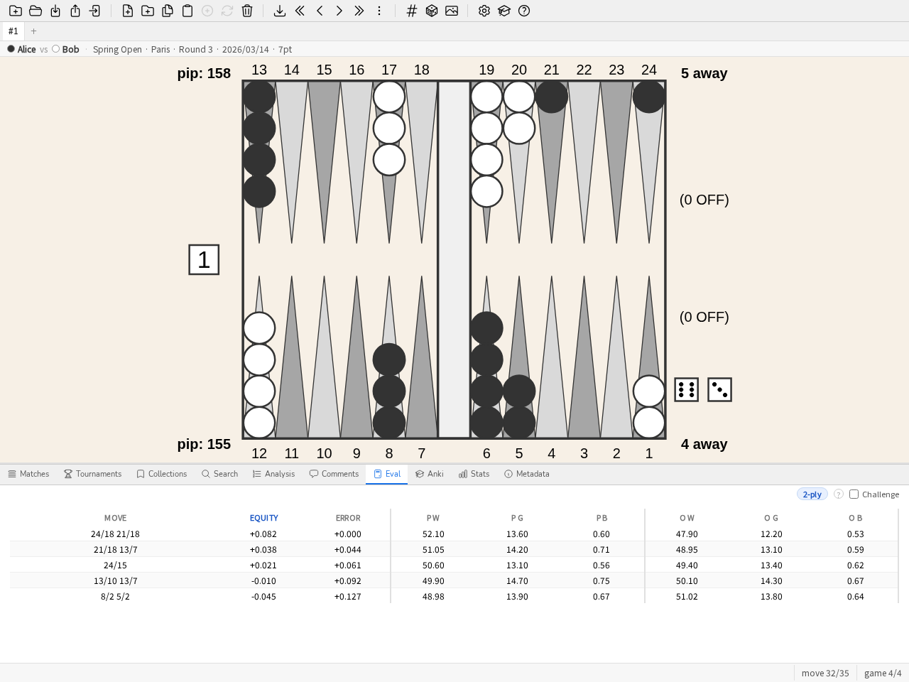

.. _guide_utilisateur:

Guide utilisateur
=================

Ce guide est une introduction pratique à blunderDB pour une prise en main
rapide. Quatre tutoriels de bout en bout couvrent les usages les plus
courants ; la suite du guide reste un catalogue de référence, geste par
geste, à consulter au besoin.

.. _ecran_accueil:

L'écran d'accueil
-----------------

Tant qu'aucune base n'est ouverte, blunderDB propose quatre chemins plutôt
qu'un plateau vide :

* **Importer mes matchs** — le chemin principal. Il enchaîne tout seul : une
  base neuve, le choix de vos fichiers (XG, GNU Backgammon, Jellyfish,
  BGBlitz), puis le :ref:`compte rendu d'import <compte_rendu_import>` —
  « voici votre PR et vos pires décisions » — et, si vous le voulez, la
  :ref:`file d'étude <file_etude>`. C'est la promesse de l'outil tenue en
  deux minutes, plutôt qu'expliquée.
* **Ouvrir la base d'exemple** — trois matchs, des collections, des
  commentaires et un paquet Anki : de quoi tout essayer sans rien apporter.
* **Visite guidée** — le tour de l'interface, panneau par panneau.
* **Ouvrir une base** — un fichier ``.db`` que vous avez déjà.

La dernière base ouverte est proposée à part, et **seulement si son fichier
existe encore** : un bouton qui échoue au clic est pire que pas de bouton.

L'écran s'efface dès qu'une base est ouverte. Un lien discret l'écarte pour
la session, parce que le panneau Eval fonctionne sans base : on peut vouloir
poser une position et l'évaluer sans rien avoir à ouvrir.

Tutoriels de bout en bout
--------------------------

.. _tuto_premier_import:

Mon premier import
~~~~~~~~~~~~~~~~~~~

Ce tutoriel part d'un fichier de match eXtreme Gammon (``.xg``) et arrive à
la liste des positions où vous avez le plus perdu.

#. **Créer une base.** Bouton *Nouvelle base de données* de la barre
   d'outils (ou *CTRL-N*), choisir un emplacement et un nom ; l'extension
   ``.db`` est ajoutée automatiquement.

#. **Importer le match.** Glisser-déposer le fichier ``.xg`` sur la fenêtre
   de blunderDB (ou *CTRL-I*, puis le sélectionner). blunderDB détecte le
   format, importe les positions, l'analyse déjà présente dans le fichier
   XG (coups, décisions de videau, marques) et affiche le panneau des
   matchs sur l'import réussi.

   .. note:: blunderDB reprend l'analyse déjà présente dans le fichier, il
      n'en refait pas une : un match jamais analysé dans XG n'a donc aucune
      erreur à montrer. Si la case *Analyser automatiquement après import*
      est cochée (fenêtre de configuration, onglet *gammonNet*), un lot
      d'analyse borné et annulable comble en tâche de fond les positions
      dépourvues d'analyse. Voir :ref:`configuration`.

#. **Revoir le match.** Double-cliquer sur la ligne du match (ou la
   sélectionner et appuyer sur *ENTREE*) ouvre la revue sur la dernière
   position visitée. Les touches *GAUCHE*/*DROITE* (ou *k*/*j*) parcourent
   les coups ; *PageUp*/*PageDown* changent de partie.

#. **Lire l'analyse.** *CTRL-L* affiche le panneau Analyse : les meilleurs
   coups, leur équité et l'erreur du coup joué (surligné dans la table).
   Sur une décision de videau, la même touche affiche la table des
   équités de videau et le verdict.

   .. figure:: img/panel_analysis.png
      :width: 100%
      :alt: Panneau Analyse pendant la revue d'un match

      Le panneau Analyse pendant la revue d'un match : le coup joué est
      surligné dans la table des coups candidats.

#. **Trouver les plus grosses erreurs.** Ouvrir le panneau Stats (*CTRL-D*),
   onglet *Dashboard* : la liste *Top blunders* donne les dix erreurs les
   plus coûteuses, et cliquer sur une ligne charge la position concernée
   dans le panneau d'analyse. Pour les habitués, la même chose au clavier :
   la commande ``bl`` (ou ``blunders``, *ESPACE* pour ouvrir la ligne de
   commande) charge directement ces positions, sans construire de recherche
   à la main. Voir :ref:`stats` pour affiner ce choix par joueur ou par
   plage de dates une fois plusieurs matchs importés.

.. _tuto_etudier_match:

Étudier un match
~~~~~~~~~~~~~~~~~

Une fois plusieurs matchs importés, ce tutoriel détaille l'étude d'un match
en particulier — au-delà du simple parcours du tutoriel précédent.

#. **Ouvrir le panneau des matchs** (*CTRL-Tab*). Il liste tous les matchs
   importés, triables par colonne (joueur, date, longueur, tournoi, PR).
   Le PR et le coût MWC sont définis dans le :ref:`glossaire`.

   .. figure:: img/panel_matches.png
      :width: 100%
      :alt: Panneau des matchs

      Le panneau des matchs : liste triable, PR et coût MWC par match.

#. **Ouvrir la revue** en double-cliquant sur la ligne, ou en la
   sélectionnant puis *ENTREE*. La barre d'informations au-dessus du
   plateau rappelle les deux joueurs, le tournoi et le score.

#. **Basculer coups de pions / décision de videau** avec la touche *d* sur
   une même position quand les deux analyses sont disponibles (l'une des
   deux peut être absente selon ce que le fichier importé contenait).

   .. figure:: img/panel_cube.png
      :width: 100%
      :alt: Panneau Analyse sur une décision de videau

      Une décision de videau dans le panneau Analyse : équités money,
      erreur de chaque option, meilleure décision.

#. **Annoter** ce que vous observez : *CTRL-P* ouvre le panneau
   Commentaires sur la position affichée — utile pour noter *pourquoi* un
   coup est un blunder, pas seulement *qu'il l'est*.

   .. figure:: img/panel_comments.png
      :width: 100%
      :alt: Panneau Commentaires sur une position

      Le panneau Commentaires : un fil d'échanges attaché à la position
      affichée.

#. **Étiqueter** une position à rejouer plus tard : *ESPACE* pour ouvrir la
   ligne de commande, ``#`` suivi d'un mot-clé (par exemple ``#blitz``),
   *ENTREE*. Voir :ref:`guide_edit_position` pour éditer directement la
   position si le coup joué n'est pas celui que vous voulez étudier.

#. **Sortir du mode match** avec la commande ``m`` : la bibliothèque
   retrouve son état précédent, la dernière position visitée du match est
   mémorisée pour la prochaine visite.

.. _tuto_anki:

Une session Anki
~~~~~~~~~~~~~~~~~~

Le panneau Anki transforme une collection ou une recherche en paquet de
cartes à réviser selon l'algorithme FSRS (répétition espacée).

#. **Constituer le paquet.** Deux points de départ possibles : une
   :ref:`collection <guide_collections>` de positions choisies à la main,
   ou une recherche (*CTRL-F*) — par exemple toutes les décisions de videau
   marquées comme des erreurs. La commande ``bl 30`` (30 pires erreurs)
   fournit un point de départ tout indiqué pour un premier paquet.

#. **Créer le paquet.** Ouvrir le panneau Anki (*CTRL-K*), bouton *Nouveau paquet*,
   nommer le paquet ; il se synchronise sur la recherche ou la
   collection choisie.

   .. figure:: img/panel_anki.png
      :width: 100%
      :alt: Panneau Anki, liste des paquets

      Le panneau Anki : un paquet par ligne, cartes totales, nouvelles et
      dues aujourd'hui.

#. **Réviser** (bouton *Étudier*) : chaque carte montre une position, vous formulez
   votre réponse mentalement, dévoilez la solution (le plateau, l'analyse
   et le commentaire éventuel), puis notez votre estimation de 1 (raté) à 4
   (facile). FSRS espace la prochaine présentation en conséquence. Rien
   n'oblige à dévoiler la réponse pour continuer si vous êtes sûr de vous.

#. **S'échauffer sans perturber l'échéancier** (bouton *Entraînement*) : présente des
   positions aléatoires du paquet sans toucher au planning FSRS — pratique
   avant un tournoi, ou pour réviser intensément sans décaler les
   échéances des autres cartes.

Voir :ref:`panneau_anki` pour le détail des paramètres (limiter la séance,
taux de rétention visé, réinitialisation d'un paquet).

.. _tuto_serveur_proxy:

Déployer le mode serveur derrière un proxy
~~~~~~~~~~~~~~~~~~~~~~~~~~~~~~~~~~~~~~~~~~~

Le mode serveur (``blunderdb serve``) expose le moteur de blunderDB en HTTP
+ JSON. Il **n'authentifie personne** (`ADR-0005 <https://github.com/kevung/blunderDB/blob/main/docs/adr/0005-serve-daemon-delegates-authentication.md>`__) : il fait confiance à
l'en-tête ``X-Tenant-ID`` tel qu'il le reçoit, et doit donc toujours être
placé derrière un reverse-proxy qui, lui, authentifie et fixe cet en-tête.
Ce tutoriel déploie l'image publiée derrière un nginx minimal, en
authentification HTTP Basic à un seul tenant, puis montre comment donner son
tenant à chaque membre. C'est le point de départ le plus simple, à adapter
(SSO, certificats clients) selon votre contexte.

#. **Lancer le démon**, replié sur ``127.0.0.1`` (jamais exposé
   directement) :

   .. code-block:: bash

      docker run --rm -p 127.0.0.1:8080:8080 -v blunderdb-data:/data \
          -e BLUNDERDB_BACKEND=sqlite -e BLUNDERDB_DSN=/data/blunderdb.db \
          ghcr.io/kevung/blunderdb-serve:<version>

#. **Créer un fichier de mot de passe** pour l'authentification Basic :

   .. code-block:: bash

      htpasswd -c /etc/nginx/blunderdb.htpasswd alice

#. **Configurer nginx** pour authentifier puis relayer, en fixant
   ``X-Tenant-ID`` lui-même — jamais celui envoyé par le client. Un
   certificat TLS est un prérequis de ce tutoriel et non son objet :
   obtenez-le au préalable (Let's Encrypt avec ``certbot``, ou l'autorité de
   certification de votre organisation), puis désignez ses deux fichiers
   ici. Le port 80 ne sert qu'à rediriger vers HTTPS.

   .. code-block:: nginx

      server {
          listen 80;
          server_name blunderdb.exemple.org;
          return 301 https://$host$request_uri;
      }

      server {
          listen 443 ssl;
          server_name blunderdb.exemple.org;

          ssl_certificate     /etc/letsencrypt/live/blunderdb.exemple.org/fullchain.pem;
          ssl_certificate_key /etc/letsencrypt/live/blunderdb.exemple.org/privkey.pem;

          location /v1/ {
              auth_basic           "blunderDB";
              auth_basic_user_file /etc/nginx/blunderdb.htpasswd;

              proxy_set_header   X-Tenant-ID "";
              proxy_set_header   X-Tenant-ID "1";
              proxy_pass         http://127.0.0.1:8080;
          }
      }

   Les deux ``proxy_set_header`` se lisent dans cet ordre : effacer d'abord
   la valeur reçue du client, injecter ensuite celle du proxy.

#. **Vérifier** avec la sous-commande de santé, qui ne passe pas par le
   proxy :

   .. code-block:: bash

      docker exec <container> blunderdb healthcheck

#. **Plusieurs membres, un tenant chacun.** Le démon n'accepte dans
   ``X-Tenant-ID`` qu'un entier positif : c'est au proxy d'associer le compte
   authentifié à cet entier. Un bloc ``map`` placé dans le contexte ``http``
   tient cette correspondance, et retombe sur la chaîne vide pour un compte
   qui n'y figure pas — jamais sur ``1`` :

   .. code-block:: nginx

      map $remote_user $tenant_id {
          default "";
          alice   1;
          bob     2;
      }

   Le ``location`` refuse alors explicitement un compte non mappé, plutôt que
   de le laisser atteindre le démon :

   .. code-block:: nginx

      location /v1/ {
          auth_basic           "blunderDB";
          auth_basic_user_file /etc/nginx/blunderdb.htpasswd;

          if ($tenant_id = "") { return 403; }

          proxy_set_header   X-Tenant-ID "";
          proxy_set_header   X-Tenant-ID $tenant_id;
          proxy_pass         http://127.0.0.1:8080;
      }

   Un tenant par membre suppose le backend PostgreSQL : sur SQLite, comme au
   point 1 de ce tutoriel, le démon ne répond que pour ``X-Tenant-ID: 1`` et
   rejette toute autre valeur. Le dépôt fournit ce schéma complet dans
   ``deploy/nginx-tenant-proxy.conf``, et son équivalent Caddy dans
   ``deploy/Caddyfile``.

Voir :ref:`headless` pour la surface complète (routes, backend PostgreSQL
multi-tenant avec Row-Level Security, migration depuis SQLite) et l'image
Docker publiée.

Comment progresser avec blunderDB
------------------------------------

Au-delà des tutoriels ci-dessus, une routine hebdomadaire simple tire le
plus de blunderDB pour progresser :

#. **Importer** ses matchs de la semaine (glisser-déposer, ou import de
   dossier récursif si plusieurs fichiers) dès que possible après les avoir
   joués — la mémoire du contexte s'estompe vite.

#. **Filtrer les décisions coûteuses** : commande ``bl`` (pires erreurs), ou
   panneau Stats filtré sur la période et le type de décision (pions /
   videau) qui pèse le plus dans le PR.

#. **Commenter** chaque position revue : ce qui a été manqué, la structure
   en cause. Un commentaire écrit force une explication — une position
   simplement revue sans un mot s'oublie aussi vite qu'elle a été manquée.

#. **Constituer un paquet Anki** à partir de ces positions commentées : la
   répétition espacée fait revenir les mêmes motifs jusqu'à ce qu'ils
   deviennent des réflexes.

#. **Suivre le PR par tournoi** dans l'onglet Progression du panneau Stats
   (:ref:`stats`) : une courbe qui baisse tournoi après tournoi est le seul
   signal qui ne ment pas.

Cette routine ne vaut que si elle est répétée — dix minutes par semaine,
tenues, valent mieux qu'une remise à plat ponctuelle et abandonnée.

Scénario de démonstration (3 minutes)
----------------------------------------

Pour présenter blunderDB sans base personnelle, la commande ``demo``
charge une base d'exemple (positions et matchs fictifs). Le scénario
suivant se déroule en trois minutes :

#. *0:00* — ``demo`` en ligne de commande (ou le bouton correspondant de la
   barre d'outils) charge la base d'exemple. Le panneau des matchs
   s'affiche.

#. *0:30* — Ouvrir un match (double-clic), parcourir quelques coups aux
   flèches, montrer le panneau Analyse (*CTRL-L*) sur un coup joué avec une
   erreur visible.

#. *1:30* — Commande ``bl`` : la vue bascule directement sur les pires
   erreurs de la base, toutes positions confondues.

#. *2:15* — Panneau Anki (*CTRL-K*) : créer un paquet à partir de ces
   positions, lancer une carte en *Study* pour montrer le cycle
   question/réponse/notation.

#. *2:45* — Retour au panneau Stats (*CTRL-D*), onglet Dashboard, pour
   montrer où ce travail se lit dans la durée.

Créer une nouvelle base de données
----------------------------------

Pour créer une nouvelle base de données, cliquer dans la barre d'outils sur le
bouton *Nouvelle base de données*. Choisir un chemin où enregistrer la base
de données, ainsi qu'un nom, et valider l'enregistrement dans la fenêtre du
système.

.. note::
   L'extension des bases de données blunderDB est *.db*.

.. tip::
   Raccourcis clavier: *CTRL-N*. Commande: ``n``

Ouvrir une base de donnée existante
-----------------------------------

Pour charger une base de données existante, cliquer dans la barre d'outils sur
le bouton *Ouvrir une base de données*. Choisir le chemin où se trouve la
base de données, choisir le fichier *.db* et valider l'ouverture dans la
fenêtre du système.

.. tip::
   Raccourcis clavier: *CTRL-O*. Commande: ``o``

Fusionner une base de données
-----------------------------

Pour fusionner une autre base blunderDB dans celle actuellement ouverte, cliquer
dans la barre d'outils sur le bouton **Fusionner une base de données**. Choisir
le fichier *.db* et confirmer.

C'est aussi la réponse de blunderDB à la question « comment synchroniser ma base
entre deux machines ? » : une base est **un seul fichier**, deux bases qui ont
divergé se fusionnent plutôt qu'elles ne se réconcilient, et la déduplication
par empreinte Zobrist fait le travail. Voir la FAQ, « Puis-je synchroniser ma
base entre plusieurs machines ? », pour ce que les services de synchronisation
de fichiers savent et ne savent pas faire — et pour le cas où plusieurs postes
doivent travailler en même temps, qui est celui du mode ``serve``.

blunderDB va fusionner intelligemment les deux bases de données:

* Les positions qui n'existent pas dans la base de données actuelle seront
  ajoutées avec leurs analyses et commentaires.

* Les positions qui existent déjà seront mises à jour: les analyses seront
  complétées si manquantes, et les commentaires seront fusionnés (ajout des
  nouveaux commentaires sans dupliquer les existants).

* Un message résumera le nombre de positions ajoutées, fusionnées et ignorées.

Une fusion **ajoute**, elle ne réconcilie pas : rien n'est supprimé de la base
courante parce que la base importée ne le contient pas.

.. note::
   L'import nécessite que les deux bases de données aient des versions de schéma
   compatibles. Il est possible d'importer une base de données d'une version
   inférieure ou égale dans une base de données de version supérieure.

.. caution::
   L'opération d'import modifie immédiatement la base de données actuellement
   ouverte. Il est recommandé de faire une copie de sauvegarde avant d'importer
   une autre base de données.

.. _guide_edit_position:

Editer une position
-------------------

Pour éditer une position, appuyer sur la touche *TAB* pour ouvrir le
panneau de recherche et l'éditeur de position.
Editer la position à la souris:

* cliquer sur les points pour ajouter des pions. Le clic gauche attribue les
  pions au joueur 1. Le clic droit attribue les pions au joueur 2. Pour insérer
  une prime, cliquer sur le point de départ, maintenir le bouton appuyé,
  relacher sur le point d'arrivée. Cliquer sur la barre pour mettre des
  pions à la barre.

* pour effacer la position, double-clic sur une zone vide en dehors du board ou
  appuyer sur la touche *RETOUR ARRIERE*.

* pour envoyer le cube vers le joueur 1, clic gauche sur le cube. Pour envoyer
  le cube vers le joueur 2, click droit sur le cube.

* pour indiquer le joueur qui a le trait, cliquer à l'emplacement prévu des dés.

* pour éditer les dés, clic gauche pour augmenter la valeur d'un dé, clic droit
  pour augmenter la valeur d'un dé. Si la face des dés est vide, cela signifie
  que la position est une décision de cube.

* pour éditer le score des joueurs, clic gauche pour augmenter le score, clic
  droit pour réduire le score.

.. tip:: La saisie de la position avec la souris pour les pions se fait de la
   même manière que dans XG.

Ajouter une position à la base de données
-----------------------------------------

Après l'édition de la position, le panneau de recherche est ouvert.

Pour enregistrer la position obtenue précédemment, faire *CTRL-S* ou appuyer
dans la barre d'outils sur le bouton *Enregistrer la position*.

.. tip:: Ouvrir la ligne de commande et exécuter: ``w``

Etiqueter une position
----------------------

Pour ajouter un tag *toto* à la position courante, ouvrir la ligne de commande en appuyant sur *ESPACE*,
taper ``#toto`` et valider la commande en appuyant sur *ENTREE*.

Supprimer une position
----------------------

Pour supprimer la position courante de la base de données, faire *Del* ou
cliquer dans la barre d'outils sur le bouton *Supprimer la position*.

.. tip:: En ligne de commande, exécuter ``d``.

.. caution:: La suppression de la position est définitive ; une confirmation
   est demandée avant.

Import une position depuis XG
-----------------------------

Pour importer une position directement depuis XG,

#. afficher dans XG la position à importer et appuyer *CTRL-C*,

#. afficher blunderDB et appuyer *CTRL-V*.

.. note::
   Le collage automatique détecte le format de la source (XG, GNUbg, BGBlitz),
   ainsi que l'identifiant OGID d'OpenGammon.

Importer un match
-----------------

blunderDB peut importer des matchs depuis différentes sources.

**Formats supportés:**

* eXtreme Gammon (XG): fichiers *.xg* et *.xgp* (positions)
* GNUbg: fichiers *.sgf*
* Jellyfish: fichiers *.mat* et *.txt*
* BGBlitz: fichiers *.bgf* et *.txt*

**Pour importer un ou plusieurs fichiers de match:**

#. Appuyer sur *CTRL-I* ou cliquer sur le bouton *Importer une
   position ou un match* dans la barre d'outils.

#. Sélectionner un ou plusieurs fichiers à importer.

#. blunderDB détecte automatiquement le format et importe le match.

#. Une fenêtre de progression affiche le nombre de fichiers importés, échoués
   et ignorés (doublons), puis un **compte rendu d'import**.

.. tip::
   Commande: ``i``

.. note::
   blunderDB détecte automatiquement les doublons et empêche l'import d'un
   match déjà présent dans la base de données.

Importer un dossier de matchs
------------------------------

Pour importer récursivement tous les fichiers de matchs contenus dans un
dossier et ses sous-dossiers:

#. Appuyer sur *CTRL-MAJ-F* ou cliquer sur le bouton correspondant dans la
   barre d'outils.

#. Sélectionner le dossier contenant les fichiers de matchs.

#. blunderDB collecte et importe automatiquement tous les fichiers reconnus
   (*.xg*, *.xgp*, *.sgf*, *.mat*, *.txt*, *.bgf*).

.. _compte_rendu_import:

Le compte rendu d'import
------------------------

Un import se termine sur un compte rendu de **ce qu'il vient d'apporter**, et
non sur un simple décompte de fichiers lus :

* les positions nouvelles, et parmi elles celles que le logiciel d'origine
  avait marquées pour étude ;
* le **PR de cet import** — le même indicateur que les statistiques, calculé
  sur ce seul lot. Il porte sur vos décisions lorsque la base connaît votre
  nom (champ *Utilisateur* de la fenêtre d'identité), sur les deux joueurs
  sinon, et le compte rendu dit lequel ;
* les positions qu'aucun moteur n'a évaluées, avec un bouton pour lancer
  l'analyse ;
* les **cinq décisions les plus coûteuses**, cliquables : un clic ouvre la
  position.

Un PR nul sur zéro décision n'est pas une partie parfaite mais l'absence
d'analyse : le compte rendu l'écrit ainsi.

Chaque import est enregistré comme un **lot**. La ligne de commande les
retrouve après coup :

.. code-block:: console

   $ blunderdb list --db base.db --type imports
   $ blunderdb list --db base.db --type imports --batch 3

La moitié mesurée du compte rendu — positions sans analyse, PR, pires
décisions — est recalculée à chaque consultation. Un lot dont les positions
ont été analysées depuis rend donc les chiffres d'aujourd'hui, non ceux du
jour de l'import.

.. _file_etude:

La file d'étude
---------------

Le compte rendu répond à « que vient-il de se passer ? ». Le bouton
**Parcourir** répond à la question qui suit : « qu'est-ce que je regarde
maintenant ? ». Il ouvre une **file ordonnée** des positions de ce lot qui
méritent un second regard, et la fait défiler une par une sur le plateau :

#. les décisions qui ont **coûté quelque chose**, la plus chère d'abord — ce
   pour quoi on est venu ;
#. les positions **marquées dans le logiciel d'origine** : vous aviez déjà
   dit, ailleurs, que celle-ci était intéressante ;
#. les **décisions de videau serrées** : rien n'a été perdu, mais la bonne
   réponse n'allait pas de soi.

Une position n'apparaît qu'une fois, sous la première raison qui la réclame :
un blunder marqué reste un blunder, et l'offrir deux fois ferait mentir la
file sur sa propre longueur. Le parcours est borné à cinquante positions —
une file qu'on ne finit pas est une file qu'on ne commence pas.

Une bande apparaît au-dessus du plateau pendant le parcours : la progression
(« 3 / 25 »), la raison de cette position, le match dont elle vient, et les
gestes. Trois d'entre eux ouvrent simplement le panneau où le geste se prend
déjà — **Commenter**, **Collection**, **Carte Anki** — parce que ces gestes
existent avec leurs règles, et que les refaire dans la bande en aurait fait
des demi-copies. **Passer** avance, **Précédente** corrige un clic,
**Quitter** arrête. Le reste de l'application continue de fonctionner : c'est
justement ce qui permet d'agir sans sortir de la file.

**Rien n'est enregistré, et rien ne note qu'une position a été vue.** Ce que
vous en faites — un commentaire, une collection, une carte — *est* la trace,
et il n'y a rien d'autre à garder. Relancer la même file plus tard est donc
parfaitement légitime, et elle sera la même.

La même liste s'obtient en ligne de commande :

.. code-block:: console

   $ blunderdb list --db base.db --type imports --batch 3 --queue

Glisser-déposer
----------------

blunderDB supporte le glisser-déposer. Il est possible de glisser-déposer
sur la fenêtre de blunderDB:

* des fichiers de match ou de position (*.xg*, *.xgp*, *.sgf*, *.mat*, *.txt*, *.bgf*)
  pour les importer,

* des fichiers de base de données (*.db*) pour les ouvrir ou les fusionner
  avec la base de données courante,

* des dossiers pour importer récursivement tous les fichiers qu'ils contiennent.

Naviguer dans un match
-----------------------

Pour naviguer dans un match importé:

#. Ouvrir le panneau des matchs avec *CTRL-Tab*.

#. Double-cliquer sur un match ou appuyer sur *ENTREE*.

#. Utiliser les touches *GAUCHE* / *DROITE* pour parcourir les coups.

#. Utiliser *PageUp* / *PageDown* pour passer d'une partie à l'autre.

#. Appuyer sur *CTRL-L* pour afficher l'analyse.

#. Appuyer sur *d* pour basculer entre l'analyse des coups de pions et du cube.

.. tip::
   Raccourci: *CTRL-Tab* pour ouvrir le panneau des matchs.
   Commande: ``m``

.. note::
   blunderDB mémorise la dernière position visitée dans chaque match. En
   revenant sur un match, la dernière position consultée est automatiquement
   restaurée.

Gérer le panneau des matchs
-----------------------------

Le panneau des matchs (*CTRL-Tab*) permet de:

* lister l'ensemble des matchs importés (triés du plus récent au plus ancien),

* trier les matchs par colonnes (joueur 1, joueur 2, date, longueur du match,
  tournoi),

* modifier les noms des joueurs ou la date en double-cliquant sur les champs,

* permuter les joueurs 1 et 2 à l'aide du bouton de permutation,

* assigner un match à un tournoi,

* supprimer un match à l'aide de la touche *Del*.

.. _guide_collections:

Gérer les collections
---------------------

Les collections permettent d'organiser des positions en groupes personnalisés.
Pour accéder au panneau des collections, appuyer sur *CTRL-B*.

**Créer une collection:**

#. Ouvrir le panneau des collections (*CTRL-B*).

#. Saisir le nom de la nouvelle collection dans le champ *Nouvelle
   collection…* en bas du panneau, puis valider avec *ENTREE*.

**Ajouter des positions à une collection:**

#. Sélectionner les positions souhaitées.

#. Les ajouter à la collection depuis le panneau des collections.

**Parcourir une collection:**

* Double-cliquer sur une collection pour parcourir ses positions.
  L'ordre des collections et des positions peut être modifié par
  glisser-déposer.

.. tip::
   Commande: ``coll``

Gérer les tournois
------------------

Les tournois permettent d'organiser les matchs importés par événement.
Pour accéder au panneau des tournois, appuyer sur *CTRL-Y*.

**Créer un tournoi:**

#. Ouvrir le panneau des tournois (*CTRL-Y*).

#. Saisir le nom du tournoi dans le champ *Nouveau tournoi…*, puis valider
   avec *ENTREE*.

**Assigner un match à un tournoi:**

* Depuis le panneau des matchs (*CTRL-Tab*), utiliser le menu déroulant
  de la colonne tournoi pour assigner un match.

Afficher les statistiques de performance
-----------------------------------------

Le panneau Stats permet de visualiser ses indicateurs de performance (PR et coût MWC)
à partir des positions importées.

#. Appuyer *CTRL-D* ou cliquer sur l'onglet Stats dans le panneau inférieur.

#. Utiliser la barre de filtre pour restreindre l'analyse par joueur,
   tournoi, plage de dates, type de décision ou longueur de match.

#. Cliquer sur un indicateur pour accéder directement aux positions correspondantes.

Évaluer une position (panneau Eval)
------------------------------------

Le panneau Eval évalue n'importe quelle position — pas seulement une course.
Sur une position de bearoff pur, il calcule l'EPC (Effective Pip Count, voir
le :ref:`glossaire`) et
les autres statistiques de bearoff ; sur toute autre position, l'évaluateur
embarqué gammonNet fournit les coups candidats ou la décision de videau,
hors ligne, sans XG ni GNUbg.

   Le panneau Eval : chances de gain/gammon/backgammon, équité et erreur de
   chaque coup candidat, calculées par gammonNet.

#. Appuyer *CTRL-E*, cliquer sur l'onglet Eval dans le panneau inférieur,
   ou exécuter la commande ``epc`` : le panneau s'ouvre sur un plateau
   vierge, prêt à éditer.

#. Pour évaluer la position déjà affichée (une position de la bibliothèque,
   ou celle d'un match en cours de revue) plutôt qu'un plateau vierge,
   clic droit sur le plateau puis *Évaluer cette position* — la position
   affichée est envoyée telle quelle dans le panneau Eval.

#. Le plateau entier s'édite au clic ou au clavier : pions, dés, score,
   position du videau, joueur au trait. Éditer uniquement les pions du jan
   (6 derniers points) des deux côtés place la position en régime bearoff.

#. Les résultats s'affichent en temps réel : en bearoff pur, EPC, nombre
   moyen de lancers, écart type, pip count et wastage, la probabilité de
   gain du joueur au trait et, dans le domaine exact, le verdict de videau
   money ; sur toute autre position avec des dés posés, les coups candidats
   classés par équité ; sans dés, la décision de videau. Voir la section
   « Méthodologie et hypothèses du panneau Eval » du manuel.

#. Pour s'entraîner à estimer ces valeurs, cocher la case *Défi* : les
   résultats sont masqués à chaque modification et se révèlent zone par
   zone, d'un clic.

.. note::
   Le panneau fonctionne pour les deux joueurs simultanément.

Afficher l'analyse d'une position importée depuis XG
----------------------------------------------------

Si une position analysée par XG, GNUbg ou BGBlitz a été importée dans
blunderDB, l'analyse peut être affichée en appuyant *CTRL-L*.

Si la position correspond à une décision de pions, les cinq meilleurs coups
sont affichés sur des lignes distinctes. Pour chaque ligne, les informations
fournies sont dans cet ordre, le coup de pion associé, l'équité normalisée,
l'erreur en équité du coup, les chances de gain, gammon et backgammon du
joueur, les chances de gain, gammon et backgammon de l'adversaire, le niveau
d'analyse. 

Si la position correspond à une décision de cube, le coût de chaque décision
est affiché ainsi que les chances de gain de la position.

Lorsque plusieurs moteurs d'analyse sont présents pour la même position
(par exemple XG et GNUbg), une colonne supplémentaire indique le moteur
d'origine de chaque analyse.

Lors de la navigation dans un match, le coup effectivement joué est mis en évidence dans la liste
des coups. Si la position a été rencontrée dans plusieurs
matchs, tous les coups joués sont indiqués.

.. tip::
   En cliquant sur un coup dans le panneau d'analyse, les flèches
   correspondantes sont affichées sur le board.

Exporter une position vers XG
-----------------------------

Pour exporter une position de blunderDB vers XG,

#. afficher dans blunderDB la position à exporter et appuyter *CTRL-C*,

#. afficher XG et appuyer *CTRL-V*.

Visualiser les différentes positions
------------------------------------

Pour visualiser les différentes positions de la bibliothèque courante, utiliser
les touches *GAUCHE* et *DROITE*. La touche *HOME* permet d'aller à la première
position. La touche *FIN* permet d'aller à la dernière position.

Pour afficher le bearoff à gauche, appuyer *CTRL-GAUCHE*. Pour afficher le
bearoff à droite, appuyer *CTRL-DROITE*.

Rechercher des positions selon des critères
-------------------------------------------

Pour rechercher des types de positions,

* appuyer sur *TAB* pour ouvrir le panneau de recherche,

* éditer la structure de position à rechercher. blunderDB va filtrer les
  positions ayant *a minima* la structure de pions saisie. Dans le
  doute, afin d'obtenir le maximum de résultats, effacer la position
  en appuyant sur la touche *RETOUR ARRIERE*. Editer si besoin la
  position du cube et le score.

Le panneau de recherche propose deux structures de pions, sélectionnables par
les onglets *Au moins* et *Sauf* situés en haut du panneau :

* *Au moins* (par défaut) : blunderDB filtre les positions ayant *a minima* la
  structure de pions saisie ;

* *Sauf* : blunderDB exclut les positions contenant l'un des pions saisis. Le
  plateau est bordé de rouge lors de l'édition de cette structure. Une position
  est rejetée si elle contient *au moins un* des éléments dessinés (par exemple,
  dessiner un pion sur les points 1, 3 et 5 ne conserve que les positions n'ayant
  aucun pion sur ces points). Le nombre de pions par point n'est pas limité :
  indiquer 3 pions sur un point exclut les positions ayant 3 pions ou plus à cet
  endroit (utile pour rechercher une porte sans spare). Deux clics rapides sur un
  point le marquent comme devant être vide (cellule rouge hachurée, aucun pion
  quelle que soit la couleur) ; un simple clic sur ce point le débloque.

Lorsqu'un point appartient aux deux structures, le critère *Sauf* l'emporte
s'il contredit le critère *Au moins*.

Méthode 1 (simple):

* Ouvrir la fenêtre de recherche (*CTRL-F*)

* Ajouter et paramétrer les filtres de recherche

* Valider en cliquant sur *Rechercher*.

Méthode 2 (avancée):

* ouvrir la ligne de commande en appuyant sur *ESPACE*,

* écrire *s*, ajouter d'éventuels filtres supplémentaires (par exemple
  *cube* ou *score* pour prendre respectivement en compte le cube et le
  score. Voir :ref:`cmd_filter` pour une liste exhaustive des
  filtres disponibles).

* valider la requête en appuyant sur *ENTREE*.

Les positions affichées sont celles de la base de données ayant vérifié
les critères de recherche entrés par l'utilisateur.

Pour aller plus loin
---------------------

Ce guide couvre les usages les plus courants. blunderDB propose plusieurs
fonctionnalités supplémentaires, détaillées dans le manuel :

* **Répétition espacée (Anki)** — le panneau Anki (*CTRL-K*) transforme une
  collection ou une recherche en paquet de cartes à réviser selon
  l'algorithme FSRS, avec un mode d'entraînement libre (*cram*) qui ne
  perturbe pas l'échéancier. Voir :ref:`panneau_anki`.

* **Vues multiples** — une barre d'onglets sous la barre d'outils permet de
  garder plusieurs espaces de travail indépendants ouverts en parallèle (par
  exemple une recherche et la navigation dans un match), chacun avec sa
  propre liste de positions et son propre contexte. Voir :ref:`onglets_vues`.

* **Diffusion filigranée** — un export peut être signé avec votre identité
  d'émetteur (filigrane infalsifiable indiquant l'origine du fichier) et
  protégé par mot de passe pour son transport. Voir :ref:`diffusion_controlee`.

* **Visites guidées et base de démonstration** — la commande ``tour``
  (alias ``tutorial``) ouvre un catalogue de visites guidées de l'interface,
  et la commande ``demo`` charge une base d'exemple pour découvrir l'outil
  sans base de données personnelle. Voir :ref:`visites_guidees`.

* **Charger les pires erreurs** — la commande ``bl`` (ou ``blunders``)
  charge directement les pires erreurs (équité ou MWC) dans la vue
  d'analyse, selon le filtre courant du panneau Stats, sans passer par une
  recherche manuelle. Voir :ref:`stats`.

