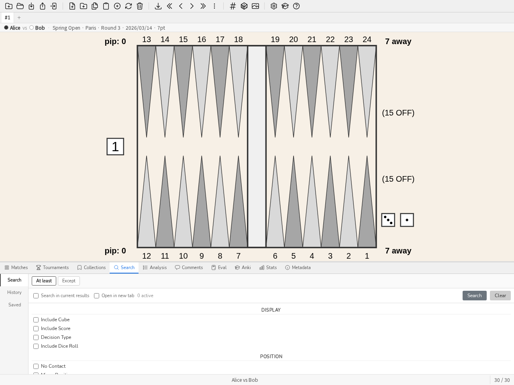
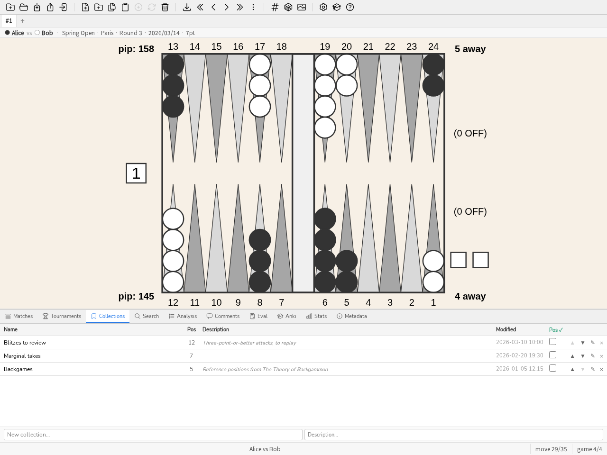
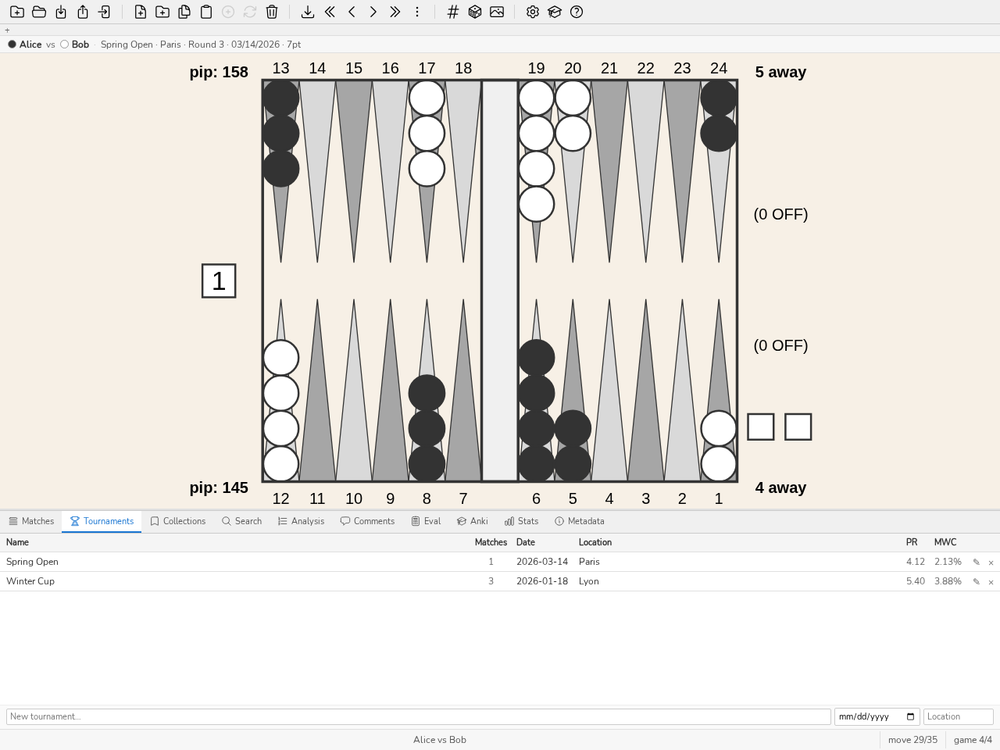
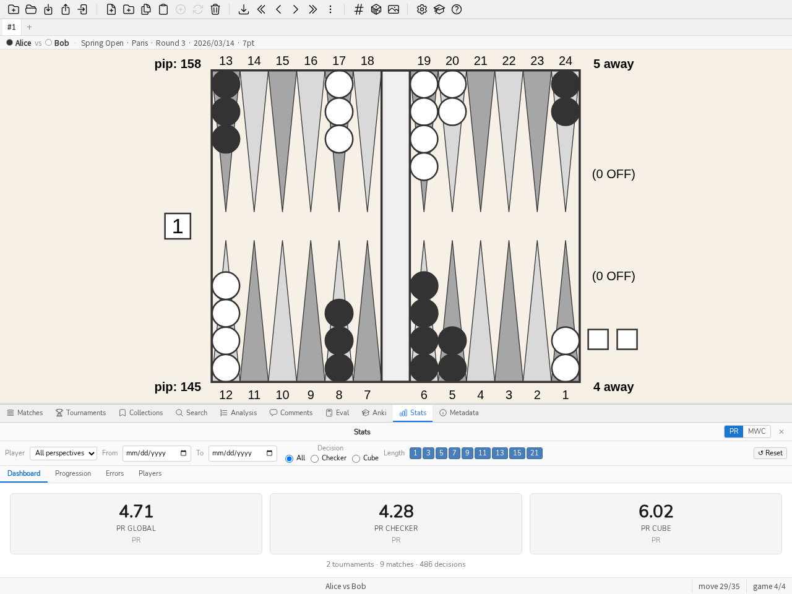
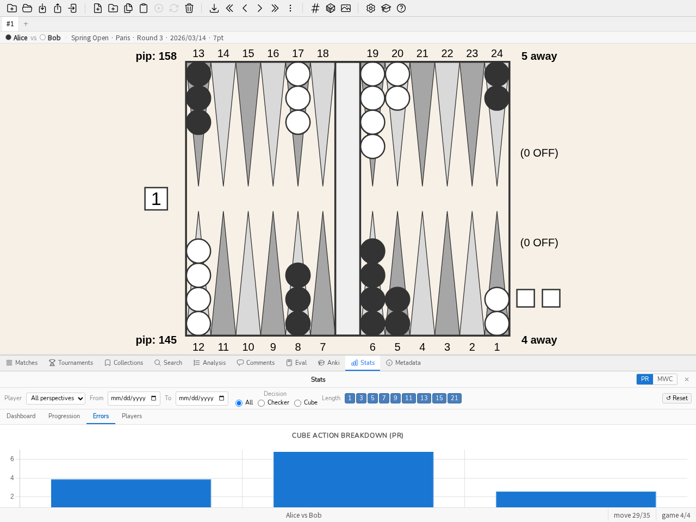
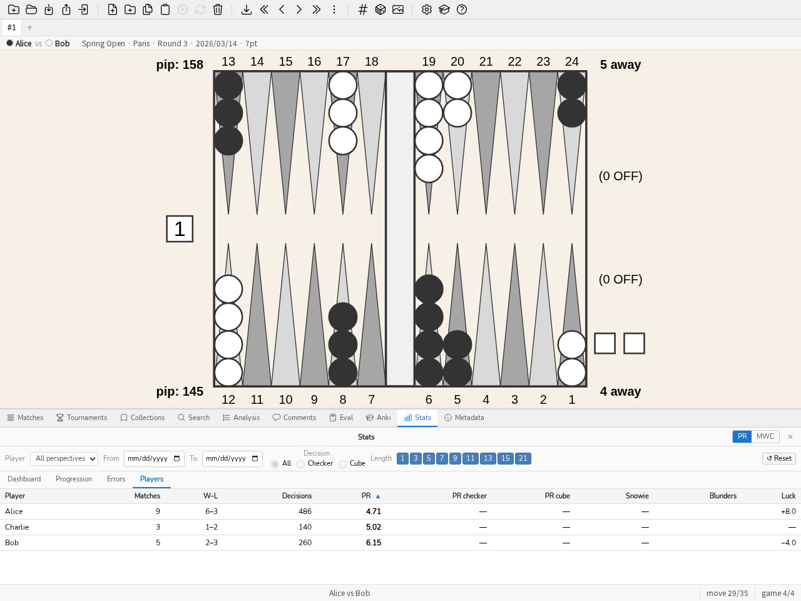

.. _manuel:

Manuel
======

Introduction
------------

blunderDB est un logiciel pour constituer des bases de données de
positions de backgammon. Sa force principale est de fournir un lieu unique
pour agréger les positions qu'un joueur a rencontrées (en ligne, en tournoi)
et de pouvoir les réétudier en les filtrant selon divers filtres arbitrairement
combinables. blunderDB peut également être utilisé pour créer des catalogues
de positions de référence.

Les positions sont stockées dans une base de données représentée par un fichier
*.db*. L'application de bureau ouvre ce fichier directement, jamais une adresse
réseau : le mode serveur (:ref:`headless`) est un autre mode du même binaire, et
l'on passe de l'un à l'autre en exportant ou en migrant la base, pas en pointant
l'application vers une URL.

Interactions principales
------------------------

Les principales interactions possibles avec blunderDB sont:

* ajouter une nouvelle position,

* modifier une position existante,

* copier l'image du board dans le presse-papier (PNG) via **CTRL-X**, ou avec l'analyse complète via **CTRL-X CTRL-X**,

* supprimer une position existante,

* rechercher une ou plusieurs positions,

* importer des matchs depuis différentes sources (XG, GNUbg, BGBlitz, Jellyfish), y compris les commentaires depuis les fichiers XG,

* naviguer dans les coups d'un match importé,

* organiser les positions en collections,

* organiser les matchs en tournois.

L'utilisateur peut étiqueter librement les positions à l'aide de tags et les
annoter via des commentaires.

Description de l'interface
--------------------------

L'interface de blunderDB est constituée de haut en bas par:

* [en haut] la barre d'outils, qui rassemble l'ensemble des principales
  opérations réalisables sur la base de données,

* [au milieu] la zone d'affichage principale, qui permet d'afficher ou d'éditer des
  positions de backgammon,

* [en bas] la barre d'état, qui présente différentes informations sur la
  base de données ou la position courante, et intègre la ligne de commande.

Des panneaux peuvent être affichés pour:

* afficher les données d'analyse associées à la position courante issues
  d'eXtreme Gammon (XG), GNUbg, ou BGBlitz,

* afficher, ajouter ou modifier des commentaires,

* rechercher et filtrer des positions selon des critères combinables,

* afficher et gérer les collections de positions (panneau collections),

* afficher la liste des matchs importés et naviguer dans les coups d'un match (panneau matchs),

* afficher et gérer les tournois (panneau tournois),

* afficher les statistiques de performance (panneau Stats),

* calculer l'EPC (Effective Pip Count) d'une position de bearoff (panneau Eval),

* étudier les positions par répétition espacée (panneau Anki),

* afficher les métadonnées de la base de données (panneau métadonnées).

Des fenêtres modales peuvent s'afficher pour:

* afficher l'aide de blunderDB,

* afficher le catalogue des visites guidées (voir :ref:`visites_guidees`),

* paramétrer l'export de la base de données,

* configurer blunderDB, notamment la langue de l'interface (voir
  :ref:`configuration`).

La zone d'affichage principale met à disposition à l'utilisateur:

* un board afin d'afficher ou d'éditer une position de backgammon,

* le niveau et le propriétaire du cube,

* le compte de course de chaque joueur,

* le score de chaque joueur,

* les dés à jouer. Si aucune valeur n'est affichée sur les dés, la
  position des dés indique quel joueur a le trait et que la position est
  une décision de cube. Lorsque la décision de cube est une réponse à un
  doublement (prise/passe), le videau proposé est affiché au centre du
  plateau, à la valeur offerte.

.. _board_menu_contextuel:

Un clic droit sur le plateau ouvre un menu contextuel proposant : évaluer la
position affichée dans le panneau Eval, évaluer son miroir, copier l'image
du plateau avec son analyse dans le presse-papier (l'équivalent de *CTRL-X
CTRL-X*, moins facile à découvrir), **enregistrer l'image dans un fichier**
en SVG ou en PNG, ouvrir une nouvelle vue sur cette position, et — si la
position vient déjà de la base — l'ajouter à un paquet Anki (répétition
espacée).

Le presse-papier est le geste courant ; enregistrer est l'autre besoin —
l'illustration d'un article, d'un message de forum, d'une leçon. Le **SVG** y
est proposé parce que le plateau en est un : c'est la forme qui survit à un
agrandissement, celle qu'on met dans un document sans la flouter. Le PNG en
dérive, comme la copie dans le presse-papier : un seul rendu, trois
destinations, donc aucune ne peut diverger des autres. Ce menu n'apparaît pas dans le panneau Eval ni
dans le panneau Recherche, où le bouton droit sert déjà à poser les pions de
l'autre couleur. Voir :ref:`eval_amener_position` pour amener une position
dans le panneau Eval.

La barre d'état est structurée de gauche à droite par les informations
suivantes:

* la ligne de commande, accessible en appuyant sur la touche *ESPACE*,

* un message d'information lié à une opération réalisée par l'utilisateur,

* l'index de la position courante, suivi du nombre de positions dans la
  bibliothèque courante (ou les informations de coup/partie lors de la
  navigation dans un match).

.. note:: Dans le cas de positions issues d'une recherche par l'utilisateur, le
   nombre de positions indiqué dans la barre d'état correspond au nombre de
   positions filtrées.

.. _onglets_vues:

Onglets de vues
---------------

Sous la barre d'outils, une barre d'onglets permet de travailler avec
plusieurs **vues** en parallèle. Chaque vue est un espace de travail
indépendant qui conserve sa propre liste de positions, l'index de la position
courante, la position affichée, l'analyse et le coup sélectionné, le panneau
actif, le commentaire en cours ainsi que le contexte de navigation dans un
match. Il est ainsi possible, par exemple, de garder une recherche ouverte
dans une vue tout en parcourant un match dans une autre.

* **Créer une vue** : cliquer sur le bouton *+* de la barre d'onglets ou
  appuyer sur *CTRL-T*. La nouvelle vue démarre comme une copie de la vue
  courante.

* **Fermer une vue** : cliquer sur la croix de l'onglet ou appuyer sur
  *CTRL-W*. La dernière vue ne peut pas être fermée.

* **Changer de vue** : cliquer sur un onglet, appuyer sur *CTRL-PageUp* /
  *CTRL-PageDown* (ou *MAJ-J* / *MAJ-K*) pour passer à la vue précédente /
  suivante, ou *CTRL-1* à *CTRL-9* pour atteindre directement la n-ième vue.

* **Renommer une vue** : double-cliquer sur l'onglet, saisir le nouveau nom
  et valider avec *ENTREE*.

Les vues sont enregistrées avec l'état de session de la base de données et
restaurées à sa réouverture.

.. _configuration:

Configuration
-------------

Le bouton de configuration (icône en forme de rouage) situé dans la barre
d'outils, à gauche du bouton d'aide, ouvre la fenêtre de configuration de
blunderDB. Elle est organisée en six onglets :

* **Interface** — langue, échelle d'affichage, position du panneau ;
* **Couleurs** — les couleurs du plateau ;
* **Bearoff** — les tables de sortie utilisées par le panneau Eval ;
* **gammonNet** — les réglages de l'évaluateur embarqué, décrits ci-dessous ;
* **Dossier surveillé** — l'import automatique des matchs qui arrivent dans un
  dossier, décrit ci-dessous ;
* **Identité d'émetteur** — la clé qui signe vos filigranes, décrite à la
  section :ref:`diffusion_controlee`.

L'onglet *Interface* propose d'abord un **thème** : *suivre le système*,
*clair*, *sombre*, *contraste élevé* ou *imprimable*. Le thème règle les
couleurs de l'interface et **propose une palette de plateau** — une interface
sombre autour d'un plateau clair n'est pas un thème sombre, c'est la moitié
d'un, puisque le plateau occupe l'essentiel de la fenêtre.

Vous gardez le dernier mot, et le mécanisme le garantit plutôt que de le
promettre : l'onglet *Couleurs* continue de régler le plateau directement, et
une couleur choisie après le thème est la vôtre. Au démarrage, seuls les
jetons de l'interface sont appliqués, jamais la palette du plateau — celle que
vous avez réglée est déjà chargée, et la réécrire à chaque lancement
effacerait votre travail une session à la fois. Voir
`ADR-0038 <https://github.com/kevung/blunderDB/blob/main/docs/adr/0038-a-named-theme-carries-the-board-palette-and-the-user-still-has-the-last-word.md>`__.

*Suivre le système* est le réglage par défaut : il obéit à la préférence
clair/sombre du bureau, y compris lorsqu'elle change en cours de session. Un
outil n'impose pas son clair ou son sombre à un bureau qui a déjà tranché.

L'onglet *Interface* permet aussi de choisir la langue parmi l'anglais, le
français, l'allemand, l'italien, l'espagnol, le finnois, le japonais, le grec
et le russe. L'ensemble de l'interface (barre d'outils, panneaux, messages,
aide) est traduit dans la langue sélectionnée. Le choix de la langue est
enregistré et conservé d'une session à l'autre.

Le même onglet propose aussi le bouton **Compacter la base**, qui récupère
l'espace disque laissé par les suppressions (matchs, tournois, purges) : la
base de données ne rétrécit jamais toute seule quand on supprime des données,
il faut demander explicitement ce compactage. L'opération peut prendre du
temps sur une grosse base et nécessite, temporairement, environ deux fois sa
taille en espace disque libre (blunderDB refuse de démarrer plutôt que de
risquer un compactage interrompu) ; une confirmation est donc demandée avant
de lancer l'opération. Le résultat — l'espace gagné, en mégaoctets — s'affiche
ensuite dans la barre d'état. La même opération est disponible en ligne de
commande via ``blunderdb vacuum`` (voir :ref:`cli`).

Le bouton **Ouvrir le dossier des journaux**, juste en dessous, ouvre le
dossier contenant le journal de l'application — utile pour joindre des
détails à un signalement de problème, en particulier quand blunderDB est
lancé depuis un raccourci ou un double-clic, sans terminal attaché pour
afficher quoi que ce soit.

La case **Vérifier les mises à jour au démarrage**, désactivée par défaut,
interroge une fois la page des dernières versions du dépôt GitHub à chaque
lancement et affiche, dans la barre d'état, un message si une version plus
récente est disponible — jamais une fenêtre qui bloque l'utilisation.
Cette vérification reste désactivée automatiquement sur une installation
passée par un gestionnaire de paquets (Flatpak, Homebrew, un paquet de
distribution…) : c'est ce canal-là qui gère alors les mises à jour, pas
blunderDB lui-même.

L'onglet *Couleurs* permet de personnaliser les couleurs du
plateau. Chaque élément dispose de son propre sélecteur de couleur : le fond,
la bordure, les flèches claires et foncées, les pions du joueur 1 et du joueur
2, les dés, les points des dés et le videau. Le bouton *Réinitialiser* rétablit
l'ensemble des couleurs par défaut. Comme la langue, les couleurs choisies sont
conservées d'une session à l'autre.

L'onglet *Bearoff* gère les tables de sortie du panneau Eval (voir
:ref:`panneau_epc`). Elles ne sont **ni embarquées dans l'exécutable, ni
téléchargées** : blunderDB les calcule sur la machine qui s'en sert, et le
résultat est identique octet pour octet à ce que produit gnubg — l'empreinte
SHA-256 est vérifiée avant que la table ne soit acceptée.

Les deux tables ordinaires (TS-06-06 pour le verdict de videau, OS-06 pour
l'EPC) sont calculées au premier lancement, en arrière-plan et sans rien
demander : environ six secondes sur un cœur, pendant lesquelles l'application
s'utilise normalement. Le panneau Eval ne le signale que si l'on y pose une
position qui a besoin d'une table pas encore prête.

L'onglet affiche le domaine actif et son origine, l'état de la table une face
que lit l'EPC, le dossier où tout cela vit, et la liste des tables présentes
avec leur taille et leur verdict. Chaque ligne se supprime individuellement,
après confirmation.

**Vérifiée ou non vérifiée.** Une table *vérifiée* a exactement les octets que
gnubg produit pour son domaine : son empreinte SHA-256 figure dans blunderDB et
a été retrouvée. Les empreintes enregistrées pour les tables une face (OS-06 à
OS-10) sont celles que produit l'outil ``makebearoff`` de GNUbg 1.08. Une table *non vérifiée* est bien formée mais son domaine n'a
pas d'empreinte enregistrée — rien ne lui est reproché, simplement personne ne
l'a comparée à la référence. Une table *corrompue* se contredit elle-même et
n'est jamais lue ; elle est recalculée.

**Calculer une table plus large.** Le domaine se choisit dans une liste à deux
familles, avec le nombre de cœurs à y consacrer (par défaut tous sauf un, pour
que la machine reste utilisable) :

* **videau exact (deux faces)**, de TS-06-06 à TS-06-15 : élargit le domaine où
  la probabilité de gain et le verdict de videau sont lus plutôt qu'estimés ;

* **EPC hors du jan (une face)**, de OS-06 à OS-10 : élargit la distance à
  laquelle un pion peut se trouver sans que le bloc EPC se taise. Ce balayage
  ne lit que des positions plus petites que celle qu'il calcule, donc il est
  séquentiel par construction et le nombre de cœurs ne lui sert à rien — le
  sélecteur le dit en se grisant.

Avant de lancer quoi que ce soit, l'onglet annonce trois chiffres pour le
domaine choisi : la taille sur le
disque, la mémoire nécessaire pendant le calcul, et le temps que cela devrait
prendre *sur cette machine*. Ce dernier commence par une estimation, puis
devient une mesure : chaque calcul assez large relève sa propre vitesse et la
conserve. Un domaine que la mémoire disponible ne permet pas est proposé grisé,
avec la raison — « il faudrait 24 Go, il en reste 12 » est une réponse, une
ligne absente n'en serait pas une.

À titre d'ordre de grandeur, sur une machine à seize fils : TS-06-09 pèse
191 Mo et demande une dizaine de secondes, TS-06-11 pèse 1,2 Go et quelques
minutes, TS-06-13 dépasse ce que la plupart des machines peuvent tenir en
mémoire. Du côté une face, sur un cœur : OS-07 pèse 4,9 Mo et prend 17 s,
OS-08 15 Mo et 1 min 20, OS-10 117 Mo et une demi-heure.

**Pause et reprise.** Pendant le calcul, la progression affiche le temps
restant *mesuré*, et deux boutons distincts : *Pause* et *Annuler*. La pause
écrit l'état du calcul à côté de la table ; le relancer reprend là où il s'est
arrêté au lieu de tout recommencer. Annuler ne garde rien. Fermer la fenêtre de
configuration n'interrompt rien — le calcul continue en arrière-plan.

Un calcul mis en pause se retrouve au lancement suivant, nommé et chiffré
(« TS-06-09 interrompue à 43 % »), avec *Reprendre* et *Supprimer*. Rien ne
redémarre tout seul : c'est l'utilisateur qui a demandé l'arrêt.

L'onglet permet enfin de pointer vers un fichier ``.bd`` two-sided externe, par
exemple une base produite par gnubg lui-même : la table au domaine le plus
large l'emporte.

L'onglet *Général* porte enfin **Réparer les analyses** : les colonnes
d'analyse que la recherche et les statistiques interrogent sont une projection
des analyses stockées, lesquelles restent intactes. Un défaut de projection se
répare donc sans rien réimporter. C'est explicite et jamais automatique —
réécrire les colonnes d'analyse de quelqu'un au seul motif qu'il ouvre sa base
n'est pas une chose qu'un outil doit faire dans son dos. Le même
``blunderdb repair`` est disponible en ligne de commande.

L'onglet **gammonNet** règle l'évaluateur embarqué (voir `ADR-0011 <https://github.com/kevung/blunderDB/blob/main/docs/adr/0011-gammonnet-is-ported-to-go-and-the-representation-boundary-sits-at-the-evaluator-s-edge.md>`__). Deux
profondeurs de recherche y sont réglables, nommées et conservées
séparément — abaisser l'une ne modifie jamais l'autre :

* **Profondeur d'affichage** — le confort interactif pendant l'édition du
  plateau ; jamais écrite en base.
* **Profondeur d'analyse** — ce que le lot d'analyse après import écrit dans
  l'Analyse d'une position.

Les deux valent par défaut **2-ply**, la configuration canonique. L'onglet
propose aussi l'**élagage** (par défaut ``k=12``) et le **nombre de coups
candidats affichés** (par défaut 10), ainsi qu'une case **analyser
automatiquement après import** qui, une fois activée, vérifie après chaque
import s'il reste des positions **sans aucune analyse** (ni gammonNet, ni XG,
ni GNUbg, ni BGBlitz — la règle est « une évaluation ne comble qu'un trou »,
jamais un remplacement) et, le cas échéant, lance en tâche de fond une analyse
gammonNet à la profondeur d'analyse configurée. Un bouton **Analyser
maintenant** relance manuellement le même rattrapage, utile pour une
bibliothèque constituée avant l'existence de cette fonctionnalité.

Un second bouton, **Ré-analyser les positions périmées**, couvre le cas
inverse : une position déjà analysée par gammonNet, mais dont l'analyse
stockée a été écrite par une version de moteur plus ancienne que celle en
cours d'exécution, ou à une profondeur différente de la profondeur d'analyse
configurée ci-dessus, y est signalée comme périmée et réévaluée. Une position
portant en plus une analyse XG, GNUbg ou BGBlitz n'est jamais touchée par ce
bouton, quel que soit son contenu gammonNet — la protection
d'`ADR-0013 <https://github.com/kevung/blunderDB/blob/main/docs/adr/0013-evaluations-fill-gaps-an-imported-analysis-is-never-overwritten.md>`__
reste inconditionnelle. Le nombre affiché à côté de chaque bouton (positions sans
analyse, positions périmées) est purement informatif ; le lot recalcule sa
propre liste au moment de démarrer.

Les deux lots sont **bornés, visibles et annulables, jamais un démon
silencieux** : leur progression (``positions analysées / total``) et un
bouton d'annulation apparaissent dans la barre de statut pendant toute leur
durée, et disparaissent une fois terminés au profit d'un message résumant le
résultat — combien de positions ont été **analysées**, combien ont été
**refusées** (une position que gammonNet décline d'évaluer, comme un score de
match hors de portée de sa table de match, ce qui n'est jamais une panne) et
combien ont **échoué** (retentées, inchangées, au prochain lancement).
Fermer l'application pendant l'un ou l'autre ne perd rien : chaque position
analysée est écrite au fil de l'eau, et un prochain lancement reprend
exactement là où l'analyse s'était arrêtée, sans aucun journal à tenir.

**Un match importé sans analyse obtient ainsi un PR.** C'est le cas d'un match
joué en ligne, ou d'un fichier Jellyfish ``.mat``, que personne n'a fait
passer par XG : blunderDB en connaissait les positions et les coups joués,
mais aucune analyse ne disait ce qu'ils valaient. Une fois le lot passé, le
coup effectivement joué est comparé au classement de gammonNet et l'écart
alimente le PR, le taux d'erreur, les pires décisions et tous les autres
indicateurs, exactement comme un match analysé par XG. La comparaison ne
s'invente rien : le coup joué vient de la table des coups du match, écrite à
l'import, que le fichier ait porté une analyse ou non.

Une base analysée avec une version antérieure à celle-ci n'a pas besoin d'être
réévaluée : ``blunderdb repair`` recalcule les colonnes à partir des analyses
et des coups déjà en base et rend leur PR à ces matchs (voir
:ref:`repair <cli_repair>`).

Une réserve honnête : une position est identifiée par sa structure, donc une
position rencontrée deux fois — bien jouée une fois, mal l'autre — ne porte
qu'un seul écart, celui de sa première occurrence enregistrée. Ce n'est pas
propre à ce calcul : une bibliothèque XG a exactement la même forme.

.. _dossier_surveille:

Dossier surveillé
~~~~~~~~~~~~~~~~~

L'onglet **Dossier surveillé** demande à blunderDB de regarder un dossier
pendant qu'il tourne et d'importer chaque fichier de match qui y **apparaît**.
Jouer une session dans eXtreme Gammon, revenir à blunderDB, et trouver les
matchs déjà là.

Rien n'est deviné. Tant qu'aucun dossier n'est désigné, il n'y a pas de
surveillance : blunderDB ne se met pas à lire un répertoire parce qu'il a
supposé où vivent vos matchs. Le bouton **Proposer** cherche les emplacements
habituels sur cette machine et n'en propose un que s'il existe réellement ;
sinon il le dit, et c'est à vous de désigner le dossier.

Trois points méritent d'être connus avant d'activer la case :

* **Seuls les fichiers qui apparaissent sont importés.** Ce que le dossier
  contient déjà au moment où la surveillance démarre est enregistré comme
  connu et laissé tranquille : pointer une surveillance sur quatre ans de
  matchs ne doit pas les importer tous. Pour importer ce qui est là,
  utilisez l'import de dossier, qui existe pour cela — et les deux se
  composent très bien, l'import d'abord, la surveillance ensuite.
* **Un fichier n'est importé qu'une fois sa taille stable.** Un match qu'un
  autre programme est en train d'écrire grossit d'un coup d'œil à l'autre ;
  l'importer à moitié écrit donnerait une erreur d'analyse syntaxique sur
  laquelle personne ne peut agir. blunderDB attend donc de voir deux fois le
  même fichier inchangé.
* **L'import est silencieux.** Vous étiez en train d'étudier une position
  quand vos matchs sont arrivés : vous reprendre l'écran serait le pire
  moment. L'import se fait sans fenêtre, et la barre d'état affiche un
  bandeau donnant le compte des matchs importés, ignorés (doublons) et en
  échec, avec un bouton qui ouvre le compte rendu complet si vous le
  souhaitez. Tout le reste est identique à un import manuel : mêmes doublons
  détectés, même lot d'import, même analyse automatique si elle est activée.

L'intervalle par défaut est de dix secondes ; le plancher est de deux. Le
dossier n'est pas parcouru récursivement : un dossier surveillé est l'endroit
où un outil dépose ses matchs, pas une arborescence à explorer. Un partage
réseau démonté n'arrête pas la surveillance et ne fait pas non plus passer son
contenu pour nouveau à son retour.

La même surveillance existe en ligne de commande, avec
``blunderdb import --type batch --dir <dossier> --watch`` (voir :ref:`cli`) :
c'est la forme qu'un serveur, une tâche planifiée ou un script peuvent
utiliser.

La fenêtre de configuration regroupe également des réglages d'affichage de
l'interface. Un curseur d'**échelle de l'interface** permet d'agrandir ou de
réduire l'ensemble des éléments, ce qui est utile sur les écrans à haute
densité ou pour améliorer la lisibilité. Un menu **position des panneaux**
détermine l'emplacement des panneaux (recherche, matchs, analyse) par rapport
au plateau : *en bas*, *sur le côté* ou *automatique* (le côté est alors choisi
sur les écrans larges afin de mieux exploiter l'espace disponible). Comme les
autres réglages, ces choix sont conservés d'une session à l'autre.

.. _visites_guidees:

Visites guidées et base d'exemple
---------------------------------

Pour faciliter la prise en main, blunderDB propose des **visites guidées** de
l'interface. Le catalogue des visites s'ouvre depuis la barre d'outils ou avec
la commande ``tour`` (alias ``tutorial``). Sept visites sont disponibles : un
tour général de l'interface, et des visites dédiées à la recherche de positions,
à la revue des matchs, à la revue des tournois, au panneau Eval, à la révision
Anki et aux statistiques. Chaque visite met en évidence les éléments concernés
de l'interface, étape par étape, ouvre au passage le panneau dont elle parle, et
peut être rejouée à tout moment. Au premier démarrage, le tour général est
proposé automatiquement.

La commande ``demo`` charge une **base d'exemple** permettant de découvrir les
fonctionnalités de l'outil sans importer ses propres parties : trois matchs
(dont deux regroupés dans un tournoi) analysés par eXtreme Gammon, BGBlitz et
gammonNet, trois collections thématiques, des commentaires étiquetés
(``#blunder``, ``#cube``) et un paquet Anki avec son journal de révisions. Les
joueurs, le tournoi et le lieu sont fictifs. Les visites guidées s'appuient sur
cette base lorsqu'aucune base n'est ouverte.

.. _navigation_positions:

Navigation dans les positions
-----------------------------

Par défaut, blunderDB permet de:

* faire défiler les différentes positions de la bibliothèque courante — qui
  n'est jamais chargée d'un bloc : blunderDB n'en tient que la liste des
  identifiants et charge les positions par fenêtres de cinquante autour de
  celle qui est affichée, si bien qu'une base de plusieurs dizaines de milliers
  de positions s'ouvre aussi vite qu'une petite,

* afficher les informations d'analyse associées à une position,

* afficher, ajouter et modifier les commentaires d'une position.

Le bouton **Aller à la position** de la barre d'outils ouvre une fenêtre où
saisir directement l'indice d'une position pour y sauter, sans avoir à
défiler. C'est l'équivalent graphique de la commande ``[number]`` en ligne de
commande (voir :ref:`cmd_positions`).

.. tip:: Se référer à :ref:`raccourcis` pour les raccourcis disponibles.

.. _edition_positions:

Édition de positions
--------------------

L'appui sur la touche *TAB* ouvre le panneau de recherche et permet
d'éditer une position sur le plateau pour l'ajouter à la base de données
ou pour définir une structure de position à rechercher.
La distribution des pions, du videau, du score, et du trait peuvent être
modifiés à l'aide de la souris (voir :ref:`guide_edit_position`).

.. tip:: Se référer à :ref:`raccourcis` pour les raccourcis disponibles.

.. _ligne_commande:

La ligne de commande
--------------------

La ligne de commande, intégrée dans la barre d'état, permet de réaliser
l'ensemble des fonctionalités de blunderDB disponibles à l'interface
graphique: opérations générales sur la base de données, navigation de
position, affichage de l'analyse et/ou des commentaires, recherche de
positions selon des filtres... Après une première prise en main de
l'interface, il est recommandé de progressivement utiliser la ligne de
commande qui permet une utilisation puissante et fluide de blunderDB,
notamment pour les fonctionnalités de recherche de positions.

Pour ouvrir la ligne de commande, appuyer sur
la touche *ESPACE*. Pour envoyer une requête et fermer la ligne de
commande, appuyer sur la touche *ENTREE*.

blunderDB exécute les requêtes envoyées par l'utilisateur sous réserve
qu'elles soient valides et modifie immédiatement l'état de la base de données
le cas échéant. Il n'y a pas d'actions de sauvegarde explicite de la part
de l'utilisateur.

.. tip:: Se référer à la :ref:`liste des commandes <cmd_mode>` pour la liste de commandes
   disponible en ligne de commande.

.. _panneau_analyse:

Panneau Analyse
---------------

Le panneau **Analyse** (*CTRL-L*) affiche les données d'analyse de la position
courante importées depuis eXtreme Gammon (XG), GNUbg ou BGBlitz. Il présente
les meilleures alternatives (coups de pions ou décisions de videau) avec leurs
valeurs d'équité et les erreurs correspondantes. La touche *d* bascule entre
l'analyse des coups de pions et l'analyse du cube. Lors de la navigation dans
un match, le coup effectivement joué est mis en évidence dans la liste des
alternatives. Appuyer sur *CTRL-L* ou exécuter la commande ``list`` pour
afficher ou masquer le panneau.

Lorsqu'une position a été jugée par **plusieurs moteurs**, une bande en tête
du panneau les met côte à côte : une ligne par moteur, avec sa profondeur et
sa réponse — le verdict de videau, ou son propre meilleur coup. Elle dit
d'abord s'ils sont d'accord, et c'est le désaccord qui la justifie : « XG dit
double, prend ; gammonNet dit pas de double » se lit d'un coup d'œil, là où
il fallait comparer deux tableaux en diagonale.

Le meilleur coup d'un moteur est le meilleur **de ce moteur** : la liste des
coups candidats est triée par équité, tous moteurs confondus, et son premier
élément n'est donc le meilleur coup d'aucun d'eux en particulier.

La bande n'apparaît que s'il y a effectivement plusieurs moteurs, et elle
n'existe que dans ce panneau : le panneau Eval présente **une** décision,
celle du moteur embarqué (`ADR-0017 <https://github.com/kevung/blunderDB/blob/main/docs/adr/0017-the-panel-shows-position-facts-plus-the-one-decision-the-board-asks.md>`__),
et une comparaison n'y aurait pas sa place.

Les coups sont écrits comme on les lit sur le plateau, ici comme dans le
panneau Eval : le pion le moins avancé bouge d'abord, et **un pion qui
enchaîne plusieurs dés ne s'écrit qu'une fois** — un 64 joué avec le même
pion se lit ``24/14``, et ``24/14*`` s'il frappe en arrivant. Le détail de
l'enchaînement ne réapparaît que lorsqu'il dit quelque chose de plus : une
frappe *en cours de route* conserve son point de passage, ``24/18* 18/14``,
sans quoi la frappe en 18 disparaîtrait de la notation.

L'équité d'une analyse importée suit la même règle que le panneau Eval : la
colonne annonce son référentiel, « Équité (money) » ou « Équité (match) »
selon le score de la position analysée, jamais un simple « Équité » muet sur
l'échelle. Les règles **Jacoby** et **Beaver** actives sur une position en
money game s'affichent, elles aussi, en badges sous le tableau de décision de
videau.

.. _panneau_commentaires:

Panneau Commentaires
--------------------

Le panneau **Commentaires** (*CTRL-P*) affiche, ajoute et modifie les
commentaires associés à la position courante. Une position peut en porter
plusieurs : ils sont tous affichés, du plus récent au plus ancien. Les
commentaires importés depuis les fichiers XG sont automatiquement associés aux
positions correspondantes. Appuyer sur *CTRL-P* ou exécuter la commande
``comment`` pour afficher ou masquer le panneau.

Chaque commentaire venu d'un fichier porte une **étiquette de provenance**
(``XG``, ``GNU BG``, ``BGF``, ou *importé* lorsque la provenance n'a pas été
enregistrée). Les commentaires que vous avez écrits n'en portent pas : c'est le
cas courant, et le signaler à chaque ligne serait du bruit. Modifier un
commentaire importé vous l'attribue : après la modification, la phrase est la
vôtre.

Cette distinction a une conséquence visible ailleurs : supprimer un match
n'efface plus une position sur laquelle **vous** aviez écrit. Une note reprise
du fichier source, elle, disparaît avec le match qui l'a apportée.

.. _tags:

Les tags
~~~~~~~~

Un **tag** est un ``#mot`` écrit dans un commentaire. Rien ne le déclare,
aucune table ne le porte, et c'est voulu : le vocabulaire est votre prose, et
exiger une déclaration avant de pouvoir taguer transformerait une habitude en
paperasse.

Ce qui manquait, c'était l'autre moitié : **voir** le vocabulaire qu'on s'est
construit, et cliquer un tag plutôt que se rappeler comment on l'écrivait. La
commande ``tags``, ou le bouton ``#`` de la zone de saisie, ouvre la fenêtre du
vocabulaire : les tags de cette base, chacun avec le **nombre de positions**
qui le portent, cliquables pour lancer la recherche correspondante. Sous la
liste figurent les tags recommandés que la base n'utilise pas encore — un
vocabulaire tiré de la littérature du backgammon (``#blitz``, ``#prime``,
``#holding``, ``#backgame``, ``#containment``, ``#crunch``, ``#ace-point``,
``#timing``…), suggéré et jamais imposé : un tag absent de cette liste vaut
exactement autant qu'un tag qui y figure.

Pendant la frappe, taper ``#`` propose les tags que **cette base** utilise
déjà, puis les recommandés. C'est ce qui évite d'écrire ``#back-game`` un jour
et ``#backgame`` le lendemain, ce que rien d'autre ne rattraperait.

La recherche par tag s'écrit ``#prime`` dans la ligne de commande. Elle est
**délimitée** : ``#prime`` ne trouve pas ``#priming``, là où une recherche de
texte ordinaire, qui cherche une sous-chaîne, ne sait pas les distinguer.
Plusieurs tags se **cumulent** — ``s #prime #backgame`` demande les positions
qui portent les deux — parce qu'une position porte plusieurs tags : en nommer
deux ne peut vouloir dire que « les deux ». C'est l'inverse du filtre de phase
ou de provenance, où une position n'a qu'une valeur et où nommer deux valeurs
ne peut vouloir dire que « l'une ou l'autre ».

La même liste s'obtient hors de l'interface avec ``blunderdb list --type
tags`` (voir :ref:`cli`).

.. _corbeille:

La corbeille
------------

Supprimer une position, une collection ou un commentaire passe désormais par
une **corbeille** : la suppression a bien lieu, mais une copie de ce qui
disparaît est gardée trente jours. La commande ``trash`` ouvre la fenêtre qui
les liste, avec pour chacune *Restaurer* et *Supprimer*.

Une position restaurée revient avec **son analyse et ses commentaires** — la
rendre nue serait une restauration de nom seulement. Elle ne revient pas sous
son ancien numéro : la ligne d'origine n'existe plus, et blunderDB la
réenregistre par son empreinte, ce qui garantit qu'elle ne crée jamais de
doublon mais lui donne un nouvel identifiant. Une collection revient avec sa
liste ; les positions qu'elle contenait, elles, n'avaient jamais été
supprimées — une collection est une vue sur elles.

Ce qui a plus de trente jours est supprimé par la commande ``vacuum``, jamais à
l'ouverture d'une base : ne pas faire de ``vacuum``, c'est tout garder.

.. note:: La corbeille ne voyage pas. Un export ne l'emporte pas, et supprimer
   un match n'y met rien : la purge des positions orphelines qui suit une
   suppression de match est un nettoyage automatique, pas un geste de
   l'utilisateur — voir la règle de rétention dans :ref:`panneau_matchs`.

.. _panneau_recherche:

Panneau Recherche
-----------------

Le panneau **Recherche** (*CTRL-F* ou *TAB*) permet de filtrer les positions
selon des critères combinables librement : structure de pions, type de décision
de videau, magnitude d'erreur, dates, tags, etc. La touche *TAB* ouvre
simultanément le panneau de recherche et l'éditeur de position, permettant de
définir une structure de pions à rechercher sur le plateau.

   Le panneau Recherche : filtres numériques, structure de pions au plateau,
   onglets *Au moins* / *Sauf*.

Pour affiner une recherche parmi les positions actuellement filtrées, utiliser
la commande ``ss`` suivie de filtres (ex: ``ss nc``, ``ss E>40``). Le panneau
de recherche propose également une case à cocher *Rechercher dans les
résultats actuels* pour la même fonctionnalité.

Le panneau propose un contrôle explicite du **type de décision** recherché :
*Indifférent* (aucun filtre), *Pions* (décisions de coup) ou *Videau*
(décisions de cube). Lorsque *Videau* est sélectionné, une seconde liste précise
le sous-type : *Tous*, *Double / Pas de double* (le joueur au trait doit décider
de doubler) ou *Prise / Passe* (réponse à un doublement adverse). Le contrôle est
synchronisé avec le plateau : modifier les dés ou le videau sur le plateau met à
jour le type de décision, et inversement. En mode *Prise / Passe*, le videau est
affiché au centre du plateau à la valeur offerte ; cette valeur reste éditable.

La **phase de partie** — ouverture, milieu de partie, course, sortie des pions —
est une étiquette calculée par blunderDB à partir du plateau seul, jamais
modifiable, et disponible en recherche par le jeton ``ph:`` de la ligne de
commande (``ph:race``, répétable : ``ph:race ph:bearoff``). Trois de ses quatre
frontières sont celles que GNU Backgammon emploie pour aiguiller ses réseaux ; la
quatrième, où s'arrête l'ouverture, est une convention de blunderDB : une
position en est encore à l'ouverture tant qu'aucun des deux camps n'a déplacé
plus de quatre pions de leurs points de départ, qu'aucun pion n'est sorti et
qu'aucun n'est sur la barre.

.. note:: L'étiquette est recalculée par la commande ``blunderdb repair``. Sur
   une base ouverte pour la première fois avec cette version, le calcul est fait
   une fois, à l'ouverture. Une base dont les phases n'ont jamais été calculées
   ne renvoie rien pour ``ph:`` — rien, plutôt qu'une réponse fausse.

Le filtre **Marquée** retient les positions que vous avez marquées (*flag*) dans
le logiciel d'origine du match. Seul eXtreme Gammon produit cette information,
enregistrée coup par coup dans le fichier ``.xg`` ; blunderDB la lit à l'import
et la conserve. Une décision de videau marquée donne deux positions marquées, le
double et la prise/passe, blunderDB scindant en deux ce que le fichier source
enregistre comme une seule décision.

.. note:: Le marquage n'est pas rétroactif : les matchs déjà présents dans la
   base ne portent pas cette information, puisqu'elle n'existe que dans les
   fichiers source. Il suffit de réimporter le fichier ``.xg`` concerné —
   l'import détecte le doublon et n'ajoute rien d'autre que les marques, sans
   toucher aux commentaires ni aux analyses existants. Le marquage ne peut ni
   être posé ni être retiré depuis blunderDB : pour une liste de travail
   temporaire, utilisez plutôt une collection.

Le filtre **Commentaire** interroge les commentaires attachés aux positions
selon trois modes exclusifs. *contient le texte* recherche un ou plusieurs mots
dans le texte des commentaires (champ de saisie, mots séparés par ``;``, au
moins un doit correspondre) ; *a un commentaire* retient toute position portant
un commentaire, quel qu'en soit le contenu ; *sans commentaire* retient au
contraire les positions non annotées — utile, combiné à un filtre d'erreur ou de
date, pour dresser la liste de ce qu'il reste à commenter.

.. note:: Les commentaires importés depuis un fichier de match (XG, GNUbg)
   comptent comme des commentaires. Pour ne retenir que les vôtres, ajoutez le
   jeton ``co:user`` sur la ligne de commande (``co:xg``, ``co:gnubg``,
   ``co:bgf`` et ``co:unknown`` désignent les autres provenances). Par ailleurs,
   les commentaires attachés à un *match* ou à un *tournoi* ne sont pas
   concernés : ils annotent le match ou le tournoi, non ses positions.

Le filtre **Matchs & Tournois** s'appuie sur un sélecteur commun (fenêtre modale)
plutôt que sur la saisie d'identifiants numériques : deux listes à cocher, une
pour les matchs et une pour les tournois, chacune filtrable par texte (joueur,
date, événement pour les matchs ; nom, date, lieu pour les tournois), avec des
boutons *Tout* / *Aucun* qui n'agissent que sur le sous-ensemble actuellement
filtré. Cocher un tournoi coche automatiquement (et grise) ses matchs membres
dans la liste des matchs, rendant visible le fait qu'un tournoi équivaut à
l'ensemble de ses matchs.

Le panneau de recherche comporte trois onglets sur son bord gauche :
*Recherche* (les filtres), *Historique* et *Enregistrés*. L'onglet
**Historique** liste les recherches passées avec leur date et leur commande :
un clic sélectionne une recherche et affiche la position associée sur le
plateau, un double-clic la ré-exécute. Chaque entrée peut être enregistrée
dans la bibliothèque de filtres (icône signet, en donnant un nom au filtre) ou
supprimée. L'onglet **Enregistrés** contient la **bibliothèque de filtres** :
double-cliquer sur un filtre enregistré pour relancer la recherche
correspondante (voir :ref:`annexe_filtres`). La commande ``history`` (alias
``hi``) ouvre le panneau de recherche.

.. tip:: Se référer à la :ref:`liste des commandes <cmd_mode>` pour la liste des filtres
   disponibles.

.. _panneau_collections:

Panneau Collections
-------------------

   Le panneau Collections : nom, nombre de positions, description,
   dernière modification.

Le panneau **Collections** (*CTRL-B*) permet de gérer des collections de
positions. Les collections peuvent être créées, renommées et supprimées. Des
positions peuvent y être ajoutées ou retirées (touche *Suppr*, confirmation
demandée). Double-cliquer sur une collection pour parcourir ses positions
avec les touches *GAUCHE* et *DROITE*. L'ordre des collections et des
positions au sein des collections peut être modifié par glisser-déposer.
Appuyer sur *CTRL-B* ou exécuter la commande ``collection`` pour afficher ou
masquer le panneau.

.. _import_regles:

Import : ce qui est écrit, ce qui ne l'est jamais
-------------------------------------------------

Importer un match, une position ou une autre base ajoute ce qui manque ; cela
ne remplace pas ce qui est déjà là.

* **Une position n'est jamais dupliquée.** C'est son identité — pions, videau,
  dés, score — qui la reconnaît, jamais le fichier d'où elle vient : la même
  position rencontrée dans deux matchs reste une seule ligne.

* **Une analyse par moteur.** eXtreme Gammon, GNUbg, BGBlitz et l'évaluateur
  embarqué cohabitent sur une même position, et le panneau Analyse indique
  l'origine de chacune. Importer l'une n'efface pas l'autre.

* **Une analyse importée n'est jamais recalculée.** blunderDB la range telle
  quelle, avec son étiquette de niveau (« 3-ply », « XG Roller++ », « Book »),
  ses équités, ses erreurs, ses probabilités et la chance du lancer. La règle
  est « une évaluation ne comble qu'un trou » : l'analyse automatique après
  import ne visite que les positions sans **aucune** analyse, et
  *Ré-analyser les positions périmées* laisse intacte toute position portant
  une analyse importée (voir :ref:`configuration`).

* **Réimporter le même fichier ne réécrit rien.** Le match est reconnu comme
  déjà présent ; seules les marques posées dans le logiciel d'origine sont
  ajoutées, sans toucher aux commentaires ni aux analyses.

* **Ce que blunderDB n'écrit jamais** : une chance recalculée — elle est lue
  dans le fichier source, ou reste inconnue — et un rollout, dont il n'ouvre
  pas les données dans un fichier ``.xg`` et qu'il ne sait pas produire.

.. _panneau_matchs:

Panneau Matchs
--------------

Le panneau **Matchs** (*CTRL-Tab*) liste les matchs importés. Double-cliquer
sur un match (ou appuyer sur *ENTREE*) pour naviguer dans ses coups. La
commande ``m`` reprend la navigation dans le dernier match visité.

L'utilisateur peut:

* parcourir les coups d'un match en utilisant les touches *GAUCHE* et *DROITE*,

* passer d'une partie à l'autre à l'aide des touches *PageUp* et *PageDown*,

* afficher l'analyse des coups (pions et cube) en appuyant sur *CTRL-L*,

* basculer entre l'analyse des coups de pions et du cube avec la touche *d*,

* voir le coup effectivement joué mis en évidence dans l'analyse.

La dernière position visitée dans chaque match est mémorisée et restaurée
automatiquement. Appuyer sur *CTRL-Tab* ou exécuter la commande ``match``
pour afficher ou masquer le panneau.

Le bouton **⊕** d'une ligne enrichit ce match depuis un fichier. Il n'y a rien
de nouveau derrière : réimporter le même match dans un autre format
l'enrichit déjà en place — l'empreinte canonique reconnaît qu'il s'agit du
même match, et les analyses et commentaires du second fichier viennent
compléter le premier. Ce que le bouton apporte, c'est qu'on le trouve :
personne ne devine qu'un import est aussi un enrichissement. Le compte rendu
qui suit dit lequel des deux a eu lieu — « enrichis : 1 » plutôt que
« importés : 1 ».

Chaque match peut être exporté en transcription Jellyfish ``.mat`` via le
bouton ⬇ de la liste des matchs ou le bouton *.mat* de la fiche du match.

Le bouton **Fusionner les joueurs** de la barre d'outils du panneau ouvre une
fenêtre listant tous les noms de joueurs de la base avec leur nombre de
matchs : sélectionner les variantes d'orthographe d'un même joueur, choisir le
nom canonique à conserver, puis fusionner. Utile pour unifier les statistiques
par joueur lorsqu'un même joueur apparaît sous plusieurs noms.

Lorsqu'un match est ouvert, une **barre d'informations** apparaît au-dessus du
plateau : elle rappelle les joueurs en présence (*joueur 1* contre *joueur 2*)
ainsi que le contexte du match (événement, lieu, ronde, date et longueur du
match, lorsque ces informations sont disponibles). Cette barre s'affiche aussi
en dehors du mode match : lorsqu'une position étudiée (issue d'une recherche,
d'une collection ou d'un accès direct) provient d'un ou de plusieurs matchs,
elle en indique la **provenance** — le premier match concerné et, le cas
échéant, un badge « +N » listant les autres au survol. Une position importée
seule, qu'aucun match ne référence, n'affiche rien.

À l'ouverture d'une base contenant des matchs, le panneau **Matchs** est affiché
d'emblée et la revue débute directement sur la première position, afin de
commencer immédiatement la navigation.

.. note:: Une base de données ne peut être ouverte en écriture que par une seule
   fenêtre à la fois. Si vous ouvrez une base déjà ouverte dans une autre
   fenêtre de blunderDB, elle s'ouvre en **lecture seule** : la navigation, la
   recherche et l'analyse restent possibles, mais toute modification est
   désactivée et la barre de titre affiche « [lecture seule] ».

.. tip:: Se référer à :ref:`raccourcis` pour les raccourcis disponibles.

.. _panneau_tournois:

Panneau Tournois
----------------

   Le panneau Tournois : un tournoi par ligne, nombre de matchs, PR du
   joueur de référence.

Le panneau **Tournois** (*CTRL-Y*) permet de regrouper des matchs en tournois
pour un suivi organisé et une analyse statistique par événement. Les tournois
peuvent être créés, renommés et supprimés ; les matchs peuvent leur être
assignés. Les statistiques du panneau Stats peuvent être filtrées par tournoi.
Appuyer sur *CTRL-Y* pour afficher ou masquer le panneau.

Les tournois se remplissent d'eux-mêmes à l'import. Les fichiers XG, GnuBG et
BGF nomment leur événement ; à l'import d'un match nouveau, blunderDB le classe
dans le tournoi de ce nom et crée celui-ci s'il n'existe pas encore. La date et
le lieu du tournoi restent vides — c'est ici qu'on les renseigne. Un match déjà
présent dans la base n'est jamais reclassé : réimporter son fichier ne défait
pas le rangement fait à la main.

La colonne **PR** de chaque tournoi affiche le PR du **joueur de référence** —
c'est-à-dire le joueur présent dans le plus grand nombre de matchs du tournoi
(en cas d'égalité, celui ayant pris le plus de décisions). Le PR ne mélange donc
pas votre jeu avec celui de vos adversaires : pour vos propres tournois, il
reflète votre performance seule. Le nom du joueur de référence apparaît en
infobulle au survol de la valeur.

.. _stats:

Panneau Stats
-------------

Introduction
~~~~~~~~~~~~~

Le panneau **Stats** permet d'analyser son niveau de jeu et de suivre sa
progression dans le temps à partir des positions importées dans la base de
données. Il calcule et affiche les indicateurs **PR** (*Performance Rating*) et
**MWC cost** (Match Winning Chance cost) pour l'ensemble des positions ou un
sous-ensemble filtré.

Le panneau Stats est particulièrement utile pour :

* **situer son niveau** par rapport aux bandes de niveau (*Classe mondiale*,
  *Expert*, *Avancé*…) grâce au PR global ;

* **suivre sa progression** tournoi après tournoi ou match après match grâce
  aux graphiques de l'onglet Progression ;

* **identifier ses points faibles** : onglet Erreurs pour voir la répartition
  entre coups joués et décisions de videau, et la distribution des magnitudes
  d'erreur ;

* **comparer les joueurs de la base** entre eux, une ligne par joueur, grâce à
  l'onglet Joueurs — utile pour suivre une compétition entière ;

* **accéder directement aux positions concernées** en cliquant sur n'importe
  quel indicateur (drill-down).

Ouverture du panneau
~~~~~~~~~~~~~~~~~~~~~

Pour ouvrir le panneau Stats :

* Appuyer sur *CTRL-D*.
* Saisir la commande ``stats`` ou ``st`` dans la ligne de commande.

.. note::
   Le panneau se rafraîchit automatiquement à chaque modification du filtre.
   Il ne recalcule pas les statistiques lors d'un simple basculement PR ↔ MWC :
   les deux métriques sont calculées simultanément par le backend.

Barre de filtre
~~~~~~~~~~~~~~~

La barre de filtre, en haut du panneau, permet de restreindre le calcul à un
sous-ensemble de positions.

Perspective joueur
^^^^^^^^^^^^^^^^^^

La liste déroulante **Joueur** permet de filtrer les statistiques selon le
joueur analysé. blunderDB sélectionne automatiquement le joueur dont le nom
apparaît le plus souvent dans la base de données — modifiable à tout moment.

.. tip::
   Changer de joueur ne provoque pas de perte de données ; il suffit de
   re-sélectionner le joueur précédent dans la liste.

Filtres disponibles
^^^^^^^^^^^^^^^^^^^

* **Tournoi(s)** — restriction à un ou plusieurs tournois. Plusieurs tournois
  peuvent être sélectionnés simultanément.

* **Dates** — plage temporelle (*De* … *À*). Si seule la date de début est
  renseignée, les positions plus récentes sont incluses.

* **Type de décision** — Tous / Coups joués / Décisions de videau.

* **Longueur de match** — restriction à des longueurs de match précises (1, 3,
  5, 7, 9, 11, 13, 15, 21 points). Plusieurs longueurs peuvent être combinées.

Un bouton **Reset** remet tous les filtres à zéro (sauf le joueur
auto-détecté).

.. note::
   Les filtres sont persistés dans la configuration de blunderDB
   (``config.yaml``) et sont restaurés à la prochaine ouverture.

Toggle PR / MWC
~~~~~~~~~~~~~~~

Le bouton **PR / MWC** en haut du panneau bascule la métrique affichée dans
tous les onglets.

**PR (Performance Rating)**

  L'erreur moyenne d'équité par décision comptée, multipliée par 500 comme
  le font eXtreme Gammon et GNUbg : un PR de 5,0 vaut 0,010 d'équité perdue
  par décision, soit 10 millipoints (mpt). La règle de comptage exacte —
  quelles décisions entrent au dénominateur, comment le score est converti —
  est celle de :ref:`stats_parity`.

  Les bandes de niveau que le panneau dessine derrière la courbe de
  progression sont un **repère indicatif propre à blunderDB** : aucune
  publication ne fait autorité sur ces seuils. La borne haute de chaque
  bande est exclue : un PR de 4 est *Avancé*, pas *Expert*.

  .. csv-table::
     :header: "Niveau", "PR"
     :widths: 20, 10
     :align: center

     "Classe mondiale", "< 2"
     "Expert", "2 – 4"
     "Avancé", "4 – 6"
     "Intermédiaire", "6 – 9"
     "Occasionnel", "9 – 12"
     "Débutant", "≥ 12"

**MWC cost (Match Winning Chance cost)**

  Probabilité cumulée de victoire de match perdue à cause des erreurs, sur
  l'ensemble du jeu de données filtré. Calculé à partir de la MET
  Kazaross-XG2 embarquée dans blunderDB.

  .. caution::
     Le MWC cost **n'est pas applicable** aux positions *money-game* (sans
     enjeu de match). Ces positions sont exclues du calcul MWC.
     Les valeurs MWC dépendent de la MET utilisée ; elles ne sont pas
     directement comparables entre logiciels utilisant des METs différentes.

Le basculement PR ↔ MWC est instantané : aucun recalcul backend n'est
effectué.

.. _rapport_html:

Le rapport HTML
~~~~~~~~~~~~~~~

Le bouton **Rapport HTML** de l'en-tête du panneau produit un document
**autonome** : un seul fichier, sans image externe, sans feuille de style
distante, sans script. Les diagrammes y sont des SVG en ligne, dessinés par le
même rendu que le plateau à l'écran, avec votre palette. Il s'ouvre dans
n'importe quel navigateur, s'envoie par courriel, et **s'imprime en PDF par le
navigateur lui-même** — ce qui évite d'embarquer un générateur de PDF pour
produire ce que tout le monde a déjà.

Il contient les indicateurs du périmètre courant (positions, matchs, décisions
comptées, PR global, pions et videau), puis les **dix décisions les plus
coûteuses**, chacune avec son diagramme, son coût, le match d'où elle vient et
le meilleur coup lorsqu'une analyse le donne.

Le rapport porte le **filtre courant** du panneau Stats. Un rapport qui ne dit
pas son périmètre est un rapport dont les chiffres ne veulent rien dire :
réglez le filtre — un tournoi, une plage de dates, un joueur — avant de le
produire.

Onglet Dashboard
~~~~~~~~~~~~~~~~

L'onglet **Dashboard** donne une vue synthétique des indicateurs clés.

   L'onglet Dashboard : PR global, PR pions, PR videau.

Cartes de niveau
^^^^^^^^^^^^^^^^

Trois cartes affichent le PR (ou MWC) pour :

* **PR Global** — toutes les décisions (coups + videau) ;
* **PR Coup** — coups joués seulement ;
* **PR Cube** — décisions de videau seulement.

Cliquer sur une carte charge dans le panneau d'analyse les positions du
sous-ensemble correspondant (drill-down).

.. note::
   Le nombre total de décisions est affiché en bas de chaque carte au survol.

PR glissant sur N dernières décisions
^^^^^^^^^^^^^^^^^^^^^^^^^^^^^^^^^^^^^^

Une ligne de valeurs PR (ou MWC) calculées sur les *N* dernières décisions
(N = 5, 10, 50, 100, 250, 500, 1000) permet de mesurer la tendance récente.
Les valeurs grisées correspondent à un N supérieur au nombre de décisions
disponibles.

Cliquer sur une valeur charge les *N* dernières positions correspondantes.

Top blunders
^^^^^^^^^^^^

La liste des 10 pires erreurs (ou MWC cost), triées par magnitude décroissante.
Cliquer sur une ligne charge la position concernée dans le panneau d'analyse.

Onglet Progression
~~~~~~~~~~~~~~~~~~

L'onglet **Progression** présente l'évolution du niveau dans le temps.

En tête de l'onglet, un **objectif** : « PR < 5 d'ici douze semaines ». Une
cible, une échéance, et une tendance qui dit où l'on va — rien de plus. Un
objectif qui se mettrait à noter, à féliciter ou à rappeler serait une autre
fonctionnalité, et pas celle-ci.

Le bouton **Proposer** suggère une cible à partir du niveau actuel : la borne
basse de la bande où vous êtes, c'est-à-dire l'entrée dans la bande suivante.
Proposer « un peu mieux » ne s'ancrerait à rien ; proposer un palier en dit
un — passer d'intermédiaire à avancé se voit et se raconte.

La **tendance** est un ajustement par les moindres carrés sur le PR de vos
matchs, projeté à l'échéance. Elle refuse de se prononcer sous trois matchs :
tracer une droite entre deux points serait une affirmation qu'on ne peut pas
tenir. Et la phrase le dit à chaque fois — *une tendance n'est pas une
prédiction*.

L'objectif est enregistré dans les **métadonnées de la base**, pas dans la
configuration : il porte sur cette bibliothèque-là, et suit donc le fichier
plutôt que la machine. Aucun changement de schéma : ``metadata`` est déjà une
table de clés et de valeurs, lisible par ``blunderdb info`` comme par le démon.

Courbe par tournoi
^^^^^^^^^^^^^^^^^^

Un graphique en ligne affiche le PR (ou MWC) pour chaque tournoi (axe X :
ordre des tournois, axe Y : valeur de la métrique). Des bandes de couleur
matérialisent les seuils de niveau.

Cliquer sur un point du graphique ouvre un menu contextuel avec deux options :

* **Ouvrir le tournoi** — ouvre le tournoi dans le panneau Tournois.
* **Ouvrir les positions** — charge toutes les positions du tournoi dans le
  panneau d'analyse.

Scatter plot par match
^^^^^^^^^^^^^^^^^^^^^^

Un nuage de points représente chaque match (axe X : date, axe Y : PR ou MWC).
La taille du point est proportionnelle au nombre de décisions dans le match.

Cliquer sur un point ouvre un menu contextuel :

* **Ouvrir le match** — ouvre le match dans le panneau des matchs.
* **Ouvrir les positions** — charge toutes les positions du match dans le
  panneau d'analyse.

Onglet Erreurs
~~~~~~~~~~~~~~

L'onglet **Erreurs** décompose les sources d'erreurs.

   L'onglet Erreurs : répartition du PR par action de videau.

Répartition par action de videau
^^^^^^^^^^^^^^^^^^^^^^^^^^^^^^^^^

Un diagramme en barres affiche le PR (ou MWC) pour chaque type de décision
de videau : *NoDouble*, *DoubleTake*, *DoublePass*, *TooGood*. Chaque barre
indique également le nombre de décisions et le taux de blunders en infobulle.

Cliquer sur une barre charge les positions correspondant à cette action de
videau, **uniquement celles avec une erreur** (drill-down).

Direction des erreurs de videau
^^^^^^^^^^^^^^^^^^^^^^^^^^^^^^^

La répartition ci-dessus indique *combien* coûtent les décisions de videau ;
ce tableau indique dans *quel sens* elles se trompent.

Une position de videau porte deux décisions prises par deux joueurs
différents, présentées ici en deux lignes :

* **Offrir** — le joueur qui tient le videau double ou ne double pas. Ses
  erreurs sont les **doubles manqués** (il fallait doubler) et les **doubles
  prématurés** (il ne fallait pas).

* **Répondre** — le joueur à qui le videau est offert prend ou passe. Ses
  erreurs sont les **passes à tort** (une prise correcte a été passée) et les
  **prises à tort** (une passe correcte a été prise).

Les deux lignes restent séparées à dessein : un joueur peut parfaitement
doubler tard *et* prendre large, et un indicateur unique appellerait cela
« équilibré » en perdant les deux moitiés de l'information.

Chaque case affiche le nombre de décisions ; l'infobulle donne l'équité perdue
cumulée. Cliquer sur une case charge les positions correspondantes. Une case à
zéro n'est pas cliquable.

.. note::
   Ce tableau compte des décisions, il ne porte pas de jugement. À partir de
   quel écart une tendance mérite d'être nommée dépend de l'effectif et d'un
   point de référence, qui ne sont pas des données du moteur.

Répartition Checker / Cube
^^^^^^^^^^^^^^^^^^^^^^^^^^^

Un diagramme comparatif place côte à côte le PR des coups joués et des
décisions de videau. Cliquer sur une barre charge les positions du
sous-ensemble avec erreur.

Histogramme des magnitudes d'erreur
^^^^^^^^^^^^^^^^^^^^^^^^^^^^^^^^^^^^

Un histogramme distribue les erreurs selon leur magnitude en millipoints
(mpt, tranches : 0–5, 5–10, 10–25, 25–50, 50–100, ≥ 100). Cliquer sur
une barre charge les positions de la tranche.

Onglet Ventilations
~~~~~~~~~~~~~~~~~~~

L'onglet **Ventilations** découpe les mêmes décisions que les chiffres globaux
selon trois axes. Aucun d'eux ne redéfinit ce qui compte comme une décision :
ce serait un second PR sous le même nom.

* **Par phase de partie** — ouverture, milieu de partie, course, sortie des
  pions. C'est ce qui répond à « mon PR en course contre mon PR en contact ».
  L'étiquette est calculée depuis le plateau (voir :ref:`panneau_recherche`) ;
  une base dont les phases n'ont jamais été calculées range tout sous *Non
  classée*, et ``blunderdb repair`` la remplit.

* **Par étiquette** — les ``#mot`` écrits dans les commentaires. Une position
  peut en porter plusieurs : **ces lignes ne s'additionnent pas au total**, et
  le panneau le dit sous le tableau. Une étiquette qualifie, elle ne partitionne
  pas.

* **Par score** — l'écart au but des deux camps, lu du côté du joueur au trait,
  donc du côté de celui qui décide. La ligne *Money* est la partie d'argent.
  Une cellule de moins de dix décisions est **grisée avec son effectif visible**
  plutôt que cachée : trop peu pour être lue, mais l'omission reste vérifiable.

.. note:: La partie Crawford n'est pas distinguée : blunderDB n'enregistre pas
   cet indicateur sur une position. L'effet pratique est faible — une partie
   Crawford n'a aucune décision de videau — mais l'omission est réelle et vaut
   mieux d'être écrite que laissée à deviner.

Onglet Joueurs
~~~~~~~~~~~~~~

Les quatre onglets précédents décrivent **un** joueur ; l'onglet **Joueurs** les
compare tous. Il affiche une ligne par joueur de la base, ce qui répond au
besoin d'un organisateur suivant une compétition entière plutôt qu'un joueur en
particulier.

   L'onglet Joueurs : une ligne par joueur, triable par n'importe quelle
   colonne.

Colonnes, dans l'ordre :

.. csv-table::
   :header: "Colonne", "Signification"
   :widths: 22, 78

   "Joueur", "Le nom **tel qu'il figure dans les matchs**. Un joueur enregistré sous deux orthographes apparaît donc sur deux lignes ; utilisez la fusion de joueurs pour les réunir."
   "Matchs", "Nombre de matchs disputés dans la période retenue."
   "V–D", "Victoires et défaites. Un match inachevé (journal tronqué, abandon) ne compte ni l'une ni l'autre : V + D peut donc être inférieur au nombre de matchs."
   "Décisions", "Nombre de décisions comptées — le dénominateur du PR. C'est la colonne qui dit ce que valent les taux voisins : un PR calculé sur douze décisions ne signifie rien."
   "PR", "Performance Rating global."
   "PR pions, PR videau", "Le PR ventilé par type de décision."
   "Snowie", "Snowie Error Rate (voir :ref:`stats_parity`)."
   "Blunders", "Nombre d'erreurs graves (au moins 0,100 EMG)."
   "Chance", "Chance moyenne par lancer, en millipoints (mpt), signée : positive si les dés ont été favorables."

Utilisation :

* **Trier** — cliquez sur un en-tête de colonne. Le tableau s'ouvre trié par PR
  croissant, meilleur joueur en tête. Les joueurs dont rien n'a été mesuré
  restent en bas quel que soit le sens du tri : un zéro faute de données n'est
  pas une performance parfaite.
* **Ouvrir le détail d'un joueur** — cliquez sur une ligne. Le joueur est
  sélectionné dans la barre de filtres et l'affichage bascule sur l'onglet
  Dashboard.
* **Restreindre la période** — les filtres de dates, de tournois et de longueur
  de match s'appliquent normalement, ce qui permet de borner le tableau aux
  dates d'une compétition.

.. note::
   Dans cet onglet, la liste **Joueur** et le choix du **type de décision** sont
   désactivés : le tableau montre tous les joueurs, et il ventile déjà les
   décisions de pions et de videau en colonnes distinctes.

.. important::
   Un tiret (« — ») signale une valeur **jamais mesurée**, à ne pas confondre
   avec zéro. C'est notamment le cas de la colonne Chance pour tout match
   importé avant la version 2.15.0 du schéma : la chance n'était alors pas
   conservée, et rien ne permet de la reconstituer après coup — il faut
   réimporter les fichiers source. Les formats qui ne la transportent pas (BGF,
   Jellyfish ``.mat``) n'en fourniront jamais.

Règle d'agrégation
~~~~~~~~~~~~~~~~~~

.. important::
   Le PR d'un tournoi (ou d'un sous-ensemble quelconque) est calculé par
   la règle **somme/somme** — jamais comme moyenne des PR individuels des
   matchs.

   Formule :

   .. math::

      PR_{tournoi} = 500 \times \frac{\sum_{i} \text{erreur}_i}{\text{nombre total de décisions}}

   **Exemple :** un joueur dispute deux matchs dans un tournoi —

   * Match A : 10 décisions, 0,100 d'équité perdue → PR = 5,0
   * Match B : 90 décisions, 0,540 d'équité perdue → PR = 3,0

   Moyenne naïve des PR : (5,0 + 3,0) / 2 = **4,0** *(incorrect)*

   Règle somme/somme : 500 × 0,640 / (10 + 90) = **3,2** *(correct)*

   La règle somme/somme est la seule qui résiste à la variation de longueur
   des matchs (un match en 21 points pèse plus qu'un match en 1 point).

MWC : limitations
~~~~~~~~~~~~~~~~~

* Le MWC cost est calculé à partir de la **MET Kazaross-XG2**, table de
  référence de facto dans le backgammon compétitif. Les résultats ne sont
  pas directement comparables avec des logiciels utilisant d'autres METs.
  C'est la même table, lue par le même point d'entrée, que celle dont
  l'évaluateur embarqué se sert pour ses décisions de videau au score : les
  statistiques et le moteur ne peuvent pas diverger là-dessus. Elle donne ses
  valeurs propres jusqu'à 25 points à faire de chaque côté ; au-delà, elle est
  prolongée par une table de Zadeh calculée comme celle de GNUbg, jusqu'à 64.

* Les positions *money-game* (sans score de match) sont **exclues** du
  calcul MWC. Si votre base de données contient beaucoup de positions
  money-game, le MWC cost peut être sous-estimé ou indisponible.

* Le MWC cost est cumulatif sur l'ensemble du jeu de données filtré — pas
  un indicateur par décision. Il mesure l'impact total de vos erreurs sur
  vos chances de victoire.

.. _panneau_epc:

Panneau Eval
------------

Le panneau **Eval** (*CTRL-E*) évalue en direct la position posée sur le
plateau, quelle qu'elle soit ; sur une position de bearoff il se spécialise et
calcule en plus l'EPC (Effective Pip Count). Il est activé en appuyant sur
*CTRL-E*, en cliquant sur l'onglet Eval dans le panneau inférieur, ou en
exécutant la commande ``epc``. Cette commande garde son nom d'origine : le
panneau s'est appelé *EPC*, puis *Bearoff*, avant de devenir *Eval* — c'est
donc ici qu'il faut chercher ce qu'une version antérieure appelait le panneau
Bearoff, le nom ne désignant plus que l'onglet de configuration des tables de
sortie.

Le panneau montre toujours la **seule décision** que la position posée sur
le plateau appelle — jamais deux à la fois — et les faits qui vont avec.
Chaque quantité se lit dans l'axe qui lui convient plutôt que dans un axe
unique imposé : la probabilité de gain, de gammon, de backgammon et
l'équité cubeless de chaque joueur, calculées *avant le jet*, se lisent
**par joueur** (bas, haut, puis Δ), à gauche de la décision de videau,
quand aucun dé n'est posé. Les faits et la décision restent côte à côte :
la décision de videau ne passe jamais sous les chiffres qui la justifient,
quelles que soient la langue de l'interface et la position sur le plateau. Dès que des dés sont posés, ces mêmes valeurs
*avant le jet* changent d'axe : elles se lisent **au trait**, en tête de la
liste des coups candidats, sous forme d'une ligne italique *avant le jet* —
pas un coup candidat de plus, un repère contre lequel lire chaque coup.
L'écart entre cette ligne et un coup contient la chance du jet, jamais le
mérite du coup, et elle ne porte donc aucune colonne d'erreur. Sur une
position de bearoff pur, un second tableau, toujours **par joueur** et
toujours présent, dés posés ou non, porte l'EPC, le pip count, le wastage,
le nombre moyen de lancers et l'écart type ; ces cinq colonnes ne migrent
jamais. Les deux tableaux sont empilés et partagent la même grille de
colonnes : mêmes bords, mêmes repères de colonne, une seule colonne de
pastilles — ils se lisent comme un seul objet à deux étages. Le badge de régime, l'attribution du moteur (la profondeur de la
dernière évaluation y figure aussi) et la case *Défi* forment une bande à
part, alignée à droite au-dessus des tableaux.

Seule la liste des coups candidats défile — la ligne *avant le jet*, elle
aussi, reste épinglée au-dessus d'elle ; le reste du panneau (faits, badge,
décision de videau) reste toujours visible, sans réglage particulier de la
taille du panneau.

Le tableau de faits et la décision sont calculés par gammonNet, embarqué,
sans XG ni gnubg. Le calcul suit la position sans jamais figer l'interface :
une profondeur 0-ply s'affiche immédiatement à chaque geste, puis, après une
demi-seconde d'immobilité, une évaluation plus profonde (2 plis par défaut,
réglable dans l'onglet *gammonNet* de la configuration) la remplace en
arrière-plan — tout nouveau geste annule ce calcul de fond. La profondeur
affichée dans la bande de badges, ou au sein du badge de régime sur une
position de course, est toujours celle qui a effectivement produit le
chiffre montré, jamais celle demandée ; elle ne se répète pas sur chaque
ligne, puisqu'une évaluation en direct partage la même profondeur pour tous
les coups.
L'équité des coups candidats et de la décision de videau suit le score de
la position : en money game elle est exprimée en points, à un score de
match en **équité normalisée** — la même échelle que XG et GNU Backgammon,
où gagner la valeur du videau courant vaut +1 et la perdre −1 — jamais
mélangées dans un même tableau. L'en-tête de la colonne le dit explicitement
plutôt que de laisser deviner l'échelle : « Équité (money) » en money game,
« Équité (match) » à un score de match. Elle tient compte du **videau
vivant** : la
recherche valorise chaque position finale par le modèle de videau (Janowski,
efficacité mesurée) dans l'état du videau de la position, comme le font XG
et GNU Backgammon en évaluation *cubeful*. C'est ce qui rend visibles au
score les effets gammon-go et gammon-save — à 4-away/2-away, le joueur mené
joue 8/2 6/2 sur un 6-4 d'ouverture parce que son double précoce donnera
au gammon la valeur du match, ce qu'une évaluation sans videau ne peut pas
voir. La ligne *avant le jet*, elle, reste une équité **cubeless** : c'est
un fait de la position, pas une décision. Ce panneau ne modifie jamais la
base : c'est un calcul, pas une analyse enregistrée. Cliquer un coup
candidat l'affiche sur le plateau sous forme de flèches, exactement comme
dans le panneau Analyse. Le bouton **?** discret, dans la bande de
badges, mène au dépôt du moteur
`gammonNet <https://github.com/kevung/gammonNet>`_ ; l'attribution complète
(réseau Strehl, configuration gammonNet) figure dans les Remerciements de
l'aide.

L'utilisateur édite la position des pions sur l'ensemble du plateau,
exactement comme en mode édition : clic gauche place un pion du joueur du
bas, clic droit un pion du joueur du haut. Le second tableau, celui de la
course, n'apparaît que lorsque la position obtenue est un bearoff pur (tous
les pions des deux joueurs dans leur jan) ; sur toute autre position, seul
le tableau des quatre colonnes communes (gain, gammon, backgammon,
cubeless) répond, et la décision porte sur les pions ou sur
un videau générique selon que des dés sont posés.

Dans chaque tableau de faits, une ligne par joueur — repérée par sa pastille
de couleur, le joueur noir étant toujours en bas. Le premier porte, tant
qu'aucun dé n'est posé, le gain, le gammon, le backgammon (probabilités,
sans le signe %) et l'équité cubeless du joueur ; le second, sur une
position de bearoff et dés posés ou non, l'EPC, le pip count, le wastage
(différence entre l'EPC et le pip count), le nombre moyen de lancers et
l'écart type.
Lorsque les deux joueurs ont des valeurs à comparer, une ligne **Δ** donne
les différences *signées* (bas − haut : négatif quand le joueur noir est en
avance). Hors position de course, poser des dés fait donc disparaître les
tableaux de faits eux-mêmes : les quatre colonnes qu'ils portaient viennent
de changer d'axe, au trait, en tête de la liste des coups.

La décision de videau a toujours la même forme, quelle que soit l'origine des
chiffres — table exacte, régime évalué ou évaluation gammonNet ordinaire :
**une ligne par option**, dans l'ordre *pas de double*, *double/prend*,
*double/passe*, avec son équité dans le référentiel de la position et son
écart à la meilleure option. L'ordre ne change jamais, contrairement à la
liste des coups : les trois options portent un nom, c'est donc le nom qu'on
lit, pas le rang. La meilleure se reconnaît à sa mise en valeur et à sa
cellule d'écart laissée vide. Lorsque le videau a déjà été retourné, les
options se lisent *pas de redouble*, *redouble/prend*, *redouble/passe*.

Une dernière ligne donne le **verdict**. Il prend quatre valeurs : *pas de
double*, *double, prend*, *double, passe* et *trop bon pour doubler*, cette
dernière lorsque jouer la position rapporte davantage que d'encaisser le
point : doubler serait alors une erreur pour la raison inverse de celle du
simple *pas de double*. C'est aussi le seul endroit où le panneau dit qu'il
n'y a **pas** de verdict, plutôt que de laisser croire à un calcul en cours :

* *pas de décision* — le régime n'y a pas droit ; le verdict de videau n'est
  jamais estimé (voir le badge *estimé*) ;
* *non évaluable à ce score* — le moteur refuse la position, typiquement un
  score hors de l'horizon de la table d'équité de match, c'est-à-dire un camp
  à plus de 64 points à faire ;
* *videau adverse* et *videau mort (Crawford)* — le videau ne peut pas être
  retourné. Les équités restent affichées, à titre indicatif, mais aucune
  option ne porte d'écart : une erreur, c'est ce que coûte un choix, et il
  n'y a pas de choix.

En money game, les règles **Jacoby** et **Beaver** actives sur la position
apparaissent sous le tableau de videau, en petits badges à côté du verdict
qu'elles changent : le verdict *pas de double* d'une position sous la règle
Jacoby n'est pas le même calcul que sans elle, et rien d'autre à l'écran ne
le disait.

Le badge de régime, la profondeur d'évaluation, le lien vers le moteur et la
case *Défi* forment une bande à part, alignée à droite au-dessus des
tableaux.

Le **joueur au trait** et la **position du videau** s'éditent
directement sur le plateau, comme en mode édition : cliquer le rectangle
bearoff/score d'un joueur lui donne le trait ; cliquer le videau fait
tourner centré → possédé bas → possédé haut (clic droit en sens inverse).
La valeur du videau reste épinglée — en money game les équités sont
exprimées en unités du videau courant, seul son propriétaire compte.
L'analyse est recalculée aussitôt. En régime estimé, le badge lui-même est
cliquable et ouvre directement l'onglet *Bearoff* de la configuration ; son
infobulle explique pourquoi (verdict de videau non estimable,
`ADR-0009 <https://github.com/kevung/blunderDB/blob/main/docs/adr/0009-race-win-chances-are-read-or-convolved-cube-verdicts-are-never-estimated.md>`__) et
comment étendre le domaine exact.

Le **score** s'édite lui aussi directement sur le plateau, comme en mode
édition : clic gauche sur le rectangle score d'un joueur décrémente son
nombre de points à faire, clic droit l'incrémente. Sortir du score *money*
(-1, -1) en éditant un seul camp aligne automatiquement l'autre camp sur la
même valeur plutôt que de laisser un score incohérent. Sur une position de
bearoff en régime *exact*, passer d'un score money à un score de match
laisse la probabilité de gain telle quelle (une lecture en base, valable
quel que soit le référentiel) mais bascule l'équité et le verdict de videau
affichés vers ceux du régime *évalué* — la table exacte étant money par
construction, elle ne sait pas répondre à la question posée au score. Le
badge devient alors composite (« exact (gain) · évalué (videau) ») pour le
dire explicitement.

Les **dés** s'éditent enfin de la même façon, et ce sont eux qui décident de
la question posée : des dés posés font une décision de pions (la liste des
coups candidats), pas de dés une décision de videau. Clic gauche sur un dé
fait monter sa valeur (6 revient à 1), clic droit la fait descendre (1 revient
à 6) ; cliquer un dé sur un plateau qui n'en a pas en pose deux d'un coup —
un seul dé ne serait ni une décision de pions ni une décision de videau.
Cliquer le rectangle d'un joueur retire les dés pour poser une question de
videau, et le clic suivant sur un dé les remet tels qu'ils étaient.

*RETOUR ARRIERE*, ou un double-clic en dehors du plateau, efface la
position : plateau vide, score money (-1, -1), pas de dés posés — des
valeurs propres au panneau Eval, différentes de celles utilisées en mode
édition (7 partout, dés 3-1), pour rester cohérentes avec ce que le panneau
affiche par défaut.

.. _eval_matrice_videau:

Matrice du videau
~~~~~~~~~~~~~~~~~

Une décision de videau n'est pas une propriété du damier. Les mêmes pions,
le même compte de pips, se doublent à 2-away/4-away et ne se doublent pas à
4-away/2-away ; un joueur qui a appris la réponse money n'a appris qu'une
case d'une grille. Le panneau Eval montre la case que la position porte ; la
**matrice du videau** montre la grille entière.

La commande ``cm`` l'ouvre sur la position affichée. Chaque case donne le
verdict à un score : la ligne est le nombre de points qu'il reste à faire au
joueur au trait, la colonne celui qu'il reste à faire à son adversaire. Les
quatre verdicts s'écrivent *PD* (pas de double), *DP* (double, prend), *DR*
(double, refuse) et *TB* (trop bon) ; une case que le moteur refuse porte un
point d'interrogation et dit pourquoi au survol, qui donne aussi les trois
équités de la case. Trois longueurs de match sont proposées : 5, 7 et 9
points.

Le score de la position est remplacé par celui de chaque case ; son
**videau**, lui, est conservé. La grille répond à « à quel score
retournerais-je *ce* videau », pas à ce que ferait une position centrée. Elle
est post-Crawford d'un bout à l'autre : pendant la partie Crawford le videau
n'est pas en jeu, et une colonne de « vous ne pouvez pas doubler » ne dirait
rien de la position.

Chaque case est une recherche à part entière. Le moteur tient compte du score
— il ne joue pas la même partie à 2-away qu'à 7-away —, donc une seule
recherche relue à travers des équités de match différentes serait fausse
exactement là où le score compte. La grille arrive d'abord en 0-ply, puis se
recalcule à la profondeur d'affichage configurée une fois la fenêtre au
repos : la même escalade que le reste du panneau, pour une grille de 9 points
qui coûte environ une seconde et demie.

La même grille se calcule hors de l'interface, avec la commande
:ref:`cubematrix <cli_cubematrix>` de la ligne de commande.

.. _eval_amener_position:

Amener une position dans le panneau Eval
~~~~~~~~~~~~~~~~~~~~~~~~~~~~~~~~~~~~~~~~

Le panneau s'ouvre par défaut sur une position de bearoff, mais l'étude part
le plus souvent d'une position déjà en main. Deux gestes l'y amènent :

* **Clic droit sur le plateau**, dans un panneau d'analyse ou pendant la
  navigation d'un match, puis *Évaluer cette position* : le panneau Eval
  s'ouvre directement sur cette position, telle qu'elle est affichée. Le
  menu contextuel n'apparaît pas dans le panneau Eval ni dans le panneau
  Recherche, où le bouton droit sert déjà à poser les pions de l'autre
  couleur.

* **CTRL-C puis CTRL-V** : copier la position depuis le panneau d'analyse,
  puis la coller une fois dans le panneau Eval. Le collage accepte aussi un
  identifiant venu d'ailleurs — un XGID (eXtreme Gammon, GNU Backgammon, une
  autre instance de blunderDB) ou un OGID (OpenGammon) : il suffit qu'il soit
  dans le presse-papier.

* **La commande** ``import XGID=…`` (ou ``import OGID=…``) pour le cas où
  l'identifiant n'est pas dans le presse-papier mais dans un message, sur un
  forum lu dans un terminal, ou produit par un script. C'est le même verbe
  qu'``import`` tout court : sans argument il ouvre un sélecteur de fichiers,
  avec un argument il lit l'identifiant. Le chemin est ensuite identique à
  celui du collage — même lecture, même déduplication, même ouverture de la
  position importée.

Un OGID ne porte qu'une position : ni évaluation, ni commentaire. La position
arrive donc sans analyse, exactement comme un XGID nu, et l'évaluateur intégré
peut la combler ensuite.

Le plateau du panneau Eval est un brouillon : la position y arrive sans son
identifiant de base, de sorte qu'aucune modification faite ici ne peut
réécrire l'enregistrement dont elle provient. Toutes les éditions habituelles
du plateau y restent disponibles (pions, videau, dés, score), et l'évaluation
suit chaque modification.

Dans l'autre sens, *CTRL-C* copie le plateau du panneau Eval dans le
presse-papier, avec un XGID recalculé à partir des pions posés — donc collable
directement dans eXtreme Gammon ou dans une autre instance de blunderDB. Seule
la position voyage : l'évaluation affichée par le panneau n'est pas un
enregistrement de la base et n'accompagne pas la copie.

En quittant le panneau Eval, la position consultée auparavant est restaurée :
le brouillon n'est jamais enregistré tout seul.

Lorsque la position est un bearoff pur (tous les pions des deux joueurs dans
leur jan) et qu'aucun dé n'est posé, la décision de videau affiche, pour le
joueur au trait :

* en régime *exact* : les équités money (cubeless, sans double, double/prend,
  double/passe) et le **verdict de videau money** (pas de double, double/prend,
  double/passe ou trop bon pour doubler) — hors score de match, voir plus
  haut pour le cas du score,

* en régime *évalué* : les mêmes équités et le même verdict à quatre valeurs,
  mais **joués par gammonNet** (recherche + modèle de videau Janowski) plutôt
  que lus dans une table — disponibles **même au score de match**, ce que le
  régime estimé n'a jamais pu offrir ;

* en régime *estimé* : le verdict de videau n'est alors volontairement pas
  affiché — seule la probabilité de gain, dans le tableau de faits,
  accompagnée de sa marge d'erreur, reste disponible.

Dès que des dés sont posés sur une position de course, cette décision de
videau *avant le jet* disparaît — le plateau demande alors une décision de
pions, pas de videau — mais la probabilité de gain, elle, reste un fait de
la position, pas une décision : elle rejoint la ligne *avant le jet* en
tête de la liste des coups, à côté de l'EPC qui, lui, reste affiché juste à
gauche.

Un badge indique le régime : **exact** (valeur lue dans une base de données
two-sided), **évalué · <profondeur>** (joué par gammonNet — la profondeur
affichée est celle qui a effectivement produit le chiffre montré),
**estimé ± marge**, ou, au score de match dans le domaine exact,
**exact (gain) · évalué (videau)** — voir plus haut. Le régime exact l'emporte
partout où il est disponible ; sinon le régime évalué s'affiche dès qu'il a
fini de calculer, remplaçant en place le régime estimé montré pendant
l'attente. Voir :ref:`epc_methodologie` pour la définition précise des trois
régimes et de leurs hypothèses.

**Élargir le domaine exact.** La table calculée au premier lancement couvre
6 pions par joueur. Deux moyens d'aller au-delà, dans l'onglet *Bearoff* de la
configuration :

* calculer une table deux faces plus large — jusqu'à TS-06-15 si la machine a
  la mémoire pour. L'onglet annonce la taille, la mémoire et le temps sur cette
  machine avant de commencer, et le calcul se met en pause et se reprend. Un
  calcul annulé laisse un fichier ``.part`` qui n'est jamais lu comme une
  table ;

* indiquer un fichier ``.bd`` two-sided de gnubg quelconque. La base au
  domaine le plus large l'emporte automatiquement.

**Le plateau du panneau est un brouillon, et il est retenu.** Quitter le
panneau Eval puis y revenir retrouve la position sur laquelle on l'a laissé,
et non le plateau de sortie par défaut : ce dernier n'est servi qu'à la
première ouverture de la session. Envoyer une position de la base vers le
panneau l'emporte sur ce souvenir, et *RETOUR ARRIERE* rend le plateau par
défaut à tout moment. Rien n'est enregistré dans la base au passage — le
brouillon n'a pas d'identité de position, et son évaluation est recalculée à
l'arrivée plutôt que transportée.

**Mode défi.** La case *Défi*, dans la bande de badges, active un mode
entraînement : à chaque modification de la position, les valeurs de trois
zones sont masquées (remplacées par « ··· ») ; un clic sur une zone révèle
cette zone seulement. Sans dés, ce sont la ligne du joueur du bas, la ligne
du joueur du haut et la décision de videau — la
ligne Δ n'apparaît qu'une fois les deux lignes joueurs révélées. Le bloc de
décision garde alors ses trois lignes : ce sont ses valeurs, son verdict et
la mise en valeur de la meilleure option qui disparaissent, faute de quoi
l'exercice se résoudrait en cherchant la ligne en gras. Dés posés
sur une position de course, la ligne EPC de chaque joueur se masque comme
avant, mais la troisième zone couvre alors la ligne *avant le jet* et la
liste des coups **ensemble** : la liste étant classée du meilleur coup au
pire, la révéler partiellement en donnerait déjà la réponse. Dés posés hors
position de course, cette même zone unique couvre à elle seule tout ce que
le panneau affiche. On peut ainsi s'entraîner à estimer l'EPC de chaque
camp, puis à se prononcer sur le videau ou sur le coup à jouer, avant de
vérifier. Le réglage est mémorisé.

Pour fermer le panneau Eval, appuyer sur *CTRL-E* ou basculer sur un autre onglet.

.. _epc_methodologie:

Méthodologie et hypothèses du panneau Eval
~~~~~~~~~~~~~~~~~~~~~~~~~~~~~~~~~~~~~~~~~~~~~

Chaque valeur affichée par le panneau repose sur des hypothèses précises,
énoncées ici exhaustivement.

**Domaine.** La *zone course* — probabilité de gain et verdict de videau — ne
traite que le bearoff pur : tous les pions restants des deux joueurs dans leur
jan intérieur. La position est évaluée *avant le lancer* ; les dés
éventuellement posés sont ignorés.

Les **blocs EPC**, eux, vont plus loin : un camp obtient son
EPC dès que son pion le plus éloigné tient dans la table une face chargée. Avec
la table par défaut (six points) c'est l'ancienne règle du jan ; avec une table
à huit points, calculée depuis l'onglet *Bearoff*, un camp dont un pion est sur
la 8 est traité comme les autres. Rien n'est extrapolé : un pion un point trop
loin n'a simplement pas d'EPC, exactement comme un pion sur la 7 n'en avait pas
avant. Quand la table qui a répondu n'est pas celle à six points, son nom
apparaît dans le coin du bloc course (« OS-08 ») — sans lui, on lirait « six »
par défaut et on croirait le camp entièrement rentré.

**Blocs EPC (toujours exacts).** L'EPC, le nombre moyen de lancers et
l'écart type proviennent de la distribution exacte du nombre de lancers pour
sortir tous les pions, lue dans la base one-sided de GNUbg (6 à 10 points,
15 pions, calculée sur la machine). EPC = lancers moyens × 49/6 (49/6 ≈ 8,167
est la moyenne exacte de pips par lancer, doubles comptés quatre fois) ;
wastage = EPC − pip count. L'unique idéalisation est le *jeu one-sided
optimal* : chaque joueur minimise ses propres lancers en ignorant
l'adversaire — c'est la définition standard de l'EPC.

**Probabilité de gain, régime exact.** Lecture directe dans la base two-sided
disponible la plus large (TS-06-06 calculée au premier lancement, fichier
externe, ou TS-06-11 calculée depuis l'onglet *Bearoff*). Ces bases résultent d'une analyse rétrograde complète sous jeu
two-sided optimal des deux camps : aucune hypothèse supplémentaire, erreur
limitée à la quantification (< 0,002 %).

**Probabilité de gain, régime estimé.** Hors du domaine de la base : la
probabilité est obtenue en convoluant les deux distributions one-sided (le
joueur au trait gagne si son nombre de lancers est inférieur ou égal à celui
de l'adversaire), puis en appliquant une correction polynomiale figée,
calibrée hors ligne contre la base TS-06-11. Trois hypothèses :

* **indépendance** des deux processus de sortie — structurelle en course,
  sans contact il n'y a aucune interaction ;

* **jeu one-sided optimal des deux camps** — c'est *l'approximation* : en
  réalité le joueur mené dévie pour jouer la variance et le meneur pour la
  sécurité. L'effet mesuré est un biais antisymétrique (la convolution
  exagère l'avance du meneur) que la correction absorbe statistiquement ;

* la **correction** a été calibrée et validée sur le domaine de l'oracle
  (jusqu'à 11 pions par joueur). Erreur résiduelle mesurée : écart type
  0,05 %, 99e centile 0,17 %, maximum observé 0,9 % (en points de
  probabilité de gain). **Au-delà de 11 pions par joueur, cette borne est
  extrapolée** — la tendance est monotone mais aucun oracle ne la certifie.

**Équités et verdict de videau (régime exact seulement).** Les équités
affichées sont celles du **money game, sans Jacoby**, dans le référentiel de
la littérature du bearoff. Dans le domaine ≤ 11 pions par joueur, les
gammons sont impossibles (chaque camp a déjà sorti au moins 4 pions) : ce
n'est pas une approximation. Le verdict (pas de double / double, prend /
double, passe) est reconstruit exactement des équités stockées, selon la
règle de GNUbg, validée trait pour trait contre son analyse.

.. note:: Les équités cubeful supposent un **jeu de videau optimal des deux
   camps jusqu'au bout** : les recubes futurs sont intégralement valorisés
   (analyse rétrograde complète). Dans les courses très volatiles de fin de
   partie, la cascade de recubes mange presque tout l'avantage du camp au
   trait — les équités « sans double » et « double/prend » peuvent alors
   être proches de zéro là où un moteur comme XG, dont le modèle de videau
   ne valorise pas cette cascade, affiche des valeurs proches du dead cube
   (par exemple 2 pions sur le point 3 contre 2 pions sur le point 2 :
   62 % de gain, D/T exact +0,006 contre +0,475 chez XG). La **décision**
   affichée, elle, coïncide avec celle des moteurs.

**Probabilité de gain et verdict, régime évalué.** Hors du domaine exact, la
probabilité de gain provient de la sortie brute de gammonNet (recherche 0- ou
2-plis selon le geste, jamais lue dans une table), et le verdict d'un
« Decide » Janowski appliqué à cette sortie — la recherche *joue* la
trajectoire au lieu d'en résumer un instantané, ce qui est précisément ce que
le régime estimé ne pouvait pas faire (voir plus bas) et permet, seul des
trois régimes avec l'exact, un verdict **au score de match**.

Ce régime a été mesuré, pas seulement supposé, contre la table two-sided
intégrée (``TestEvalMeasure``, 4000 décisions money échantillonnées,
paramètres canoniques 2-plis k=12) : accord de verdict money **93,4 %**
(3735/4000), ventilé par distance au point de prise de gammonNet — 61,1 % à
moins de 1 % du point de prise (la zone la plus sensible à un pile ou face),
88,3 % entre 1 et 5 %, 91,5 % entre 5 et 10 %, 94,0 % entre 10 et 20 %,
94,4 % au-delà. Écart de probabilité de gain : moyenne 0,85 %, médiane
0,44 %, 95e centile 3,21 %, maximum 8,30 %. Écart d'équité cubeful : moyenne
0,039, médiane 0,018, 95e centile 0,151, maximum 0,406. La forme est celle
attendue : l'essentiel du désaccord se concentre exactement au point de
prise, où deux méthodes légitimement différentes divergent le plus sur une
décision serrée — pas une erreur diffuse qui coûterait de l'équité partout.

Cette mesure porte sur des décisions **money**, en course. Le verdict au score
de match — que ce régime est seul à savoir rendre — et les positions de contact
n'ont pas de mesure publiée : ce qui précède ne se transporte pas à ces cas.

**Pourquoi pas plus profond que 2 plis ?** Parce que la mesure dit que cela ne
rapporte rien. Une décision de pions coûte 99 ms à 2 plis et 8,4 s à 3 plis sur
la même machine — **85 fois plus**. Sur quarante décisions réelles rejouées aux
deux profondeurs, la recherche plus profonde a changé d'avis **deux fois**, et
les deux fois le gain qu'elle s'attribuait à elle-même valait au plus 0,0005
d'équité normalisée : deux ordres de grandeur sous 0,020, le seuil à partir
duquel eXtreme Gammon parle d'erreur. Par décision, tous cas confondus, le gain
est de 0,0000.

Le réglage n'est donc pas proposé. Il ne s'agit pas de dire que 3 plis ne vaut
rien en général, mais que sur *ce* réseau, avec le filtre canonique, il ne paie
pas l'attente de quelqu'un devant un panneau. La mesure est reproductible
(``TestThreePlyMeasure``) et la conclusion se rejugera si le réseau change.

**Pourquoi le verdict estimé n'existe-t-il pas ?** Ce qui suit vise
spécifiquement la méthode par *convolution* (régime estimé), pas le régime
évalué ci-dessus : l'équité cubeful est un problème de *trajectoire* (quand
doubler), qu'aucun résumé statistique de la position ne capture — le meilleur
modèle statique mesuré laisse une erreur résiduelle (écart type 0,016
d'équité, maximum 0,20) qui suffit à inverser toutes les décisions serrées.
De même, la conversion du verdict au score de match via une table d'équités
de match a été mesurée insuffisante (12 % de désaccords avec l'analyse
2-ply de GNUbg, avec de vraies bourdes). Un verdict faux affiché avec aplomb
étant pire que pas de verdict, la convolution n'a jamais eu le droit
d'afficher de verdict — c'est une recherche qui joue la trajectoire, pas un
résumé statistique, qui comble ce trou.

.. note:: Les bases de bearoff sont des tables mathématiques immuables.
   blunderDB les calcule lui-même, à l'identique de l'outil ``makebearoff`` de
   GNUbg — octet pour octet — dans l'onglet *Bearoff* de la configuration ou
   avec ``blunderdb bearoff generate``.

.. _panneau_anki:

Panneau Anki
------------

Le panneau **Anki** (*CTRL-K*) permet d'étudier des positions par répétition
espacée en utilisant l'algorithme FSRS. L'utilisateur peut créer des paquets
à partir de collections ou de résultats de recherche.

**Création de paquets :** Cliquez sur *New Deck* pour créer un paquet à partir
d'une collection ou des résultats de recherche courants. Les paquets basés sur
une recherche se synchronisent automatiquement à l'activation de l'onglet Anki.

**Révision :** Sélectionnez un paquet puis cliquez sur *Study* (ou double-cliquez
sur un paquet) pour commencer la révision des cartes dues. Chaque carte affiche
la position correspondante sur le plateau. Évaluez votre rappel avec les touches
*1* (À revoir), *2* (Difficile), *3* (Bien), ou *4* (Facile). Appuyez sur *Esc*
pour arrêter et revenir à la liste des paquets.

**Afficher la réponse :** La carte pose une question — quel coup jouer, ou quelle
action de videau. Réfléchissez, puis appuyez sur *ESPACE* (ou cliquez sur la zone
masquée) pour dévoiler la réponse : l'analyse enregistrée de la position, telle
que l'onglet Analyse la présente. Elle apparaît sous les boutons d'évaluation,
qui restent à leur place et à portée. Cliquer sur un coup de la liste le montre
sur le plateau.

Rien ne vous oblige à dévoiler la réponse pour évaluer : si vous êtes sûr de
vous, les touches *1* à *4* restent actives. La réponse se remasque à la carte
suivante, mais pas si vous changez simplement d'onglet — allez consulter le
panneau Éval ou le commentaire de la position, elle vous attendra au retour.

Une position dépourvue d'analyse enregistrée l'indique directement, sans zone
masquée.

**Limiter la séance.** Par défaut, une séance de révision va jusqu'au bout des
cartes dues. Vous pouvez la borner à un nombre de cartes, par paquet, dans les
Paramètres : cochez *Limiter la séance* et indiquez combien de cartes une séance
doit servir. Quand la limite est atteinte, la séance s'arrête en le disant — le
message distingue « limite atteinte, tant de cartes encore dues » d'une file
réellement épuisée. Pour continuer malgré tout, l'entraînement libre est là : il
sert d'autres positions sans rien modifier au planning.

Une limite de **0** ne sert aucune carte : c'est un état à part entière, utile
pour geler un paquet le temps de préparer un tournoi, et ce n'est pas la même
chose que « pas de limite ». Le bouton *Study* est alors inactif.

La limite porte sur la **séance**, pas sur la journée. Un paquet blunderDB est
bâti sur une collection ou une recherche : c'est un corpus fini, introduit en
quelques séances, dont le volume quotidien est déjà borné par sa taille. Un
plafond par jour n'y mordrait jamais, ou bien créerait un retard sur un paquet
qui tenait en une séance.

**Entraînement libre (cram) :** Le bouton *Cram*, à côté de *Study*, lance une
session d'entraînement libre : des positions aléatoires du paquet vous sont
présentées sans tenir compte de l'échéancier FSRS. Ce mode **ne modifie jamais
le planning de révision espacée** — idéal pour s'échauffer avant un tournoi ou
réviser intensément un paquet thématique sans perturber son ordonnancement. Une
pastille *Cram* remplace l'état de la carte et un bouton *Suivant* (touches *1*
à *4*) fait défiler les positions. *Esc* revient à la liste sans enregistrer de
session interrompue.

**Écarter une carte, sans la noter.** Pendant une révision, un clic droit sur
l'en-tête de la carte ouvre trois gestes qui la sortent de la séance sans rien
dire au planificateur :

* **Suspendre** — la carte garde son échéancier et ne remonte plus jamais tant
  qu'elle est suspendue. C'est la manière de mettre de côté une carte fausse,
  ou pas encore utile, sans perdre l'historique qui y est attaché.

* **Enterrer** — la carte disparaît jusqu'au lendemain. Contrairement à la
  suspension, cela ne dit rien de sa valeur : c'est pour celle que l'on vient
  de voir ailleurs, ou que l'on préfère ne pas croiser deux fois dans la soirée.

* **Retirer** — la carte quitte le paquet, après confirmation. La position,
  elle, reste dans la base : un paquet est une liste d'étude sur la
  bibliothèque, jamais une copie de celle-ci.

Aucun de ces trois gestes n'enregistre de note : une carte écartée n'est pas
une carte répondue, et elle ne compte pas dans le décompte de la séance.

**Journal des révisions.** Dans les Paramètres d'un paquet, le bouton *Journal
des révisions* montre ce que le planificateur a été **dit** — date, position,
note, état, intervalle accordé — par opposition à ce qu'il prévoit. C'est le
seul endroit où une note entrée par erreur se voit. Elle ne s'y corrige pas :
l'échéancier reste hors de portée, et cette règle est précisément ce qui rend
le journal utile — on ne peut pas réécrire le passé, mais on peut savoir ce
qu'il a été.

**Arrêt/Reprise :** Vous pouvez interrompre une session de révision à tout moment
avec *Esc*. Le bouton change en *Resume* et affiche votre progression.
Cliquez dessus pour reprendre là où vous vous êtes arrêté.

**Gestion des paquets :** Utilisez les boutons d'action pour renommer,
synchroniser, réinitialiser ou supprimer des paquets (confirmation demandée
pour ces deux dernières actions). Les paramètres FSRS (rétention cible,
intervalle maximum, aléa) peuvent être configurés par paquet dans les
Paramètres (icône engrenage).

**Rétention : la cible et la mesure.** La *rétention cible* est votre choix sur
le compromis entre charge de travail et qualité du rappel : plus elle est haute,
plus les intervalles raccourcissent et plus vous révisez. En regard, les
Paramètres affichent la **rétention mesurée** sur vos propres révisions — une
information, jamais un pilotage : blunderDB ne modifie pas votre cible pour
poursuivre votre taux de réussite. Sous une vingtaine de révisions, la mesure
n'est pas affichée : elle se lirait comme un fait alors qu'elle n'est que du
bruit.

Changer la rétention **n'est pas rétroactif** : chaque carte adopte le nouveau
rythme à sa prochaine révision, et les échéances déjà fixées ne bougent pas.
L'effet est donc progressif, et invisible le jour même.

L'*intervalle maximum* borne l'espacement. Un paquet créé récemment démarre à
un an : une position que l'algorithme reporterait de plusieurs années a quitté
le paquet sans que vous l'ayez décidé, et votre propre jeu change plus vite que
cela. Les paquets plus anciens conservent la valeur qu'ils avaient.

.. _panneau_metadata:

Panneau Métadonnées
-------------------

Le panneau **Métadonnées** affiche les informations générales de la base de
données courante : nom, description, nombre de positions, nombre de matchs et
de parties, version du schéma. Accessible via la commande ``meta``.

Il affiche également, **lorsqu'elle existe**, l'origine de la base — voir
:ref:`diffusion_controlee`. Une base ordinaire n'affiche pas cette section.

.. _diffusion_controlee:

Diffuser une base : origine et mot de passe
-------------------------------------------

Un enseignant qui distribue une base de positions dispose de deux mécanismes,
indépendants l'un de l'autre, tous deux facultatifs et choisis **au moment de
l'export** : marquer le fichier de son origine, et le protéger par un mot de
passe.

.. note::

   Aucun des deux ne suit ce que devient le fichier. blunderDB **n'enregistre
   rien du côté de celui qui reçoit la base** : ouvrir une base marquée est
   exactement comme ouvrir n'importe quelle autre, et rien nulle part ne
   consigne qui l'a ouverte, quand, ni d'où vient son contenu.

Marquer une base de son origine
~~~~~~~~~~~~~~~~~~~~~~~~~~~~~~~

La fenêtre d'export tient en un seul écran : le formulaire, puis une
progression qui se superpose à lui le temps de l'écriture. Elle se ferme
d'elle-même une fois terminée, et le résultat s'affiche dans la barre d'état.

Trois points méritent l'attention :

* **L'export porte sur les positions actuellement affichées**, pas sur la base
  entière. Après une recherche, seuls les résultats partent — la fenêtre le
  rappelle en tête.
* **Une collection dont toutes les positions ne sont pas dans la sélection
  arrive tronquée.** La liste affiche donc, pour chaque collection, la part
  couverte (« 12/40 ») et la signale en rouge lorsqu'elle est partielle.
* **Les tournois ne peuvent être exportés qu'avec les matchs** : sans eux, le
  lien tournoi–match n'existe pas et le tournoi arriverait vide. La case est
  désactivée tant que « inclure les matchs » ne l'est pas.

Les champs *Utilisateur*, *Description* et *Date* décrivent le **fichier
produit** ; ils sont préremplis depuis la base source. La case *Mes filtres
enregistrés* est à part des autres : elle n'exporte pas du contenu mais vos
propres recherches enregistrées, sans utilité dans la base de quelqu'un
d'autre.

Cocher **Marquer ce fichier de son origine** fait apparaître deux champs :

* **Origine** — ce qu'est ce fichier et d'où il vient, dans vos mots :
  « Cours de Jean Dupont — 12 mars 2026 ». Ce champ est **obligatoire** : tant
  qu'il est vide, le bouton d'export reste inactif.
* **Note**, facultative — conditions d'utilisation, adresse de contact, une
  demande de ne pas rediffuser.

La marque est signée avec votre identité d'émetteur. Elle est donc
**inaltérable et infalsifiable** : nul ne peut la modifier, ni en fabriquer une
à votre nom. Elle n'est en revanche **pas ineffaçable** — le fichier distribué
est une base SQLite ordinaire, et blunderDB est un logiciel libre. Elle
n'empêche rien : elle dit d'où vient le fichier.

Identité d'émetteur
~~~~~~~~~~~~~~~~~~~

Les marques sont signées avec votre **identité d'émetteur**, créée toute seule
la première fois que vous marquez un fichier ; il n'y a rien à configurer. Elle
appartient à une personne et non à une base : tous vos fichiers portent la même
empreinte publique, de la forme ``A3F1-9C24-7B05-E1D8``.

Vous pouvez communiquer cette empreinte à vos destinataires pour qu'ils
vérifient qu'un fichier vient bien de vous. L'identité se transporte d'un poste
à l'autre en un seul fichier (extension ``.bdbid``), éventuellement protégé par
une phrase secrète. **Ce fichier permet de signer en votre nom : ne le partagez
pas.**

Dans les préférences (icône engrenage de la barre d'outils), l'onglet *Identité
d'émetteur* affiche votre nom et votre empreinte, et propose *Enregistrer
l'identité…*, *Charger une identité…* et *Régénérer…*.

.. warning::

   **Régénérer ne révoque rien.** Un filigrane embarque la clé publique qui l'a
   signé : il se vérifie donc pour toujours, tout seul. Si votre fichier
   d'identité a fuité, celui qui le détient pourra continuer à signer sous votre
   ancienne empreinte, et ces marques resteront valides.

   Ce qui vous protège après une fuite n'est pas logiciel : c'est de publier
   votre nouvelle empreinte et de désavouer l'ancienne auprès de vos
   destinataires.

   La régénération écrase la clé actuelle ; blunderDB propose de l'enregistrer
   avant de la remplacer.

Protéger une base par un mot de passe
~~~~~~~~~~~~~~~~~~~~~~~~~~~~~~~~~~~~~

Le mot de passe se saisit masqué, ici comme à l'ouverture d'un fichier protégé ;
l'icône en forme d'œil l'affiche **tant qu'on la maintient enfoncée**, et le
masque de nouveau dès qu'on relâche.

Cocher **Protéger ce fichier par un mot de passe** produit un fichier
d'extension ``.dbx`` — y compris si vous aviez choisi un nom en ``.db`` dans la
fenêtre d'enregistrement, celle-ci s'ouvrant avant que le mot de passe ne soit
demandé. Pour l'ouvrir, utilisez l'ouverture de base habituelle : la fenêtre de
sélection accepte aussi bien les ``.db`` que les ``.dbx``. blunderDB demande
alors le mot de passe et installe une base ordinaire à côté ; ensuite plus rien
n'est demandé.

La fenêtre propose de **supprimer le fichier protégé une fois ouvert** : sans
cela vous conservez le même contenu sous deux noms. La case n'est pas cochée par
défaut — le fichier protégé reste le vôtre si vous comptez le transmettre — et
la suppression n'a lieu qu'après une ouverture réussie.

.. warning::

   Le mot de passe protège le **transport** du fichier, pas la base. Il empêche
   un tiers d'ouvrir un fichier qui traîne dans un dossier de téléchargement ou
   une pièce jointe transférée par erreur. Il ne protège pas de celui à qui vous
   avez donné le mot de passe.

Le mot de passe est vérifié à **chaque** ouverture, y compris lorsque le fichier
a déjà été ouvert auparavant sur ce poste.

Techniquement, la base est chiffrée par **AES-256 en mode GCM**, avec une clé
dérivée du mot de passe par **Argon2id** (64 Mio de mémoire, 3 passes, 4 fils),
et un sel tiré au hasard propre à chaque fichier. Le mode GCM authentifie
l'ensemble : un mot de passe erroné est détecté comme tel, et toute altération du
fichier chiffré l'est également — on n'obtient jamais une base corrompue en
silence.

L'en-tête du fichier protégé reste **en clair** : son origine demeure lisible
sans le mot de passe.

Lire l'origine d'un fichier
~~~~~~~~~~~~~~~~~~~~~~~~~~~

Dans l'application, ouvrez le fichier et affichez le panneau **Métadonnées**
(commande ``meta``). Une section **Origine** apparaît en tête du panneau, en
lecture seule, indiquant ce qui a été inscrit, par qui, quand, et l'état de la
signature :

* « ✓ signature vérifiée — marquée par vous » : le fichier porte votre marque,
  intacte ;
* « ✓ signature vérifiée » : la marque est intacte et vient d'une autre clé —
  comparez son empreinte à celle que le producteur vous a communiquée ;
* « ⚠ signature invalide » : le document a été modifié ou contrefait.

Cette section n'apparaît pas sur une base ordinaire.

En ligne de commande, ``blunderdb info --db fichier.db`` affiche l'origine et
l'état de la signature, **sans jamais écrire dans le fichier**. La commande
fonctionne aussi sur un fichier protégé, sans le mot de passe. Voir
``CLI_USAGE.md`` pour les options ``--watermark`` et ``--password`` de
``export``, ainsi que pour ``identity`` et ``open``.

.. _partager_une_base:

Publier une base pour d'autres
~~~~~~~~~~~~~~~~~~~~~~~~~~~~~~

Une base marquée se distribue comme n'importe quel fichier — courriel, site
personnel, clé USB. blunderDB **ne fournit aucun service** : ni dépôt, ni
catalogue hébergé, ni compte. C'est une conséquence directe de sa conception :
rien n'est jamais enregistré du côté de celui qui reçoit un fichier, et il n'y
aurait donc rien à faire remonter à un service, même s'il en existait un.

Ce qui rend une base publiée utilisable par quelqu'un d'autre tient à quatre
champs, tous déjà là :

* **Utilisateur** — qui l'a constituée, sous le nom que vous voulez voir cité.
* **Description** — ce que la base contient, en une phrase qui tienne dans une
  liste : « 240 décisions de videau au score, commentées, niveau intermédiaire ».
* **Origine** (du filigrane) — ce qu'est ce fichier et pour qui il a été
  produit. C'est ce que le destinataire lit en premier dans le panneau
  *Métadonnées*.
* **Empreinte d'émetteur** — publiez-la à côté du fichier, pas dedans : c'est
  en la comparant que le destinataire vérifie que le fichier vient de vous et
  non de quelqu'un qui a repris votre nom.

Une base publiée sans filigrane reste parfaitement utilisable ; elle est
simplement anonyme, et le panneau *Métadonnées* n'affiche alors aucune section
*Origine*.

Pour faire connaître une base, la catégorie *Show and tell* des `discussions du
dépôt <https://github.com/kevung/blunderDB/discussions>`_ sert d'annuaire :
c'est une liste tenue par ceux qui publient, pas un service rendu par
blunderDB. Y annoncer une base demande le lien, les quatre champs ci-dessus et
l'empreinte.

