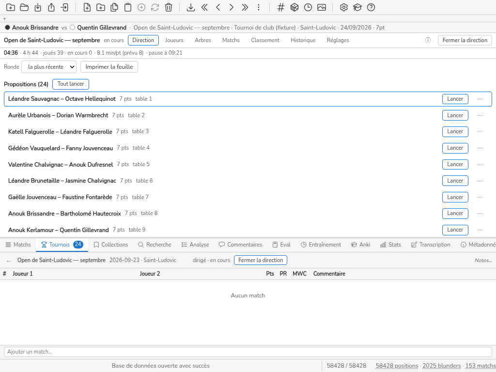

# S2 — Le week-end à une épreuve (Sophie, Léa)

Mesuré le 2026-09-24, front réel + `Database` réel par le shim ([../outillage.md](../outillage.md) § 1),
Chromium système, locale française, viewports 1024×768 et 1366×768 (une ligne quand les deux
comptes sont égaux, deux sinon). Colonnes : [../mesure.md](../mesure.md) § 4. Les touches sont
données avec, entre parenthèses, celles qui restent hors saisie des noms et des scores ;
« écart » compare le coût **hors saisie** (clics + touches hors saisie + vues + menus + modales
+ crans) au budget de `ux.md` § 4. La colonne « lecture » est omise : aucune opération n'a
demandé de lire ailleurs que l'écran où elle se fait, sauf où la prose le dit.

Bases : `S2-samedi-14h.db` (51 inscrits, 39 matchs joués, 0 en cours, **24 propositions** à la fin
du repas), `S2-samedi-soir.db` (suisse fini, tirage du tableau 16 proposé), `S2-fin.db` (clos,
28 Matchs importés rattachables). Déroulé joué : [scenarios-go.md](scenarios-go.md) § 4.

## Ce qui tient à l'écran

Avec le dock ouvert à sa hauteur par défaut (250 px), la page Direction dispose de **423 px**
(de y = 68 à 491) à 768 px de haut, dont 370 pour son corps défilant. À 14 h, la file de 24
propositions occupe y = 189 → 997 : **la grille des 14 tables est entièrement sous la ligne de
flottaison** (y = 1059 → 1253). Après « Tout lancer » (14 matchs, 10 propositions restantes), la
grille commence à y = 586. **1366×768 n'y change rien** : la contrainte est la hauteur, pas la
largeur. Le budget « la grille de 14 tables et la file de 20 propositions tiennent sans
défilement à 1366×768 » n'est **pas tenu** ; il ne peut pas l'être par une grille plus serrée
seule.

## Opérations

| heure | persona | opération | clics | touches | vues | menus | modales | défil. (crans / px) | KLM (s) | budget ux.md | écart | capture |
|---|---|---|---|---|---|---|---|---|---|---|---|---|
| 14:00 | Sophie | O5 tout lancer (24 propositions) | 2 | 0 (0 hors saisie) | 0 | 0 | 0 | 0 | 4 | 2 clics | tenu |  |
| 15:10 | assistante | O7 résultat table 12 avec score @1024 | 4 | 2 (0 hors saisie) | 0 | 0 | 0 | 4 / 400 | 8.3 | 2 clics ; ≤ 4,5 s | dépassé de 6 | S2-O7-1024.png |
| 15:10 | assistante | O7 résultat table 12 avec score @1366 | 4 | 2 (0 hors saisie) | 0 | 0 | 0 | 3 / 300 | 8 | 2 clics ; ≤ 4,5 s | dépassé de 5 | S2-O7-1366.png |
| 15:12 | assistante | O7 résultat table 14 sans score @1024 | 2 | 0 (0 hors saisie) | 0 | 0 | 0 | 0 | 4 | 2 clics | tenu |  |
| 15:12 | assistante | O7 résultat table 14 sans score @1366 | 2 | 0 (0 hors saisie) | 0 | 0 | 0 | 1 / 100 | 4.3 | 2 clics | dépassé de 1 | S2-O7-1366.png |
| 15:13 | assistante | O9 corriger la dernière @1024 | 2 | 0 (0 hors saisie) | 0 | 0 | 0 | 0 | 4 | 2 | tenu |  |
| 15:13 | assistante | O9 corriger la dernière @1366 | 2 | 0 (0 hors saisie) | 0 | 0 | 0 | 1 / 100 | 4.3 | 2 | dépassé de 1 | S2-O9-1366.png |
| 15:20 | Sophie | O6 imprimer la feuille d’appariements | 1 | 0 (0 hors saisie) | 0 | 0 | 0 | 5 / 500 | 4.2 | 2 + système | dépassé de 4 | S2-O6-1024.png |
| 15:25 | Sophie | O10 classement en cours (CSV) | 1 | 0 (0 hors saisie) | 1 | 0 | 0 | 0 | 4 | 3 | tenu |  |
| 16:00 | Sophie | O14 table 7 cassée : déplacer son match | 3 | 2 (0 hors saisie) | 1 | 1 | 0 | 5 / 500 | 9.9 | ≤ 4 | dépassé de 6 | S2-O14-1024.png |
| 16:30 | Sophie | O11 retirer (liste de 51, sans filtre) | 1 | 0 (0 hors saisie) | 1 | 0 | 0 | 4 / 400 | 5.2 | 4 + 3 K | dépassé de 2 | S2-O11-1024.png |
| 16:35 | Sophie | O11 retirer (avec filtre) | 2 | 18 (0 hors saisie) | 1 | 0 | 0 | 4 / 400 | 11.5 | 4 + 3 K | dépassé de 3 | S2-O11-1024.png |
| 16:40 | Sophie | O12 retardataire (tableau pas encore tiré) | 1 | 15 (1 hors saisie) | 0 | 0 | 0 | 0 | 6.9 | 2 + 6 K | tenu |  |
| 17:05 | Léa | O15 reprendre après une absence (ce qui s’est passé) | 0 | 0 (0 hors saisie) | 1 | 0 | 0 | 0 | 2.7 | ≤ 10 s | sans budget |  |
| 18:05 | Sophie | O16 ajouter une consolante en cours @1024 | 1 | 0 (0 hors saisie) | 1 | 0 | 0 | 1 / 100 | 4.3 | ≤ 4 | tenu | S2-O16-1024.png |
| 18:05 | Sophie | O16 ajouter une consolante en cours @1366 | 1 | 0 (0 hors saisie) | 1 | 0 | 0 | 0 | 4 | ≤ 4 | tenu |  |
| 18:06 | Sophie | O16 passer à la phase suivante @1024 | 1 | 0 (0 hors saisie) | 1 | 0 | 0 | 1 / 100 | 4.3 | 1 | dépassé de 2 | S2-O16-1024.png |
| 18:06 | Sophie | O16 passer à la phase suivante @1366 | 1 | 0 (0 hors saisie) | 1 | 0 | 0 | 0 | 4 | 1 | dépassé de 1 |  |
| 17:30 | Sophie | O20 rattacher 28 matchs importés | 28 | 0 (0 hors saisie) | 1 | 0 | 0 | 0 | 39.1 | 1 + n | tenu |  |
| 17:40 | Sophie | O19 classement par section et prix | 0 | 0 (0 hors saisie) | 1 | 0 | 0 | 0 | 2.7 | ≤ 4 | tenu |  |
| 17:45 | Sophie | O19 rouvrir pour corriger | 1 | 0 (0 hors saisie) | 0 | 0 | 1 | 0 | 4 | ≤ 4 | tenu | S2-O19-1024.png |

Une opération sur une table du bas de la grille (O7 table 12) coûte **3 à 4 crans** de défilement,
soit 2,5 à 3 fois son budget. Le défilement lui-même ne se fait qu'à la barre : **la molette,
au-dessus de la Direction, change la position de la bibliothèque cachée derrière** et ne fait pas
défiler la page (E1, [README.md](README.md) § 3).

## Incidents

- **I2 (11:15)** : au suisse, entre avec ses deux vies (O12 ; 2 hors saisie). Rien ne manque.
- **I4 (16:00, table 7 cassée)** : pas de champ « table indisponible » (voir S1) ; déplacer le
  match coûte **12 gestes à l'état réel** (5 crans pour atteindre la table 7 puis la fiche) au lieu
  de ≤ 4. Côté moteur (scenarios-go § 4), 14 tables sur 14 étaient occupées : le match de la
  table cassée ne pouvait aller nulle part, et **déplacer un match sur une table occupée est
  accepté sans avertissement** (G2).
- **I5 (17:00)** : rejeu identique, 13 ms.
- **F15 — la consolante ajoutée le samedi soir** : Réglages n'a **aucun champ « consolante »** pour
  la phase suivante (la ligne n'expose que longueur, vies, bascule, micro-rondes, longueur de fin,
  seuil — H5). Le moteur l'accepte par la configuration, **et l'accepte aussi après le tirage, sans
  rien créer** (G3).
- **I6 (sam 21:00 → dim 14:00)** : rien de dédié ; sa proposition reste dans la file et « Tout
  lancer » la lancerait.
- **I1 (sam 22:00, demi-finaliste qui part)** : retrait immédiat, match perdu par forfait, **rang
  final 14/51 « forfait »** (H12, H15).
- **I3 (finale inversée)** : le moteur signale `bracket_wrong_players` et propose l'annulation ;
  **à l'écran, la correction d'un résultat ancien n'a pas de chemin** (E2, voir S1).

## Léa reprend en ≤ 10 s ?

Non mesurable comme tel : l'onglet Historique liste tout (1 vue, 2,7 s), mais rien n'y marque
« depuis votre dernier geste », et la dernière décision (`LastDecision`) n'est pas visible à la
réouverture. Constat, pas mesure : il faut lire l'Historique en entier.

## Dimanche soir

- **O20** : 28 matchs rattachés en 28 clics + 1 vue — budget `1 + n` tenu.
- **O19** : le classement ne montre qu'**une section**, la générale (4 primés) : la consolante n'a
  pas de classement à elle faute de barème à son nom (scenarios-go § 9, C6).
- Contrôle de langue (allemand, grec, 1024) : aucun libellé de bouton ni de case ne déborde.
