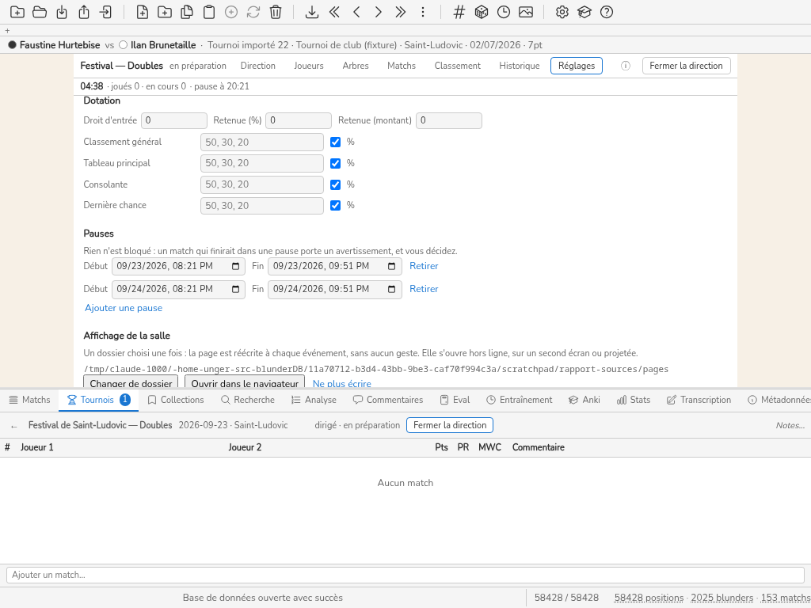

# S3 — Le festival à trois épreuves (Karim)

Mesuré le 2026-09-24, front réel + `Database` réel par le shim ([../outillage.md](../outillage.md) § 1),
Chromium système, locale française, viewports 1024×768 et 1366×768 (une ligne quand les deux
comptes sont égaux, deux sinon). Colonnes : [../mesure.md](../mesure.md) § 4. Les touches sont
données avec, entre parenthèses, celles qui restent hors saisie des noms et des scores ;
« écart » compare le coût **hors saisie** (clics + touches hors saisie + vues + menus + modales
+ crans) au budget de `ux.md` § 4. La colonne « lecture » est omise : aucune opération n'a
demandé de lire ailleurs que l'écran où elle se fait, sauf où la prose le dit.

Base : `S3-samedi-20h.db` : principal (65 inscrits, 105 joués, 7 en cours), speed (32, tirage
proposé), doubles (16 paires, en préparation). Trois Tournaments, trois Directions (décision Q2).
Déroulé joué : [scenarios-go.md](scenarios-go.md) § 5.

## Opérations

| heure | persona | opération | clics | touches | vues | menus | modales | défil. (crans / px) | KLM (s) | budget ux.md | écart | capture |
|---|---|---|---|---|---|---|---|---|---|---|---|---|
| 19:59 | Karim | O18 changer d’épreuve (principal → speed) | 3 | 0 (0 hors saisie) | 0 | 0 | 0 | 0 | 5.3 | sans budget | sans budget |  |
| 20:00 | Karim | O17 qui est libre pour le speed ? | 0 | 0 (0 hors saisie) | 1 | 0 | 0 | 0 | 2.7 | sans budget | sans budget |  |
| 20:01 | Karim | O5 lancer le tirage du speed | 3 | 0 (0 hors saisie) | 1 | 0 | 0 | 0 | 6.6 | 1-2 clics | dépassé de 2 |  |
| 20:05 | Karim | O6 page murale : dossier par épreuve (3) | 11 | 0 (0 hors saisie) | 1 | 0 | 0 | 8 / 800 | 19.4 | 0 après réglage | sans budget | S3-O6-1024.png |

## La salle partagée, à l'écran

Le principal occupe les tables **1, 2, 3, 4, 5, 6 et 9**. Karim ouvre le speed et lance son
tirage : le moteur du speed croit avoir 14 tables à lui et **pose 7 de ses 14 matchs sur les 7
tables occupées par le principal** ; au moins une joueuse du speed était en match au principal à
cet instant (comparaison des noms des deux grilles). Rien, à l'écran, ne le signale. En Go, sur le
week-end entier : **28 collisions** de table et 12 appariements retenus parce qu'un joueur jouait
dans une autre épreuve (scenarios-go § 5).

- **O17 « qui est libre pour le speed ? »** : aucune vue ne croise les épreuves ; la seule réponse
  est de lire la liste d'attente d'une Direction, puis d'ouvrir l'autre (O18) et de comparer de
  mémoire.
- **O18 changer d'épreuve** : 3 clics, **sans confirmation** — ouvrir une Direction ferme l'autre
  en silence (H1). En Go, 1 à 6 changements de Direction par heure (scenarios-go § 5).
- **O6 page murale** : une par épreuve, un dossier de sortie à choisir **dans chacune des trois**
  Directions : **20 gestes** (dont 8 crans pour atteindre le bouton dans Réglages).

## Incidents

- **I4 (deux tables cassées)** : une table cassée se déclare **dans chaque Direction** (4
  changements de configuration en Go) ; à l'écran, il n'y a pas de champ pour le faire (S1).
- **I1 (un joueur des deux épreuves part)** : deux retraits, un par Direction.
- **I2** : tableau de 64 déjà tiré → inscrit, n'entre nulle part (`no_entry`, H11).
- Les doubles : une paire est un Participant « A / B » ; l'annuaire compte ensuite 16 « personnes »
  nommées « A / B » sur 85 lignes (H10).
- Le nombre d'interruptions « je joue où ? » **n'est pas mesuré** : la simulation n'a pas de joueurs
  réels. Ce qui l'est : 7 matchs posés sur des tables occupées en un seul tirage, que seul un
  joueur arrivé à sa table découvrirait.
