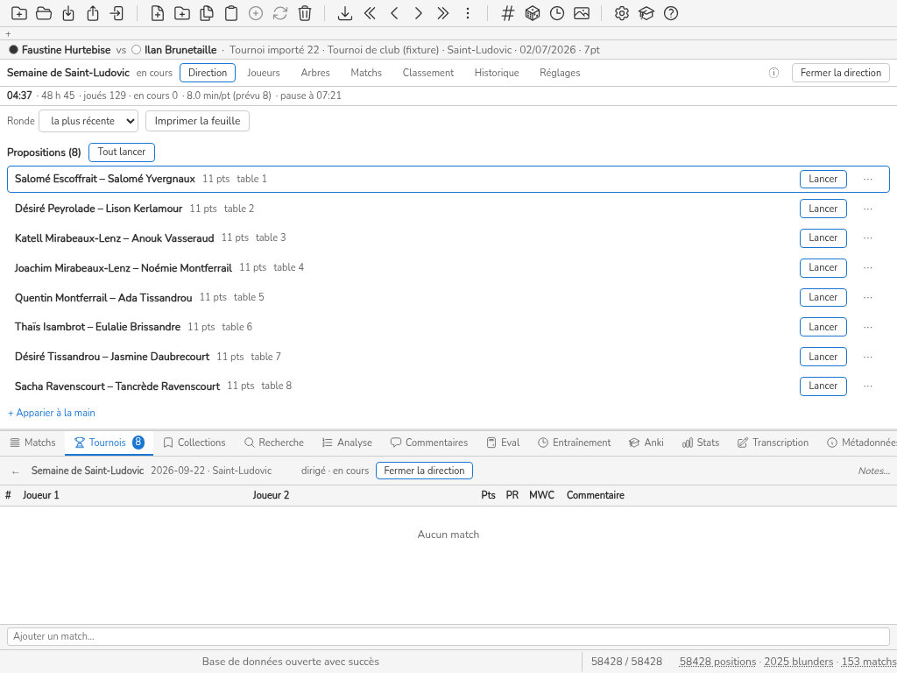

# S5 — Une épreuve sur cinq jours (Sophie)

Mesuré le 2026-09-24, front réel + `Database` réel par le shim ([../outillage.md](../outillage.md) § 1),
Chromium système, locale française, viewports 1024×768 et 1366×768 (une ligne quand les deux
comptes sont égaux, deux sinon). Colonnes : [../mesure.md](../mesure.md) § 4. Les touches sont
données avec, entre parenthèses, celles qui restent hors saisie des noms et des scores ;
« écart » compare le coût **hors saisie** (clics + touches hors saisie + vues + menus + modales
+ crans) au budget de `ux.md` § 4. La colonne « lecture » est omise : aucune opération n'a
demandé de lire ailleurs que l'écran où elle se fait, sauf où la prose le dit.

Base : `S5-mercredi-matin.db` (51 inscrits, 129 matchs, 311 événements ; dernier événement mardi
soir). Déroulé joué : [scenarios-go.md](scenarios-go.md) § 7.

## Opérations

| heure | persona | opération | clics | touches | vues | menus | modales | défil. (crans / px) | KLM (s) | budget ux.md | écart | capture |
|---|---|---|---|---|---|---|---|---|---|---|---|---|
| mer. 09:00 | Sophie | O15 reprendre le matin (« depuis hier soir ») | 0 | 0 (0 hors saisie) | 0 | 0 | 0 | 0 | 1.4 | ≤ 10 s | sans budget |  |
| mer. 09:01 | Sophie | O5 tout lancer (micro-rondes) | 2 | 0 (0 hors saisie) | 0 | 0 | 0 | 0 | 4 | 2 clics | tenu |  |
| mer. 16:00 | Sophie | O11 départ définitif du premier (différé si en match) | 2 | 21 (0 hors saisie) | 1 | 0 | 0 | 0 | 11.1 | 4 + 3 K | tenu |  |
| mer. 16:02 | Sophie | O21 historique du partant | 1 | 6 (0 hors saisie) | 1 | 0 | 0 | 0 | 5.6 | ≤ 2 | tenu |  |

## Reprendre le matin (O15)

La bande d'horloge affiche **« 48 h 45 · joués 129 · en cours 0 · 8.0 min/pt (prévu 8) · pause à
HH:MM »** : le temps écoulé compte les nuits (48 h pour deux jours et demi de jeu), la pause
suivante n'a pas de jour, et **aucune fin estimée** n'est affichée nulle part (H13, confirmée
plus largement par scenarios-go § 8). La dernière décision de la veille est visible ; rien ne
résume « depuis hier soir ».

## Le format et l'horaire

Le suisse à trois vies s'épuise en deux jours et demi : clôture **mercredi 23:35** au lieu de
vendredi (scenarios-go § 7) ; les incidents du jeudi et du vendredi sont **sans objet**. Rien, à
l'écran, ne l'annonçait le lundi.

## I1 — le meilleur part mercredi

Retrait différé (il jouait) : 2 clics + le nom au filtre. Au classement de fin : **50/51
« forfait »** avec 8 victoires (H15, moteur).

## Rejeu

Journal final de 355 événements rejoué en 3,6 ms (médiane SQLite ; budget 50 ms), identique à
chaque fermeture du soir (scenarios-go § 2).
